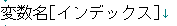

# JavaScript基礎

------

## JavaScriptとは

JavaScriptはブラウザ上で実行されるスクリプト言語（ソースコードを記述することで即座に動作できるようなプログラム言語のこと）として誕生し，現在ではそれ以外にもサーバー側で動作する[node.js](https://nodejs.org/ja/)のような環境も登場しています。このJavaScriptをブラウザ側で実行することで，フォームに入力された値の確認，ページ内の要素にアニメーションや効果を加えたりなど，いろいろな処理が可能になります。ブラウザごとに差異はありますが，現在では国際的な標準化団体の一つである[ECMA(エクマ) International](https://www.ecma-international.org/)において規格が策定されているので，ECMAscriptという名前で呼ばれることもあります。

名前が似た[Java](https://www.java.com/ja/)という言語がありますが，全くの別物です。JavaScriptのことを"Java"と略して呼ぶのは止めましょう。

JavaScriptをWebページで使用する際には，基本として

* 各行の最後に`;(セミコロン)`を使う
* 大文字小文字の区別がされるため，変数名や関数名をつける際には注意する
* HTMLに直接埋め込む場合は`<html>～</html>`の間に`<script type="text/javascript">～</script>`を書いて，`～`の部分にコードを記述する。

ということを覚えておいてください。


外部のファイルを読み込む方法もありますが，ここでは最初，直接JavaScriptコードをHTMLファイルに埋め込む方法をとります。

## プログラムを実行してみる

まずは，適当なコードを実行してみて動作確認をしてみましょう。上でも説明したように，<script>タグの中にコードを記述していきます。


### コード

```html
<!DOCTYPE html>
<html>
<head>
    <meta charset="utf-8">
    <title>JS実行テスト1</title>
</head>
<body>
    <h1>実行テスト</h1>
    <script>
        alert('Hello World!');
    </script>
</body>
</html>
```

### 結果

[](http://cs-tklab.na-inet.jp/phpdb/Chapter1/fig/JS2.PNG)


### 説明

ここで`window.alert('Hellow, World!');`は，警告ダイアログを表示させるための文です。文法については後で説明していきます。 もし，ダイアログが表示されない場合はブラウザの設定でJavaScriptが有効になっているか確認してみてください。

> `window`はグローバルスコープなので、省略できる。


## 変数

### 変数の宣言

JavaScriptでは，変数は最初に使うタイミングで自動的に確保されますが，`var 変数名;`というように明示的に変数の宣言をすることもできます。下の画像では`hoge`という変数に`1234`というデータを代入しています。

```js
var hoge;
hoge = 1234;
```

### 配列

配列とは，１つの変数に複数のデータをまとめて入れられる仕組みの１つです。配列に格納されたデータは「要素」と呼ばれ，自動的に１つずつ先頭から番号がふられます。

この番号は「インデックス」と呼ばれ，先頭は０から始まります。インデックスは，個別にデータを引き出したいときなどに使います。

[](http://cs-tklab.na-inet.jp/phpdb/Chapter1/fig/JS4-small.png)

### 配列の作成

変数に複数のデータを配列として格納するには，このように記述します。

[](http://cs-tklab.na-inet.jp/phpdb/Chapter1/fig/JS5.PNG)

### 配列の要素の参照

要素を指定してデータを引き出す際はこのように記述します。

[](http://cs-tklab.na-inet.jp/phpdb/Chapter1/fig/JS6.PNG)

たとえば，`a`という変数に，配列`hoge`の先頭から2番目に格納されている`222`というデータを代入したいときは下記のように記述します。

```js
var hoge = [111, 222, 333];
a = hoge[1];
```

## 関数とは

関数とは，あらかじめ定めた処理をひとまとめにして定義することで，処理を使いまわせるようにしたものです。関数を定義するためには`function文`を使います。関数名は変数と同じように任意の名前をつけることが出来ます。

```js
// 関数の定義
function 関数名(引数) {
  任意の処理
  return 戻り値
}

// 関数の呼び出し
関数名();
```

* 関数の定義については，上の画像のようにするのが基本的な記述のしかたです。`（ ）`の中の「引数」についてはあとで説明します。
* 上の画像のように関数を定義し，呼び出すことで`｛ ｝`内の処理を行うことが出来ます。
* また，`{ }`内に戻り値とありますが，この戻り値の部分に変数や式を書いておくと，処理を一通り終えた後にそれをデータとして出力することが出来ます。戻り値の指定には`return文`を使います。

## 関数の使用例

上の説明だけではわかりにくいので，実際に使ってみます。

### コード

```html
<!DOCTYPE html>
<html>
<head>
    <meta charset="utf-8">
    <title>JS実行テスト: 関数</title>
</head>
<body>
    <h1>関数</h1>
    <script>
        function sum() {
            var a = 3 + 4;
            return a;
        }
        alert(sum());
    </script>
</body>
</html>
```

### 結果

[](http://cs-tklab.na-inet.jp/phpdb/Chapter1/fig/JS10.PNG)

### 説明

* 11～12行目の「`3 + 4`の結果を戻り値を使って出力する」処理を`sum`という関数で定義しています。15行目でそれを呼び出し，警告ダイアログで結果を表示しています。
* 引数は今回指定してありませんが，`()`は省略せずに書く必要があるので，覚えておきましょう。

## 引数

引数とは，簡単にいうと関数内の変数へ代入する値で，function文の()内に記述することで指定することが出来ます。これを使うことで，関数に様々な値を渡すことができます。

## 引数の使用例

### コード

```html
<!DOCTYPE html>
<html>
<head>
    <meta charset="utf-8">
    <title>JS実行テスト3: 関数の引数</title>
</head>
<body>
    <h1>関数の引数</h1>
    <script>
        function sum(x, y) {
            var a = x + y;
            return a;
        }
        alert(sum(3, 4));
    </script>
</body>
</html>
```

### 説明

* 引数を使って値を渡すようにした以外は上の使用例で作成したものと同じ処理をするプログラムです。同じように「7」という結果を警告ダイアログで返します。
* 9行目のfunction文で変数x,yを引数として設定し，15行目の()内の値を代入することで処理を行っています。
* このように引数に変数を指定することで処理のたびに違う値を渡すことが出来ます。引数に指定した変数は「仮引数」と呼ばれ，あらかじめ宣言しなくても使うことが出来ます。

## スコープ

スコープとは，変数が有効な範囲のことです。普通にプログラムで宣言した変数はプログラムのどこでも有効となります。（プログラム全体がスコープ）この変数のことをグローバル変数といいます。

それに対し，関数の中でvarを用いて変数を宣言した場合は，関数の中でのみ有効な変数となります。（関数の中がスコープ）これをローカル変数といいます。ローカル変数は関数の外で値を代入したり，参照することが出来ません。

ちなみに，関数の中でグローバル変数を宣言したい場合はvarをつけずに宣言することで可能です。

[](http://cs-tklab.na-inet.jp/phpdb/Chapter1/fig/JS15.PNG)

## 関数の定義方法

ここまで関数の勉強をしてきましたが，最初の方法以外にも関数を定義する方法があるので紹介していきます。

### 宣言して定義

[](http://cs-tklab.na-inet.jp/phpdb/Chapter1/fig/JS12.PNG)

これは最初に勉強した方法です。この方法で宣言した関数のことを宣言型の関数といいます。

### 変数に代入


次に，変数に代入して宣言する方法です。この場合，関数名は書かずに宣言します。この書き方を関数リテラル，無名関数といいます。

### コンストラクタ

[](http://cs-tklab.na-inet.jp/phpdb/Chapter1/fig/JS14.PNG)

最後に，コンストラクタを使用する方法を紹介します。まず，コンストラクタとは右側の`new Function('仮引数','処理');`の部分のことで，これも一応変数に代入して宣言しています。これを説明するには組み込みオブジェクトの話が必要となってくるため，ここではこういうものがある，ということだけ覚えておいてください。

## オブジェクトとは

変数の中にはデータを直接代入するだけでなく，変数や関数を代入して使うことも出来ます。これをオブジェクトといい，中に入った変数やデータはプロパティ，関数はメソッドと呼ばれます。プロパティにはそれぞれプロパティ名をつけて管理します。


ちなみに，オブジェクトは下の画像のコードのように入れ子にすることもできます。今回は`list`オブジェクトの中に２つのプロパティ(`id`, `name`)と`address`オブジェクトを代入しています。

```js
var list = {
  id: 1,
  name: '高性能次郎',
  address: {
    tel: '0000-00-0000',
    mail: 'jiro@example.com'
  }
};
```

このオブジェクトの仕組みを樹形図にするとこのようになります。


* プロパティのデータを追加・上書きするには，オブジェクト名.プロパティ名 = データというようにして代入します。
* 同じように複数のデータを格納する方法である配列とは違い，オブジェクトにはインデックスは振られていません。

上記の`list`オブジェクトのデータを取り出すJavaScriptは例えば次のようになります。

```html
<!DOCTYPE html>
<html>
<head>
    <meta charset="utf-8">
    <title>JS実行テスト4: オブジェクト</title>
</head>
<body>
    <h1>オブジェクト</h1>
    <script>
var list = {
  id: 1,
  name: '高性能次郎',
  address: {
    tel: '0000-00-0000',
    mail: 'jiro@example.com'
  }
};
alert(list.name + '\n' + list.address.mail);
    </script>
</body>
</html>
```

　これを実行すると，listオブジェクトの`name`プロパティと`address`オブジェクト(プロパティ)の中の`mail`プロパティが下記のように表示されます。

[](http://cs-tklab.na-inet.jp/phpdb/Chapter1/fig/javascript4_exec.png)