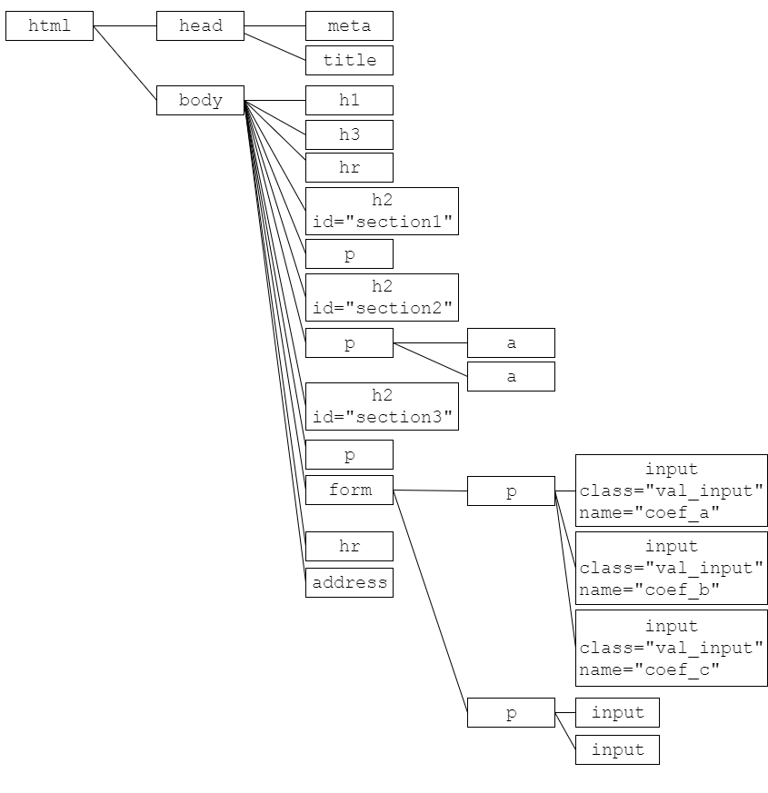
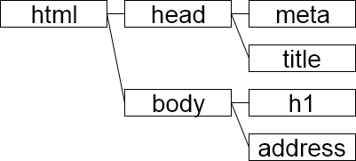
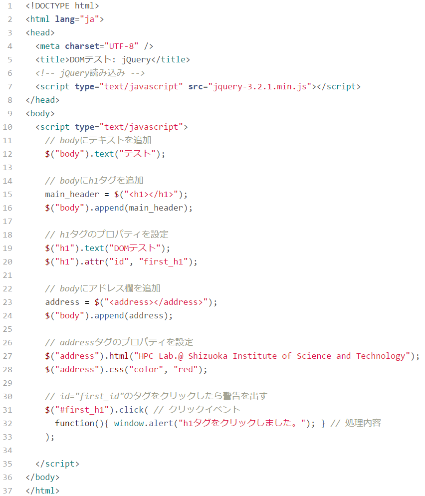

# DOM(Document Object Model)とjQuery

------

## ツリー構造とは？

多様なデータを整理するには，その中に構造(structure)を導入して使いやすく整理します。ツリー構造(tree data structure)はその一種で，親子関係のように，大本のデータ（親, parent）に割り付けられた従属データ（子, child）を，枝分かれする木（ツリー, tree）のように見立てるものです。

例えば，下記のようなツリー構造が与えられたとします。左側のデータ（ノード, node）が親，親から線が伸びて繋がっている右側のデータが子となります。

上記のケースでは，例えば下記のようなHTMLファイルに対して，DOMはタグの階層構造を表現したツリーになります。例えばノードAとノードBの関係は，「AはBの親」もしくは「BはAの子」と言えます。また，ノードEとノードAの関係は，「Aは，Eの親Bの親」もしくは「Eは，Aの子Bの子」と言えます。

## DOM(Document Object Model)とは

DOMとは，階層構造になっているHTMLのタグを一つのオブジェクトとするデータモデルです。

HTMLのタグは典型的なツリー構造をなしており，すべてのタグはhtmlタグの子（子孫）となります。このようなタグの木構造を，ドメインオブジェクトモデル(Domain Object Model)と呼びます。

以降では，HTMLをDOMとして見ていくことにします。JavaScriptを組み合わせるとこのDOM構造を動的に扱うことができます。

## DOMとJavaScript

下記のHTMLファイルを使ってDOMを考えてみましょう。

dom_sample_html.html

上記のHTMLファイルのDOMツリーは下記のようになります。

JavaScriptを使うと，後から動的にDOM要素を追加することができます。例えば，上記のHTMLと同じDOMツリーを生成するためには，例えば次のようなJavaScriptを実行すれば良いわけです。各JavaScriptの関数やクラスについては調査の上，先生役の人が逐一説明をしてあげて下さい。

dom_sample_js.html

このJavaScriptの入ったHTMLファイルのDOMツリーは下記のようになります。黒字は元々のdom_sample_js.htmlファイルに記述してある静的なDOM要素，赤字の部分は後からJavaScriptで生成したDOM要素です。

## jQueryの基本

[jQuery](https://jquery.com/)は，全てのオブジェクトのトップに`jquery`というオブジェクトを立て，その下に全ての機能を置くように構成された，CSS, JavaScriptのフレームワーク(枠組み)です。以前のJavaScriptでは扱いづらい機能を実現してくれるフレームワークですが，現在ではjQueryに頼らずともかなりのことが素のJavaScriptだけで実現できるようになりました。本テキストではjQueryを使うケースと使わないケース，それぞれ示していきます。

### jQueryの組み込み方

使う際には，まずjQueryのサイトからjQuery本体のJavaScriptファイル（何種類か存在しています）をダウンロードし，HTMLファイルのヘッダに組み込みます。下記の例は，jQuery 3.2.1の圧縮バージョンを組み込んだ例です。

``

### jQueryのセレクタ

jQueryを組み込むと，DOMであるHTMLの各タグを

jquery("DOM名")

として表現することができるようになります。ちなみに，`jquery`の略語として`$(ドルマーク)`も使えるため，

$("DOM名")

として使うこともできます。これによってHTMLの全てのタグを配下に置き，短い記述で指定することができるようになります。

[最初に示したHTML](http://cs-tklab.na-inet.jp/phpdb/Chapter1/dom_jquery.html#first_dom_sample)の場合，`h1`タグや，`id="section1"`，`class="val_input"`を属性値として持つタグは

| $("h1")         | ←→   | <h1>...</h1>                |
| --------------- | ---- | --------------------------- |
| $("#section1")  | ←→   | <h2 id="section1">...</h2>  |
| $(".val_input") | ←→   | <input class="val_input" /> |

というように指定できます。このようにタグを指定する機能をセレクタ(selector)と呼びます。以下ではこの`$`の機能を使ってjQueryの機能を利用していきます。

jQueryのセレクタを使うと，DOMに紐づけされているプロパティ，メソッドにアクセスしやすいため，このjQueryを土台として様々なJavaScriptライブラリが提供されています。

### jQueryを使った動的DOM要素の生成

先ほど作った[JavaScriptによるDOM生成の例](http://cs-tklab.na-inet.jp/phpdb/Chapter1/dom_jquery.html#dom_sample_js)を，jQueryのセレクタやメソッドで実現したものが下記のHTMLファイル(とJavaScript)です。

dom_sample_jquery.html

JavaScriptやjQueryを多用するのは[第5章](http://cs-tklab.na-inet.jp/phpdb/Chapter5/)となります。活用の機会が来た時には，この解説を参照して下さい。
