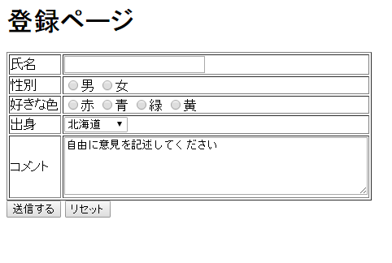

# 練習問題

------

覚えたフォームを使い下の画像のような登録ページを作成してください。

* 出身は47都道府県です。
* textareaの大きさは，横幅50，縦幅5とします。

[](http://cs-tklab.na-inet.jp/phpdb/Chapter1/fig/lesson1-1.PNG)

------

分からないところは最初からあきらめずに自分で調べましょう。
どこを見ればいいか分からないときは下のヒントを見ましょう。

ここで作ったフォームは以降の練習問題で使用します。きちんと作りましょう。

------


**test1.php**

```php
<!DOCTYPE html>
<html>
    <head>
        <title>登録ページ</title>
        <meta charset="utf-8">
    </head>
    <body>
        <h1>登録ページ</h1>
        <form>
            <table border="1">
                <tr><th>氏名</th><td><input name="name"></td></tr>
                <tr><th>性別</th><td>
                    <input type="radio" name="sex" value="男">男
                    <input type="radio" name="sex" value="女">女
                </td></tr>
                <tr><th>好きな色</th><td>
                    <input type="radio" name="color" value="赤">赤
                    <input type="radio" name="color" value="青">青
                    <input type="radio" name="color" value="緑">緑
                    <input type="radio" name="color" value="黄">黄
                </td></tr>
                <tr><th>出身</th><td>
                    <select name="prefecture">
                        <?php
                            foreach(["北海道", "青森県", "岩手県", "宮城県", "秋田県", "山形県", "福島県", "茨城県", "栃木県", "群馬県", "埼玉県", "千葉県", "東京都", "神奈川県", "新潟県", "富山県", "石川県", "福井県", "山梨県", "長野県", "岐阜県", "静岡県", "愛知県", "三重県", "滋賀県", "京都府", "大阪府", "兵庫県", "奈良県", "和歌山県", "鳥取県", "島根県", "岡山県", "広島県", "山口県", "徳島県", "香川県", "愛媛県", "高知県", "福岡県", "佐賀県", "長崎県", "熊本県", "大分県", "宮崎県", "鹿児島県", "沖縄県"] as $value)
                                echo "<option value=$value>$value</option>"
                        ?>
                    </select>
                </td></tr>
                <tr><th>コメント</th><td><textarea name="comments" rows="5" cols="50"></textarea></td></tr>
            </table>
            <input type="submit">
            <input type="reset">
        </form>
        <?php
        if(isset($_GET['name'])) {
            echo "<p>私の名前は、" . htmlspecialchars($_GET['name']) . "です。</p>";
            if(isset($_GET['sex']))
                echo "<p>性別は、" . htmlspecialchars($_GET['sex']) . "です。</p>";
            if(isset($_GET['color']))
                echo "<p>好きな色は、" . htmlspecialchars($_GET['color']) . "です。</p>";
            if(isset($_GET['prefecture']))
                echo "<p>出身は、" . htmlspecialchars($_GET['prefecture']) . "です。</p>";
            if(isset($_GET['comments']))
                echo "<p>" . htmlspecialchars($_GET['comments']) . "</p>";
        }
        ?>
    </body>
</html>
```

