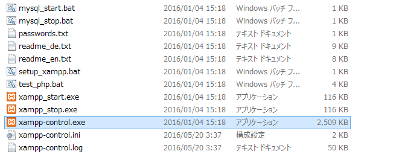
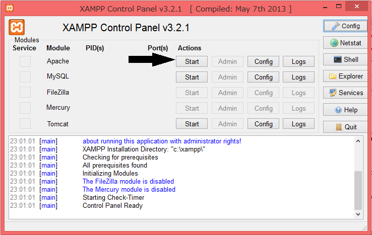
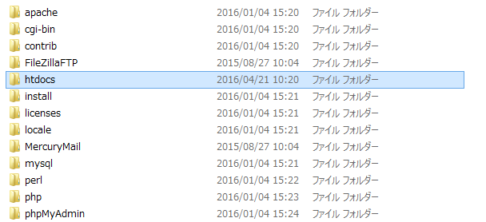

# Apache(アパッチ)の起動

------

PHPのプログラム制作するは，これまで使ってこなかったXAMPP(X...OS, A...Apache, M...MySQL, P...Perl, P...PHP)のApache，すなわち，Webサーバーを起動しなければなりません。

HTMLのみで作った静的なWebページは何もしなくても作動しますが，PHPを使用する動的なWebページでは，Apacheを起動させなければ，PHPのインタプリタを起動することができず，正常に作動させることができません。

## Apacheの起動

XAMPPをインストールしたドライブのトップに`xampp`というフォルダーがあるはずです。

その中にある`xampp-control.exe`を起動します。

[](http://cs-tklab.na-inet.jp/phpdb/Chapter2/fig/PHP1-1.PNG)


下のようなウィンドウが出てくるので[Apache]の[Start]ボタンをクリックすればApacheを起動することができます。

[](http://cs-tklab.na-inet.jp/phpdb/Chapter2/fig/PHP1-2.PNG)

PHPスクリプトが正常に動作しない場合は，

1. Apacheは正常に起動しているか？
2. `**http://localhost/seminar/PHPスクリプト名**`というURLを通して実行しているか？

という2点を必ず確認して下さい。


### PHPスクリプト作成の注意

PHPスクリプトを作る際には，どのフォルダに作成するのかを留意する必要があります。 今回はXAMPPを利用しているので，Apacheがアクセスできる範囲のフォルダにPHPスクリプトを作らなくてはなりません。

XAMPPをインストールしたフォルダの下に`htdocs`というフォルダーが存在しているはずですので，そこに新しくフォルダーを作ってその中に作成していきましょう。Apacheはこのhtdocsフォルダ以下のファイルにしかアクセスできないからです。

[](http://cs-tklab.na-inet.jp/phpdb/Chapter2/fig/PHP1-3.PNG)

以降では，動的なWebページとなるPHPスクリプトは拡張子を`～.php`，静的なWebページとなるHTMLファイルは`～.html`と指定してください。

------

## index.htmlにリンクを追加していく

以降では，必ず最初にApacheを起動し，次にブラウザを立ち上げて`http://localhost/指定フォルダ/PHPスクリプト名`というURLをアドレス欄に直打ちしてPHPスクリプトの動作を確認していきます。HTMLファイルについても同様に必ずlocalhost(ブラウザが動作しているマシンを意味します)を経由して作成したファイルにアクセスするようにして下さい。

例えば，`htdocs/seminar/samplehtml1.html`にアクセスする際は，下記のようにブラウザのアドレス欄に直打ちします。

[](http://cs-tklab.na-inet.jp/phpdb/Chapter2/fig/PHP1-4.PNG)


Apacheの標準的な設定では，フォルダ内に`index.html`もしくは`index.php`ファイルが存在していると，ファイル名を省略してこれらのファイルにアクセスすることができるようになります。これを**インデックスファイル(indexファイル)**と呼びます。([インデックスファイル](http://cs-tklab.na-inet.jp/phpdb/Chapter5/system3.html#index_file)の詳細）

インデックスファイル`index.html`は今まで作成したプログラムのリンクを貼りつけてみましょう。


※これは例なので，自分が分かりやすいよう自由に中身を作成してみて下さい。

seminar/index.htmlの例

```html
<!DOCTYPE html>
<html>
<head>
    <meta charset="utf-8">
    <title>自分名前の作成プログラム一覧</title>
</head>
<body>
  <h1>自分名前の作成プログラム一覧</h1>
  <h2>第1章</h2>

  <h3>HTML</h3>
  <ul>
    <li><a href="sample_html_1.html">文字の装飾</a></li>
    <li><a href="sample_html_2.html">文字の変更</a></li>
    <li><a href="sample_html_3.html">見出し</a></li>
    <li><a href="sample_html_4.html">改行</a></li>
    <li><a href="sample_html_5.html">段落</a></li>
    <li><a href="sample_html_6.html">表(テーブル)</a></li>
  </ul>

  <h3>CSS</h3>
  <ul>
    <li><a href="sample_css_1.html">インライン</a></li>
    <li><a href="sample_css_2.html">内部参照</a></li>
    <li><a href="sample_css_3.html">外部参照</a></li>
  </ul>
  <h3>フォーム</h3>
  <ul>
    <li><a href="textbox.html">テキストボックス</a></li>
    <li><a href="radio.html">ラジオボタン</a></li>
    <li><a href="checkbox.html">チェックボックス</a></li>
    <li><a href="list.html">リストメニュー</a></li>
    <li><a href="file.html">ファイルメニュー</a></li>
    <li><a href="textarea.html">テキストエリア</a></li>
  </ul>
  
  <hr>
  <address>Copyright (c) 2020 J. Random Hacker. All rights reserved.</address>
</body>
</html>
```


ブラウザ(Google Chrome)での表示例

[](http://cs-tklab.na-inet.jp/phpdb/Chapter2/fig/sample_index_html_browser.png)


これ以降に作成していくプログラムのリンクもインデックスファイル`index.html`に貼りつけていくことにしましょう。

