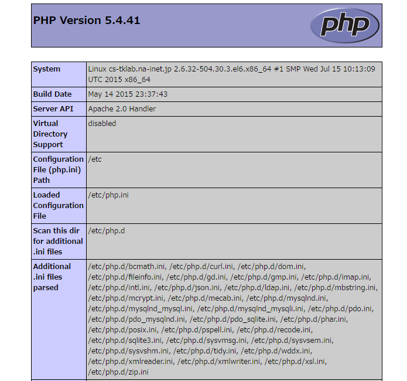
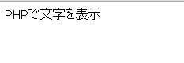
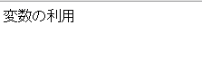
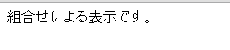
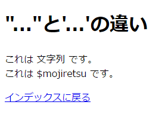

# PHP

------

## PHPとは

PHP(ピーエッチピー)は【PHP: Hypertext Preprosessor】(PHP ハイパーテキスト プリプロセッサー)の略で，Webサーバー側(サーバーサイド)で動作する動的なWebページを記述することに特化したサーバーサイドスクリプト言語です。1995年に"Personal HomePage Tool"として開発が始まり，2017年2月現在の最新バージョンはPHP 7.1.1です。

サーバーサイドスクリプトとは，Webサーバ上で動作し，ブラウザからのアクセス要求に応じて，呼び出されるたびに標準出力をウェブブラウザに送信するプログラムです([第0章参照](http://cs-tklab.na-inet.jp/phpdb/Introduction/Intro.html))。

PHPスクリプトを作って動作させるためには，

* スクリプトの拡張子として`.php`を使う
* PHPスクリプトを記述した部分は，最初に`<?php`を，最後に`?>`を付加して囲む
* 各行の最後に`;(セミコロン)`を付ける
* 必ずPHPスクリプトをApacheを通じて動作させる。Apacheを起動させ，ブラウザから`http://サーバ名/・・・/PHPスクリプト名`というURLを直接打ち込んでApacheを介して動作させる

という原則を守る必要があります。


## 最初のPHPスクリプト

まず，動作しているApache, PHPの環境をチェックするための１行PHPスクリプトを作ってみましょう。`phpinfo.php`という名前で下記の内容の１行ファイルを作り，適当なフォルダに設置してブラウザからアクセスしてみて下さい。

`<?php phpinfo(); ?>`

これをブラウザから`http://localhost/適当なフォルダ名/phpinfo.php`にアクセスすると，下記のような表示がされるはずです。

[](http://cs-tklab.na-inet.jp/phpdb/Chapter2/fig/phpinfo_browser.png)

縦に長い表示となりますが，これを丁寧に見ていくと，Apache，PHPのバージョン，PHPから使用できる機能が分かるようになっています。セキュリティに考慮して，外部からアクセスできないところで実行するようにして下さい。

## ファンクション

ファンクションは"関数"とも言い，PHPでプログラムを書くときにもっとも重要な機能となります。


動的Webページを作成するために必要な関数が大量に用意されており，標準的なファンクションは[PHPマニュアル](http://php.net/manual/ja/)から調べることができるようになっています。

## 文字列の表示

では，ブラウザに文字列を表示するPHPスクリプトを作ってみましょう。下記のPHPスクリプトをエディタから打ち込み，ファイル名はPHPスクリプトの原則を守りつつ適当に決め，PHPスクリプトが動作可能なフォルダに保存して下さい。

PHPスクリプト

```php
<!DOCTYPE html>
<html>
<head>
    <meta charset="utf-8">
    <title>sample1</title>
</head>
<body>
  <?php print('phpで文字を表示')?><br>
  <?php echo 'phpで文字を表示'; ?><br>
  <?='phpで文字を表示'?>
</body>
</html>
```


ブラウザから実行すると，下記のように「PHPで文字を表示」という文字列が表示されるはずです。エラーメッセージが出たら修正して再度実行して下さい。

ブラウザの表示[](http://cs-tklab.na-inet.jp/phpdb/Chapter2/fig/PHP2-2.PNG)

### 使用ファンクション: **print**

printファンクションはprint(' ');の中の「' '(シングルクォーテーション)」で囲まれた場所をHTML文として 表示させることができます。 これは「" "(ダブルクォーテーション)」でも同じことができます。但し，両者で機能に若干の違いがありますので，詳細は後述します。

単純標準出力`echo`，書式付き標準出力関数`printf`，文字列に出力する`sprintf`も同類のファンクションです。これは後ほど多用します。

------

## PHPの変数

PHPでは`$(ドルマーク)`を接頭詞とする文字列を変数として型宣言なしに随所で使用できます。一度変数に入力した値は何度でもスクリプト内で使用することができます。

変数は下記の2種類あります。

* 可変変数(variable variables):

  自由に作成と値の入出力ができる

* 外部ソースを利用する固定名の変数(Variables from external sources):

  名前が固定されている$_POST, $_GET, $_REQUEST, $_FILES, $_SERVER, $_COOKIE等の変数は，それぞれ固定化した外部ソースからの入力を受け取るための変数として利用される

可変変数はいつでも自由に作成でき，入力する内容も制限がないため便利に使用することができます。


### 変数の値を表示させる

標準出力表示にはprintまたはechoファンクションを使用しますが，変数を表示する際にはそのまま変数名を指定すれば値を表示できます。

例えば可変変数`$sample`の値を表示するためには下記のようにプログラムします。

プログラム

```php
<!DOCTYPE html>
<html>
<head>
    <meta charset="utf-8">
    <title>sample2</title>
</head>
<body>
    <?php
    $sample = '変数の利用';
    print($sample);
    ?>
</body>
</html>
```


これを実行すると次のような表示になります。

ブラウザ上の表示

[](http://cs-tklab.na-inet.jp/phpdb/Chapter2/fig/PHP2-4.PNG)


文章と変数を混ぜて表示する場合は｢.(ピリオド)｣を中間に入れることで，前後を連結して一つの文字列として扱うことができるようになります。

プログラム

```html
<!DOCTYPE html>
<html>
<head>
    <meta charset="utf-8">
    <title>sample3</title>
</head>
<body>
    <?php
    $sample = '表示';
    print("組み合わせによる" . $sample . "です。");
    ?>
</body>
</html>
```


ブラウザ上の表示

[](http://cs-tklab.na-inet.jp/phpdb/Chapter2/fig/PHP2-6.PNG)


### ダブルクォーテーション(double quotation)とシングルクォーテーション(single quotation)の違い

PHPでは，ダブルクォーテーション`"..."`でもシングルクォーテーション`'...'`でも，括られた部分を文字列として扱いますが，変数を括った時の扱いがそれぞれ異なります。前者は変数を解釈してその値を文字列として表示しますが，後者は変数名を単なる文字列として扱います。次の例で違いを確認して下さい。

プログラム

```php
<!DOCTYPE html>
<html>
<head>
    <meta charset="utf-8">
    <title>"..."と'...'の違い</title>
</head>
<body>
    <h1>"..."と'...'の違い</h1>
    <?php $strings = "文字列"; ?>
    <?="これは $strings です。"?><br>
    <?='これは $strings です。'?><br>

    <p><a href="index.html">インデックスに戻る</a></p>
</body>
</html>
```


ブラウザ上の表示

[](http://cs-tklab.na-inet.jp/phpdb/Chapter2/fig/double_single_quote_browser.png)


