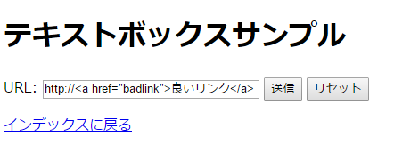
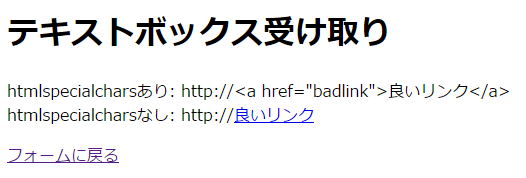
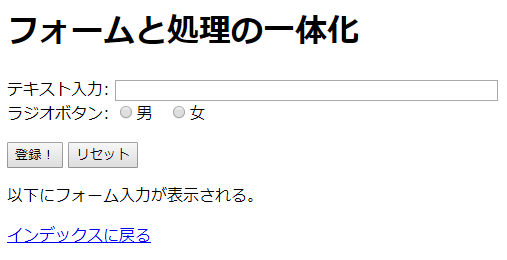
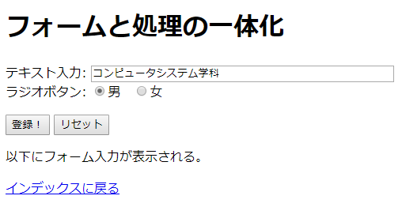
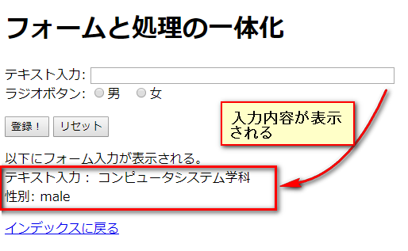

# フォーム入力の受け取り

------

[前章で作ったフォーム](http://cs-tklab.na-inet.jp/phpdb/Chapter1/form.html)は静的なHTMLファイルとして作ったものですが，入力されたデータは，submitボタンをクリックした後，`action`属性に示したURLに送信されます。action属性が未指定の場合はフォームが記載されているファイルに対して送られます。

フォーム入力値に対してどういうアクションを返すかはそのaction属性値で指定されたURLで規定する必要があります。ここではPHPスクリプトを使って受信データの処理の仕組みを見ていくことにします。

## 使用変数とファンクション

### 受け取り用

フォームの入力値をPHPスクリプトが受け取ると，処理された入力データが次の固定名の変数に格納されます。`$_GET`，`$_POST`配列は送信するページのフォーム要素に使用されているmethod属性に対応しています。method属性に依らずデータを受け取りたい時には`$_REQUEST`配列を使います。

* $_GET：`method="get"`からの送信を受け取り
* $_POST：`method="post"`からの送信を受け取り
* $_REQUEST：getとpostのどちらからも受信可能

これらの固定名の変数は全て配列となっており，配列の添字は入力要素の`name`属性値として使用され，そこに入力値が格納されます。


例えば`<input ... name="kore">`に入力されたデータはPOSTメソッドの場合は`$_POST['kore']`，GETメソッドの場合は`$_GET['kore']`に格納されます。勿論メソッドに依らず，`$_REQUEST['kore']`で受信することも可能です。

### 受信データのセキュリティ対策: **[htmlspecialchars](http://php.net/manual/ja/function.htmlspecialchars.php)**

フォーム入力値をによってはプログラム(PHPスクリプト，JavaScript)と判断されて不正に実行される危険性があります。その危険性から守るためのファンクションが `htmlspecialchars`です。下記の使用例に示すように，HTMLタグとして記述された文字列を加工してくれます。`ENT_QUOTES`オプションを指定することで，`'(シングルクォーテーション)`を安全に受信することができるようになります。

例えば，テキストボックスからURLを受け取るフォームを作ったとします。

HTMLファイル：textbox.html

```html
<!DOCTYPE html>
<html>
<head>
    <meta charset="utf-8">
    <title>テキストボックスサンプル</title>
</head>
<body>
  <h1>テキストボックスサンプル</h1>
  <form action="textbox.php" method="get">
    URL: <input type="text" name="sample" value="http://" size="30" maxlength="255">
    <input type="submit" value="送信">
    <input type="reset" value="リセット">
  </form>
  <p><a href="index.html">return to index</a></p>
</body>
</html>
```


テキストボックスからの入力を`$_REQUEST['sample']`で受信するPHPスクリプトを下記のように記述し，htmlspecialcharsファンクションの効能を確認してみましょう。

PHPスクリプト：textbox.php


```php
<!DOCTYPE html>
<html>
<head>
    <meta charset="utf-8">
    <title>テキストボックス受け取り</title>
</head>
<body>
    <h1>テキストボックス受け取り</h1>
    <p>
        <?='htmlspecialcharsあり:'?><br>
        <?=htmlspecialchars($_REQUEST['sample'], ENT_QUOTES)?>
    </p>
    <p>
        <?='htmlspecialcharsなし:'?><br>
        <?=$_REQUEST['sample']?>
    </p>

    <p><a href="forms.html">フォームに戻る</a></p>
</body>
</html>
```


例えば悪意のあるユーザーが不正なリンク(この例では`badlink`)をテキストボックスに忍び込ませたとしましょう。

悪意のある入力例

[](http://cs-tklab.na-inet.jp/phpdb/Chapter2/fig/textbox_browser_input.png)


こういうケースでも，htmlspecialcharsファンクションを使うことで，リンクを無効にすることができます。

ブラウザ出力

[](http://cs-tklab.na-inet.jp/phpdb/Chapter2/fig/textbox_browser_output.png)


ユーザからの入力は基本的に鵜呑みにせず，htmlspecialchars等のフィルタを必ずかけるようにして下さい。

※ファイルメニューとチェックボックスの受け取りはこの方法とは少し違ってきます。その方法については次のページで説明しています。

## フォームと入力処理の一体化

本章で示す事例の大部分は，分かりやすさ重視のため，フォーム部分をHTMLファイルで作成し，そこから別ファイルとなっているPHPスクリプトを呼び出すようにしています。しかし，フォームの入力内容をそのまま受け取って以降の処理に生かしたい場合もあります。その際にはフォームとPHPスクリプト部分を一体のファイルとして作成しておくと便利です。以下，簡単な事例で確認していきましょう。

以降で作成するファイルを`form_onepage.php`とします。まず，フォーム部分(11行目～15行目)と，後からPHPスクリプトを追記する部分(17行目～19行目)を作成します。

form_onepage.php : (1)フォーム部分を作る。

```html
<!DOCTYPE html>
<html>
<head>
    <meta charset="utf-8">
    <title>フォームと受信の一体化</title>
</head>
<body>
    <h1>フォームと処理の一体化</h1>

    <!-- フォーム: action指定を空白にすると自分自身を呼び出す -->
    <form acrion="" method="post">
        テキスト入力: <input type="text" name="input_text" size="50"><br>
        ラジオボタン: 
            <label for="sex_male"><input type="radio" name="sex" id="sex_male" value="male">男</label>
            <label for="sex_female"><input type="radio" name="sex" id="sex_female" value="female">男</label>
            <p>
                <input type="submit" value="submit">
                <input type="reset" value="reset">
            </p>
    </form>
</body>
</html>
```


この段階でフォームが下記のように表示されていることを確認しましょう。


[](http://cs-tklab.na-inet.jp/phpdb/Chapter2/fig/form_onepage_browser1.png)


フォームの`action`を無指定，あるいは空にすると，このフォームが記述されたファイルそのものが，登録(サブミット)時に呼びだされ，フォームの入力内容が投げ込まれます。

次に，このフォームに入力がなされた時のみ，その内容を表示するよう，17行目～19行目にPHPスクリプトを記述します。このPHPスクリプトで使っている技法は[後ほど解説します](http://cs-tklab.na-inet.jp/phpdb/Chapter2/PHP6.html)ので，そのまま打って下さい。

form_onepage.php : (2)入力内容を表示する。

```php
<!DOCTYPE html>
<html>
<head>
    <meta charset="utf-8">
    <title>form</title>
</head>
<body>
    <?php
    if(!empty($_REQUEST['input_text'])){
        $input_text = htmlspecialchars($_REQUEST['input_text'], ENT_QUOTES);
        echo "<p>テキスト入力: $input_text</p>";
    }
    if(!empty($_REQUEST['sex'])){
        $sex = htmlspecialchars($_REQUEST['sex'], ENT_QUOTES);
        echo "性別: $sex";
    }
    ?>
</body>
</html>
```


上のフォーム部分を入力し，「登録！」ボタンを押すと，このフォームが記述されているPHPスクリプトが呼び出されて入力内容が渡されます。下記のように入力し，


[](http://cs-tklab.na-inet.jp/phpdb/Chapter2/fig/form_onepage_browser2.png)↓↓↓↓↓↓↓↓↓
「登録！」でサブミットすると・・・
↓↓↓↓↓↓↓↓↓[](http://cs-tklab.na-inet.jp/phpdb/Chapter2/fig/form_onepage_browser3.png)


・・・というように出力されることを確認して下さい。

5章以降では，このように同一ページにフォームと処理内容を記述する事例が出てきます。処理に応じて使い分けるようにして下さい。
