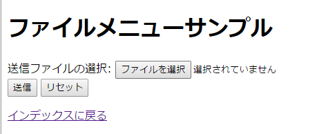
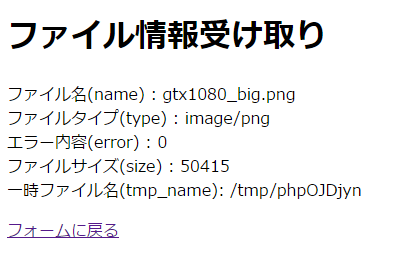
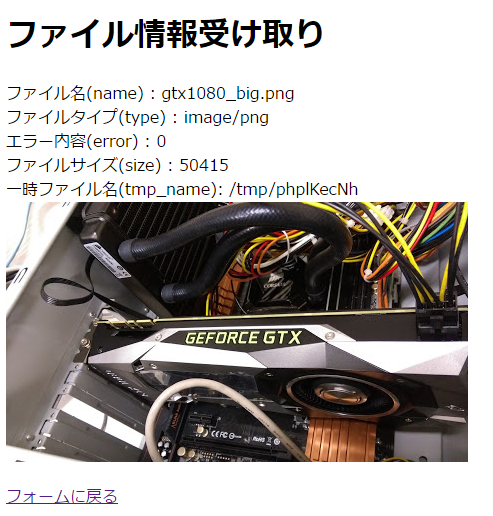
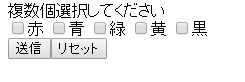
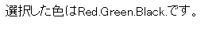
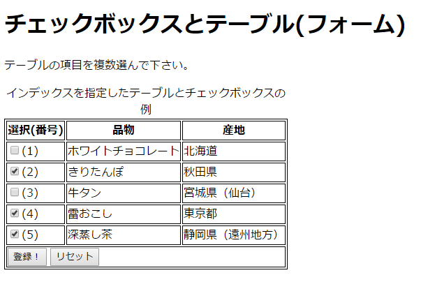

# ファイルメニューとチェックボックス入力の受け取り

------

ここでは前のページで説明しなかったファイルメニューとチェックボックス入力を受信する方法を解説します。

他のフォーム入力要素と分けて説明する理由は，この２つだけ明確に他とは違う受信方法を取る必要があるからです。ファイルメニューは選択したファイルの情報と中身，チェックボックスは選択した複数の項目から内容が送られてくることを想定しなくてはいけません。

## ファイルメニュー入力の受信

ファイルメニューからの入力データの受け取りでは，指定したファイルをそのまま送信することはできないので，form属性の`enctype="multipart/form-data"`でコード化したデータをやり取りすることになります。

### ファイルメニュー専用の変数とファンクション

`$_FILES[ファイルメニューのname属性値]`: ファイルメニューの時のみ使用される固定名の変数（配列）です。 $_FILESは連想配列となっており，送信ファイルの情報が複数の内容に分かれて入っています。ファイルそのものはPHPの設定で指定された一時保管ファイルに保存されますが，そのファイル名もここに格納されています。

### 送信内容情報の一部を表示させるプログラムの例

ファイルメニュー(`name="sample"`)を持つフォームをHTMLファイル`filemenu.html`に作り，submitボタンを押すとその内容をPHPスクリプト`filemenu.php`に送信するように設定します。


HTMLファイル：filemenu.html

```html
<!DOCTYPE html>
<html>
<head>
    <meta charset="utf-8">
    <title>ファイルメニューサンプル(複数ファイル受け取り対応版)</title>
</head>
<body>
  <form id="fileform" action="filemenu.php" method="post" enctype="multipart/form-data">
    送信ファイルの選択: <input id="fileinput" type="file" name="sample"><br>
    <input type="submit" value="submit">
    <input type="reset" value="reset">
  </form>
  <p><a href="index.html">go back</a></p>
</body>
</html>
```


これをブラウザで表示すると，下記のような画面になります。「ファイルを選択」ボタンがファイルメニューで，ここにローカルのファイルを指定しておき，submitボタンを押すとその内容がPHPスクリプトに渡ります。この場合はファイルは一つだけ送られるものと仮定していますが，複数ファイルをまとめて指定することも可能です。

ブラウザの表示

[](http://cs-tklab.na-inet.jp/phpdb/Chapter2/fig/filemenu_html_browser.png)


受信する`$_FILES['sample']`配列を`$file`にコピーして表示しています。扱うのは

* $file['name'] = $_FILES['sample']['name']

  アップロードしたファイル名

* $file['type']

  ファイルのタイプ

* $file['error']

  (発生していれば)アップロード時のエラー

* $file['size']

  ファイルサイズ

* $file['tmp_name']

  アップロードされた一時保管ファイルパス(フォルダ名＋ファイル名)

だけを表示しています。

PHPスクリプト：filemenu.php

```php
<!DOCTYPE html>
<html>
<head>
    <meta charset="utf-8">
    <title>ファイル情報受け取り</title>
</head>
<body>
    <h1>ファイル情報受け取り</h1>
    <?php $file = $_FILES['sample']; ?>
    <p>name: <?=$file['name']?></p>
    <p>type: <?=$file['type']?></p>
    <p>error <?=$file['error']?></p>
    <p>size <?=$file['size']?></p>
    <p>tmp_name <?=$file['tmp_name']?></p>
    <p><a href="filemenu.html">return to form</a></p>
</body>
</html>
```


画像ファイルをアップロードして成功すると，下記のような表示になります。

画面の表示

[](http://cs-tklab.na-inet.jp/phpdb/Chapter2/fig/filemenu_php_browser.png)


アップロードされたファイルをサーバ側で利用する場合は，`move_uploaded_file`ファンクションを利用して，一時保管ファイルを適切なフォルダ位置に移動します。下記に示すように，16行目以降を次のように書き換えることで，画像ファイルがアップロードされれば，PHPスクリプトと同じフォルダ位置に，元のファイル名で保管することができます。

プログラム：filemenu.php


```html
<!DOCTYPE html>
<html>
<head>
    <meta charset="utf-8">
    <title>ファイル情報受け取り</title>
</head>
<body>
    <h1>ファイル情報受け取り</h1>
    <?php
        $file = $_FILES['sample'];
        // 一時ファイルをカレントディレクトリに移動
        move_uploaded_file($file['tmp_name'], './'.$file['name']);
    ?>
    <p>name: <?=$file['name']?></p>
    <p>type: <?=$file['type']?></p>
    <p>error <?=$file['error']?></p>
    <p>size <?=$file['size']?></p>
    <p>tmp_name <?=$file['tmp_name']?></p>
    <!-- 画像ファイルは正常に閲覧できるはず -->
    >
    <p><a href="filemenu.html">return to form</a></p>
</body>
</html>
```


画像ファイルのアップロードが成功し，元のファイル名で保管されると，下記のようにブラウザ画面に画像が表示されるようになります。

画面の表示

[](http://cs-tklab.na-inet.jp/phpdb/Chapter2/fig/filemenu2_php_browser.png)


アップロードされた一時保管ファイルを移動する先のフォルダ(ディレクトリ)には，Apacheが書き込みできる権限が与えられている必要があります。書き込み権限がないと，move_uploaded_fileファンクションの処理が失敗して画像を元のファイル名で保管することができません。エラーなしで正常にアップロードされているのに画像が表示されない時には，Apache(Others)に対してフォルダの書き込み権限が与えられているかどうかを確認して下さい。

------

## チェックボックス

チェックボックスの場合，選択された項目の数だけ配列となって内容が送信されてきます。従って， 送信された配列の中身を全て表示させるためには，PHPのfor文，またはforeach文によるループ（繰り返し指定） を使う必要があります

### 送信内容をすべて表示させるプログラムの例

プログラム：checkbox.html

```html
<!DOCTYPE html>
<html>
<head>
    <meta charset="utf-8">
    <title>ファイルメニューサンプル(複数ファイル受け取り対応版)</title>
</head>
<body>
  <form action="checkbox.php" method="post">
    <p>複数個選択してください。</p>
    <label><input type="checkbox" name="sample[]" value="Red">Red</label>
    <label><input type="checkbox" name="sample[]" value="Blue">Blue</label>
    <label><input type="checkbox" name="sample[]" value="Green">Green</label>
    <label><input type="checkbox" name="sample[]" value="Yellow">Yellow</label>
    <label><input type="checkbox" name="sample[]" value="Black">Black</label>
    <br>
    <input type="submit" value="submit">
    <input type="reset" value="reset">
  </form>
</body>
</html>
```


画面の表示

[](http://cs-tklab.na-inet.jp/phpdb/Chapter2/fig/image4-3.PNG)


プログラム：checkbox.php

```html
<!DOCTYPE html>
<html>
<head>
    <meta charset="utf-8">
    <title>チェックボックス受け取り</title>
</head>
<body>
    <p>選択した色は<?=htmlspecialchars(implode(', ', $_POST['sample']))?>です。</p>
</body>
</html>
```


画面の表示

[](http://cs-tklab.na-inet.jp/phpdb/Chapter2/fig/image4-4.PNG)


## チェックボックスによる複数項目・複数データの受信

下記のように，複数の項目から成るテーブルのデータを，左のチェックボックスにチェックされたものだけ複数受信するためにはどうしたらいいでしょうか？


[](http://cs-tklab.na-inet.jp/phpdb/Chapter2/fig/checkbox_table_sample_empty.png)


前のチェックボックスの例で見たように，inputタグのname属性に`sample[]`のようにして，変数名に大かっこ（`[ ]`）を付けると，PHP側では受信した`$_POST['sample']`が配列になります。この仕組みはチェックボックスだけでなく，どのinputタグでも利用可能です。

これを利用して，複数データを複数項目に渡って受信できるようにしましょう。

下記のように，テーブルの各項目の値を`hidden`属性を与えたinputタグで埋め込んでおき，name属性をそれぞれ`index[]`, `items[]`, `area[]`のように大かっこを付けて指定します。

下記のHTMLフォームでは，更に大かっこの中のキー(インデックス)を各項目で共通にしておくために，`index[キー値]`, `items[キー値]`・・・のようにキー値を明示的に指定しています。指定がない場合は，`items[0]`, items[1], ...のようにゼロ(0)からキー値が自動的に割り振られます。

ここに例示したHTMLではキー値を1, 2, ...に指定していますが，PHPの配列の添字として使用できる文字列を指定することも可能です。

HTMLファイル(フォーム部のみ抜粋): checkbox_table1.php

```php
<?php
    $data = [
        ['item'=>'ホワイトチョコレート', 'area'=>'北海道'],
        ['item'=>'きりたんぽ', 'area'=>'秋田県'],
        ['item'=>'牛タン', 'area'=>'宮城県(仙台)'],
        ['item'=>'雪おこし', 'area'=>'東京都'],
        ['item'=>'深蒸し茶', 'area'=>'静岡県(遠州地方)']
    ];
?>
<!DOCTYPE html>
<html>
<head>
    <meta charset="utf-8">
    <title>チェックボックスとテーブル(フォーム)</title>
</head>
<body>
  <h1>チェックボックスとテーブル(フォーム)</h1>
  <p>テーブルの項目を複数選んでください。</p>
  <form action="checkbox_table2.php" method="post">
    <table style="border: thin double;">
      <caption>インデックスを指定したテーブルとチェックボックスの例</caption>
      <thead>
        <tr><th>選択(番号)</th><th>品物</th><th>産地</th></tr>
      </thead>
      <tbody>
        <?php foreach($data as $i => $d) { ?>
            <tr>
                <td><label><input type="checkbox" name="index[<?=$i?>]" value="<?=$i?>">(<?=$i?>)</label></td>
                <td><?=$d['item']?></td><input type="hidden" name="items[<?=$i?>]" value="<?=$d['item']?>">
                <td><?=$d['area']?></td><input type="hidden" name="area[<?=$i?>]" value="<?=$d['area']?>">
            </tr>
        <?php } ?>
      </tbody>
      <tfoot>
          <tr>
              <td colspan="3">
                  <input type="submit" value="submit">
                  <input type="reset" value="reset">
              </td>
          </tr>
      </tfoot>
    </table>
  </form>
</body>
</html>
```


さすれば，受信する側のPHPスクリプトでは，この大かっこ付きのname属性を与えられたinputタグの値が，配列として`$_POST['index']`, `$_POST['items']`, `$_POST['area']`に渡されます。キー値(`$key`)も共通ですので，これを使って他の配列の値を取り出すこともできるようになっています。

PHPスクリプト: checkbox_table2.php

```php
<!DOCTYPE html>
<html>
<head>
    <meta charset="utf-8">
    <title>チェックボックスとテーブル(受信)</title>
</head>
<body>
  <h1>チェックボックスとテーブル(受信)</h1>
  <p>テーブルの項目を複数選んでください。</p>
  <span>選択した項目は</span>
    <?php foreach($_POST['index'] as $index) { ?>
        <p>
            <?=htmlspecialchars($index, ENT_QUOTES)?>
            <?=htmlspecialchars($_POST['items'][$index], ENT_QUOTES)?>
            <?=htmlspecialchars($_POST['area'][$index], ENT_QUOTES)?>
        </p>
    <?php } ?>
    <span>です。</span>
  </p>
  <p><a href="checkbox_table1.html">フォームに戻る</a></p>
</body>
</html>
```


このようにすると，HTMLフォームから(2), (4), (5)のみチェックを付けて選択すると，


[](http://cs-tklab.na-inet.jp/phpdb/Chapter2/fig/checkbox_table_sample_checked_2-3-5.png)


として，`index[2], items[2], area[2]`と`index[4], items[4], area[4]`，そして`index[5], items[5], area[5]`がPHPスクリプトに送られ，これを取り出すことができるようになります。


[](http://cs-tklab.na-inet.jp/phpdb/Chapter2/fig/checkbox_table_sample_checked_2-3-5_php.png)


submitボタンが押された結果，上記のように表示されれば，複数項目を一気に受信できたことが分かります。
