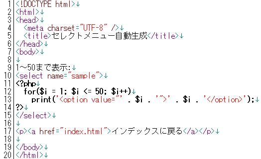
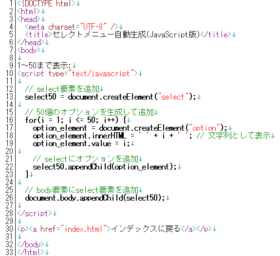
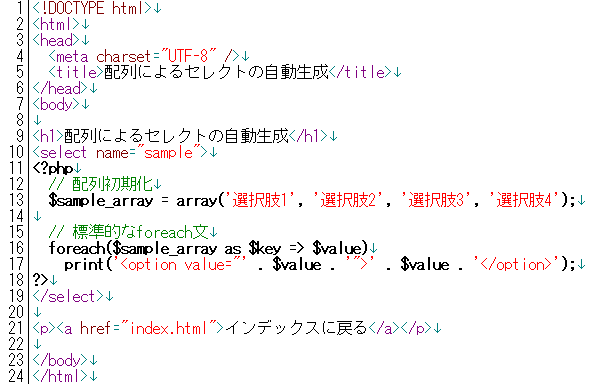
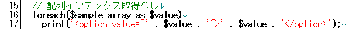
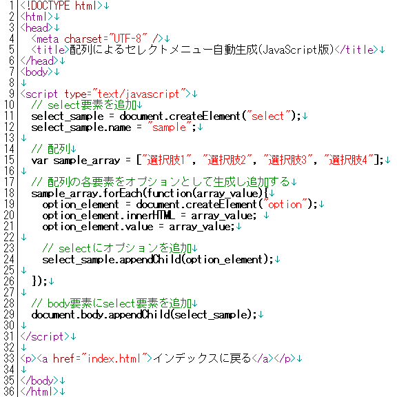

* [←ファイルメニューとチェックボックスの受け取り](http://cs-tklab.na-inet.jp/phpdb/Chapter2/PHP4.html)
* [ホーム](http://cs-tklab.na-inet.jp/phpdb/index.html)
* [if文→](http://cs-tklab.na-inet.jp/phpdb/Chapter2/PHP6.html)

# PHPとJavaScriptによるフォームの生成

------

PHPの制御文をうまく使うことで，面倒なHTMLフォームの生成を省力化できるケースがあります。ここでは比較的簡単な事例を紹介します。

以降の章では，データの保存・検索をPHPスクリプトを介してデータベースで行うようになりますが，扱うデータの内容や数量に応じてフォームの形式を変えたい時にはPHPの方で制御できると便利です。

ここで紹介する自動生成方法はJavaScriptでも可能です。状況に応じてPHPとJavaScriptをうまく使い分けて下さい。

## for文を用いたリストメニュー

たくさん選択肢を用意する必要がある場合は，PHPのfor文，あるいはforeach文を使って生成すると楽ができます。

PHPスクリプト

ブラウザの表示

`for`：指定した条件まで繰り返す制御文です。for文は3つの条件を指定する構成になっており，

for (初期値の設定; 繰り返しを続ける条件; 繰り返し実行する部分の最後に行われる計算) {
　　...繰り返し実行する部分...
}

という形で使用します。

上記の例の場合，

1. まず条件設定として変数$iを作成し初期値を1とし
2. 繰り返し条件は$iが50を超えるまで
3. 繰り返しの最後に$iに+1し，上限値まで届くようにする

というように設定しています。

HTMLとしての表示は，printを使い，変数`$i`だけを`'...'`から外して表示しています。こうしてリストメニューの選択肢を50個生成している訳です。

### JavaScriptの場合

前の章で解説した通り，リストメニュー(select要素)をJavaScriptから動的に生成することも可能です。上記の例をJavaScriptで書くと，例えば次のように記述します。

JavaScript入りHTMLファイル(PHPファイルでも可)

ブラウザ画面はPHPと同じになりますので省略します。先生役の人はPHP版とどこが異なるのかを解説しましょう。(ブラウザからソースを見せると分かりやすい。）

## 配列とforeach文を用いたドロップダウンメニューの自動生成

プログラム

画面の表示

配列に入っている値を使ってセレクトによるドロップダウンメニューを自動生成します。この事例ではPHPに備わっている下記の機能を使っています。

* array();配列の初期値を設定する
* foreach：配列の中身をすべて取り出すまで繰り返す

変数$sample_arrayの初期値を，`array( )`を使用して配列としてまとめて設定しています。この場合は，`$sample_array[0] = '選択肢1', ...`のようにインデックスと値が設定されます。

for文を使って配列の中身を取り出すことは可能ですが，全ての要素を取り出すためには`foreach`文の方が配列の要素数，インデックスの形式に依存せず使用できるため，楽に使用できます。

foreachの構文は下記のようになります。

foreach (配列名 as インデックス => 値){
　　...繰り返し実行する部分...
}

インデックスを使用しない上記のようなケースは，`<インデックス => 値`の部分を省略して`値`だけを代入するように書くこともできます。例えば上記の例では17行目を下記のように書くことができます。

### JavaScriptの場合

JavaScriptで配列を作り，その要素から動的にリストメニューを生成するためには，次のように配列クラスのメソッドである`配列.forEach`を使うと便利です。上記の例をJavaScriptで書くと，例えば次のように記述します。

JavaScript入りHTMLファイル(PHPファイルでも可)

ブラウザ画面はPHPと同じになりますので省略します。先生役の人はPHP版とどこが異なるのかを解説しましょう。

------

* [←ファイルメニューとチェックボックスの受け取り](http://cs-tklab.na-inet.jp/phpdb/Chapter2/PHP4.html)
* [ホーム](http://cs-tklab.na-inet.jp/phpdb/index.html)
* [if文→](http://cs-tklab.na-inet.jp/phpdb/Chapter2/PHP6.html)

Copyright (c) 2014-2017 幸谷研究室 @ 静岡理工科大学 All rights reserved.
Copyright (c) 2014-2017 T.Kouya Laboratory @ Shizuoka Institute of Science and Technology. All rights reserved.