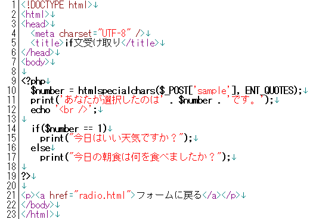

* [←PHPによるフォームの生成](http://cs-tklab.na-inet.jp/phpdb/Chapter2/PHP5.html)
* [ホーム](http://cs-tklab.na-inet.jp/phpdb/index.html)
* [セッション→](http://cs-tklab.na-inet.jp/phpdb/Chapter2/PHP7.html)

# if文

------

## フォーム入力値による処理内容の変更

変数の値によって処理内容を変更したい時にはif文を使います。下記の例では，選択されたラジオボタンの値によって表示を変更しています。

HTMLファイル：radio.html

PHPスクリプト：radio.php

ラジオボタン選択画面

上記のラジオボタン選択画面から，①と②を選ぶことができます。①が選ばれた時には1，②が選ばれた時には2がPHPスクリプトに送られ，それに応じて次のように表示を変更しています。

* ①を選んだ場合の表示

  

* ②を選んだ場合の表示

  

`if`文は変数の内容に応じて処理を変更したい時に使います。ここではラジオボタンの選択によって表示する内容を変更しています。

この場合は，条件では1を選んだ場合のほかにはelseだけですが，これはそれ以外の全ての場合を表しているので2択の場合はこれで十分です。

## 入力への警告について

フォームの入力値に対する自動チェック機能はJavaScriptでも実装することができます。状況に応じてPHPとJavaScriptをうまく使い分けて下さい。

フォームを送信する前に入力内容をチェックしておく必要があります。場合によってはエラーとして排除しなくてはなりません。 以下では様々なケースでif文を使って入力値を確認する事例を紹介していきます。

### フォームの内容が空の場合

次のフォームはテキストボックス(`name="input"`)からPOSTメソッドを使って文字列を`input.php`に送信します。

HTMLファイル：input.html

ブラウザで表示すると次のようになります。

入力値を受け取るPHPスクリプト`input.php`で入力値が空かどうかチェックするには`empty関数`を使います。

PHPスクリプト：input.php

この処理によって，次のように入力値が空かどうかを確認できます。

* 画面の表示：内容あり

  

* 画面の表示：内容なし

  

ifの条件文にempty関数を使うことで，変数が空であるかないかを判断して表示を分けています。これによって入力欄が空である時の表示エラーを防ぐことができます。

### 入力内容が数字であるかないか

入力内容を限定したい時がある時には，PHPの関数を利用して入力値の種別を判別します。ここでは整数値（半角数字のみ）の入力値かどうかを判断する事例を紹介します。

フォームは下記のように作ります。

HTMLファイル：number.html

上記のHTMLファイルをブラウザで表示すると下記のような画面になります。

ブラウザの表示

入力値を判断するには下記のように`is_numeric関数`を使います。

全角数字でも対応できるように`mb_convert_kana関数`を使って半角数字に変換も行っています。ここでは全角を半角に変換するためにmb_convart_kanaの2番目のパラメータに｢n｣を入力しています。

PHPスクリプト：number.php

* 数字のみの文字列の場合

  

* 画面の表示：数字以外

  

### 正規表現を利用した文字列形式のチェック

電話番号や郵便番号のように形式の決まった文字列だけを扱いたい時に重宝するのが正規表現(regular expression)を利用した文字列形式チェックです。

PHPでは`preg_match関数`を使うことで，指定した正規表現による文字列の照合を行うことができます。これによって文字列の形式をチェックすることができます。

正規表現の指定方法はたくさんあるので，ここでは文字列が電話番号の書式にのっとっているかを確認する例だけを示します。使用するのは下記の正規表現の書法です。

* `/(スラッシュ)`で囲まれた内側が正規表現による文字列の形式の指定になります
* `\A`は文字列の先頭を，`\z`は改行などを除いた文字列の終端であることを意味します
* `\d`はその文字が数字であることを意味します。`\d{n}`とすると，数字がn文字連続していることを意味します
* `\-`は-(ハイフン)を意味します

htmlファイル：regular.html

ブラウザ画面の表示

電話番号の書式に則っているかどうかを`preg_match関数`で確認するPHPスクリプトは次のようになります。

プログラム：regular.php

正しい書式かどうかで画面の出力結果が下記のように変化します。

* 正しい電話番号の書式である場合

  

* 電話番号の書式でない場合

  

------

## PHPとJavaScript

PHPスクリプトはサーバーサイド，つまり，Webサーバ側で実行されるプログラムです。それに対して，HTMLやJavaScriptはブラウザ側で実行されてレンダリングして画面に表示されます。従って，Webサーバ側にあるPHPスクリプトをにアクセスすると

1. Webサーバ側： PHPスクリプトを実行
2. ブラウザ側 ： PHPスクリプトの実行結果(標準出力)をHTML & JavaScriptとして実行

という順番で実行されます。この仕組みを理解するために，下記のPHPスクリプトを作成し，実行してみましょう。

javascript_output.php

上記のPHPスクリプトは35行目～58行目にあたります。ここで，PHPの変数`$run_output1`, `$run_output2`の値を40行目，50行目のPHPのif文でチェックし，値が1の場合は，それぞれに対応するJavaScriptの関数`output1_function`(`$run_output1 = 1`の時)，`output2_function`(`$run_output2 = 1`の時)を出力し，ブラウザ側に渡して実行させています。

実際に，`$run_output1`, `$run_output2`の値を変化させて実行させると，次のようにブラウザ側に渡される出力内容(JavaScript)が変化し，実行結果も変わってきます。

$run_output1 = 1, $run_output2 = 0の時

実行結果

$run_output1 = 0, $run_output2 = 1の時

実行結果

現代のWebアプリケーションでは，サーバ側で実行されるプログラムと，ブラウザ側で実行させるスクリプトでそれぞれ役割分担を行っています。処理内容に応じてPHPとJavaScriptの組み合わせが自在にできるよう，精進していきましょう。

------

* [←PHPによるフォームの生成](http://cs-tklab.na-inet.jp/phpdb/Chapter2/PHP5.html)
* [ホーム](http://cs-tklab.na-inet.jp/phpdb/index.html)
* [セッション→](http://cs-tklab.na-inet.jp/phpdb/Chapter2/PHP7.html)

Copyright (c) 2014-2017 幸谷研究室 @ 静岡理工科大学 All rights reserved.
Copyright (c) 2014-2017 T.Kouya Laboratory @ Shizuoka Institute of Science and Technology. All rights reserved.