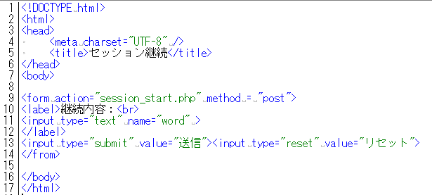
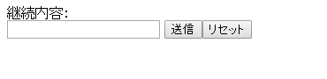
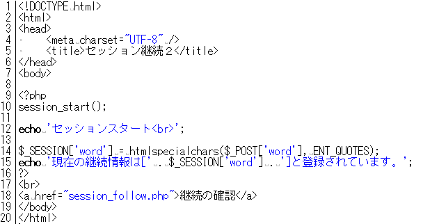
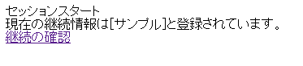
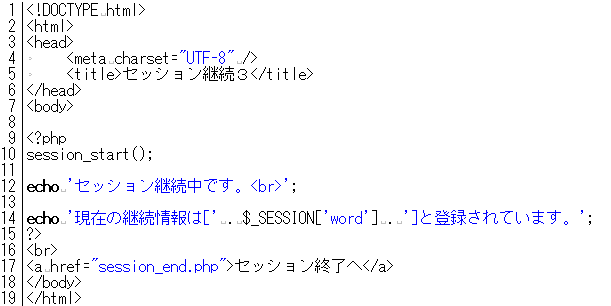
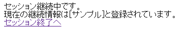
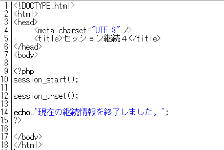

* [←if文](http://cs-tklab.na-inet.jp/phpdb/Chapter2/PHP6.html)
* [ホーム](http://cs-tklab.na-inet.jp/phpdb/index.html)
* [練習問題→](http://cs-tklab.na-inet.jp/phpdb/Chapter2/lesson2.html)

# セッション

------

セッションとは，PHPシステム側で用意される時限付きの状態記憶機能です。セッションが有効である間は固有の変数（セッション配列）である`$_SESSION`を使うことができ，どのPHPスクリプトであってもセッションを有効にすればこの`$_SESSION`に記憶された値を共有し，読み書きすることができるようになります。これによって，例えば一度ログインしたユーザかどうかの情報をどのページでも確認することが可能になります。

------

## セッションを使用する際に必要な注意

* セッションを使用するページでは，必ず最初に`session_start`ファンクションを使用し，初期化処理を行う必要があります。
* セッションが開始されると，終了処理が行われるまでセッション配列の情報は保持されます。使用時には必ず次の項目であるセッションの終了処理を行って下さい。さもなければ，意図しないページを埋め込まれた時に，セッション配列を通じて情報が漏えいする可能性が出てきます(セッションハイジャック)。セッションの開始と終了は必ずセットにして実行して下さい。

## セッションの利用例

セッション配列`$_SESSION`に値を格納し，別ページでも利用できること確認しましょう。ここで使用するファイルと，セッション変数の共用の様子を示したものが下記の図になります。一通り実行した後で，`$_SESSION['word']`に格納された値がどのように共通化されているのか，もう一度確認して下さい。

### セッションの開始

まず，次のフォームから値を入力します。

HTMLファイル：session_form.html

画面の表示

フォームから受け取ったデータ`$_POST['word']`をセッション配列`$_SESSION['word']`に格納するスクリプトは次のようになります。

PHPスクリプト：session_start.php

### セッション変数の利用

`$_SESSION['word']`に入力された値を表示して確認し，ページ下のリンクをクリックして別のPHPスクリプト`session_follow.php`に飛んでみましょう。

画面の表示

前のページと同じ値が`$_SESSION['word']`から取得できるか確認するPHPスクリプトが下記になります。

PHPスクリプト：session_follow.php

同じ値が入っていることを確認したら，ページ下のリンクからセッションを終了させるPHPスクリプトに飛びます。

画面の表示

### セッションの終了

セッションを終了するには`session_unset()`，あるいは`session_destroy()`ファンクションを使います。

`session_unset関数`は全てのセッションを終了させます。セッション配列の個別のインデックスを消去するには`unset($_SESSION[インデックス])`とします。

PHPスクリプト：session_end.php

画面の表示

------

* [←if文](http://cs-tklab.na-inet.jp/phpdb/Chapter2/PHP6.html)
* [ホーム](http://cs-tklab.na-inet.jp/phpdb/index.html)
* [練習問題→](http://cs-tklab.na-inet.jp/phpdb/Chapter2/lesson2.html)

Copyright (c) 2014-2017 幸谷研究室 @ 静岡理工科大学 All rights reserved.
Copyright (c) 2014-2017 T.Kouya Laboratory @ Shizuoka Institute of Science and Technology. All rights reserved.