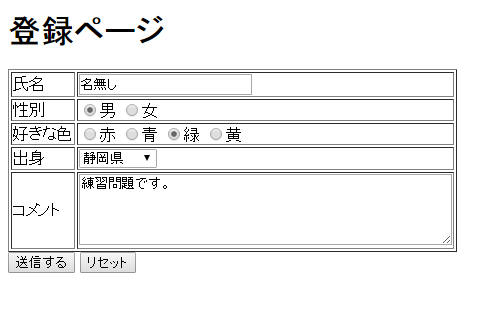
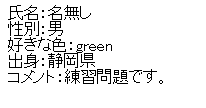
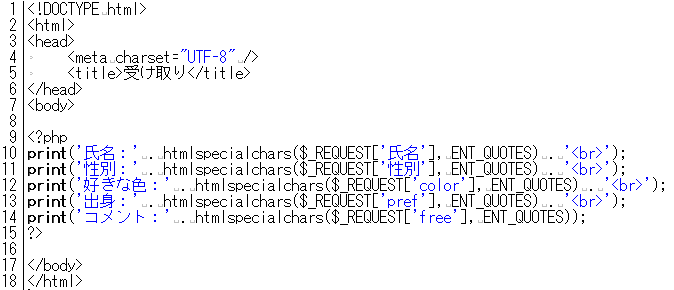

* [←セッション](http://cs-tklab.na-inet.jp/phpdb/Chapter2/PHP7.html)
* [ホーム](http://cs-tklab.na-inet.jp/phpdb/index.html)
* [解答例→](http://cs-tklab.na-inet.jp/phpdb/Chapter2/lesson2-A.html)

# 練習問題

------

[第1章の練習問題](http://cs-tklab.na-inet.jp/phpdb/Chapter1/lesson1.html)で制作した登録フォームの入力を受け取って表示するPHPスクリプトを制作しましょう。受け渡す方法(GETかPOSTか）や，フォーム入力データを受け渡すPHPスクリプトファイル名（～.php）の指定は適切なものを自分で指定して下さい。

画面の表示

------

分からないところは最初からあきらめずに自分で調べましょう。 どこを見ればいいか分からないときは下のヒントを見ましょう。

[ヒント(別窓で開きます)](http://cs-tklab.na-inet.jp/phpdb/Chapter2/PHP3.html)

------

* [←セッション](http://cs-tklab.na-inet.jp/phpdb/Chapter2/PHP7.html)
* [ホーム](http://cs-tklab.na-inet.jp/phpdb/index.html)
* [解答例→](http://cs-tklab.na-inet.jp/phpdb/Chapter2/lesson2-A.html)

Copyright (c) 2014-2017 幸谷研究室 @ 静岡理工科大学 All rights reserved.
Copyright (c) 2014-2017 T.Kouya Laboratory @ Shizuoka Institute of Science and Technology. All rights reserved.

* [←問題へ戻る](http://cs-tklab.na-inet.jp/phpdb/Chapter2/lesson2.html)
* [ホーム](http://cs-tklab.na-inet.jp/phpdb/index.html)

# 解答例

------

------

* [←問題へ戻る](http://cs-tklab.na-inet.jp/phpdb/Chapter2/lesson2.html)
* [ホーム](http://cs-tklab.na-inet.jp/phpdb/index.html)

Copyright (c) 2014-2017 幸谷研究室 @ 静岡理工科大学 All rights reserved.
Copyright (c) 2014-2017 T.Kouya Laboratory @ Shizuoka Institute of Science and Technology. All rights reserved.