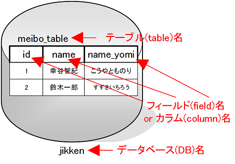
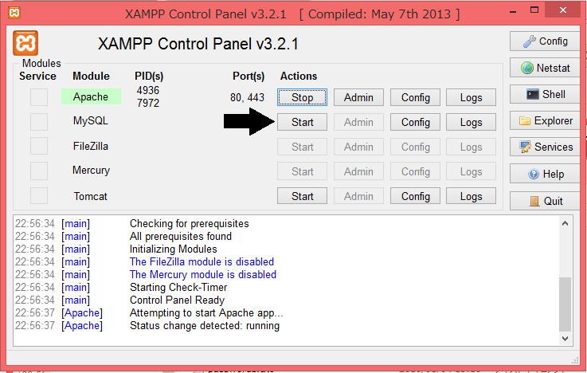
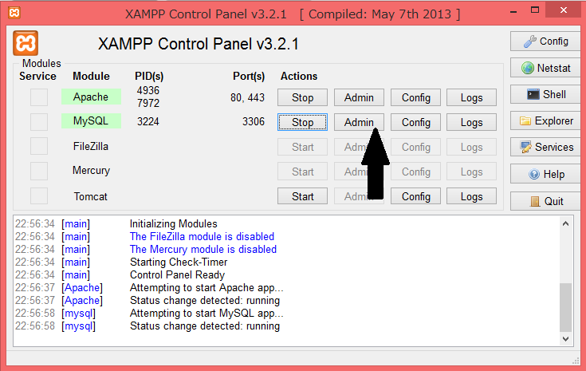
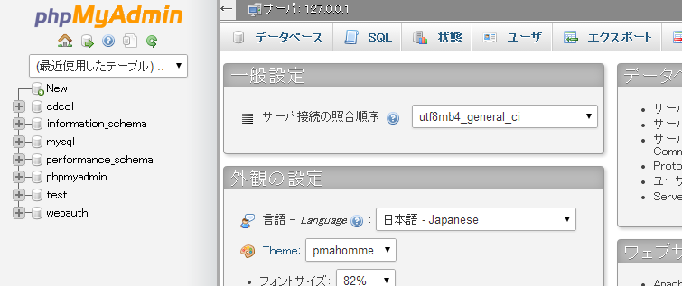

* [ホーム](http://cs-tklab.na-inet.jp/phpdb/index.html)
* [新規データベースの作成→](http://cs-tklab.na-inet.jp/phpdb/Chapter3/DB2.html)

# データベース

------

## リレーショナルデータベース(RDB)とは

データベース(Database)とは，データを保守・管理して使用しやくすしたソフトウェアの総称です。

現在のデータベースは，データをテーブル(table)としてひとまとめにし，テーブルを複数まとめたデータベース(database)として管理します。更に，テーブルやデータベースに対してデータの関連(Relation)を生かした検索等のデータ管理を行う，リレーショナルデータベース(Relational DataBase, RDB)が今のデータベースの主流です。データの管理システム(Management System)を加えて，RDBMSとも呼ばれます。

現在使用されているRDBMSとしては，[SQLite](https://www.sqlite.org/), [SQLserver](https://www.microsoft.com/en-us/sql-server/), [PostgreSQL](https://www.postgresql.org/), [Oracle](https://www.oracle.com/)等，たくさんの種類がありますが，この教材ではXAMPPに同梱されている[MySQL](https://www.mysql.com/)(あるいは[MariaDB](https://mariadb.org/))を使用します。

データを格納するだけなら単なるファイルで十分です。しかし，記録されているデータが増えてくると，データのグループ化(grouping)を行ったり，並べ替え(sorting)したりといった複雑な処理が求められるようになります。このようなデータに対する複雑な処理を，SQL(エスキューエル)という一連の命令を使うことで，簡単に実施できるところがRDBのメリットです。

この章では[phpMyAdmin](https://www.phpmyadmin.net/)というPHPによるWebアプリケーションを介してMySQLを使用し，SQLの基本を解説します。

## MySQLとは

MySQLオープンソースで開発されており，非商用利用なら無料で使用することができ，高速なデータ処理を得意とします。XAMPP for Windowsでも，Webサーバとして使われることの多いLinuxでもMySQLはデフォルトで組み込まれており，PHPをはじめとする開発言語から簡単に利用できるため，世界各地で広く使用されています。

現在はMySQLから枝分かれしたMariaDBが使われることが多くなっていますが，今のところMySQLとの高い互換性を保っており，SQLやPHPのMySQL関係ファンクションがそのまま利用できます。

## SQLとは

SQLとはRDBを操作するためのプログラミング言語であり，国際的な標準規格となっています。

SQLはMySQL専用の言語ではありませんが，現実にはRDBソフトウェアごとに「方言」のような独自仕様が組み込まれており，完全な互換性は期待できないところがあります。ここではMySQL向きのSQLの基本を解説します。

RDBはSQL文を介してしか操作できませんので，今後PHPスクリプトからMySQLデータベースを利用する際にも必ずSQL文を構成して実行します。次のページ以降で基本的なSQL文を見ていくことにします。

## XAMPPを利用したMySQLとphpMyAdminの起動

MySQLは，データを保持・管理するMySQLサーバ(MySQL Server)と，MySQLサーバに接続してSQL文を通じてデータの入出力を行うMySQLクライアント(MySQL Client)から構成されます。従って，何はさておきMySQLサーバを起動しなくては何もできません。また，MySQLサーバの状態を見つつ，GUIを使って操作ができるphpMyAdminをMySQLクライアントとして利用できると何かと便利です。

MySQLサーバもphpMyAdminから利用できますので，以下では簡単にその起動方法を説明します。

### MySQLサーバの起動

1. XAMPP Control Panelを起動します。

2. これまで使用していたApacheを起動し，更にMySQLのStartボタンをクリックし，MySQLサーバを起動します。

   

   

   

### phpMyAdminの起動

[phpMyAdmin](https://www.phpmyadmin.net/)はPHPスクリプトで構成されたMySQLクライアントの一種で，WebベースのGUIからMySQLサーバに格納されているデータを操作することができます。従って，phpMyAdminを利用するには，Aapache + PHPが使用でき，なおかつMySQLサーバが起動している必要があります。

phpMyAdminはMySQLを利用するユーザの多くが利用している代表的な管理ツールですが，セキュリティ的に問題も見つかっており，利用する際には必ず最新版を使うようにして下さい。また，外部から利用できるところに設置しないように心がけて下さい。

1. XAMPP Control PanelからApacheとMySQLサーバを起動します。

2. 両社の起動を確認した後，MySQLのAdminボタンをクリックします。

   

   

   

3. ブラウザが立ち上がり，下記のようにphpMyAdminのトップ画面が開きます。ここから，MySQLのデータベースを編集することができるようになります。

   

   

   

以降ではこのphpMyAdminを通じてSQL文の基本と学びつつMySQLサーバを操作していきます。

------

* [ホーム](http://cs-tklab.na-inet.jp/phpdb/index.html)
* [新規データベースの作成→](http://cs-tklab.na-inet.jp/phpdb/Chapter3/DB2.html)

Copyright (c) 2014-2017 幸谷研究室 @ 静岡理工科大学 All rights reserved.
Copyright (c) 2014-2017 T.Kouya Laboratory @ Shizuoka Institute of Science and Technology. All rights reserved.