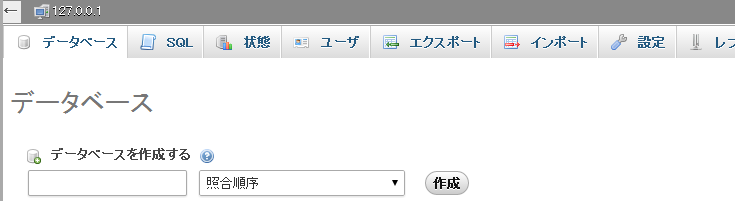
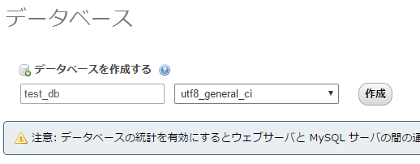

# 新規データベースの作成

------

前述した通り，全てのデータはテーブル(table)に格納され，そのテーブルを複数束ねて格納するフォルダのような役割を担うのが(狭義の)データベース(database)です。ここではphpMyAdminから新規にデータベースを作る手順を解説します。

1. phpMyAdminのトップページにあるデータベースのタブをクリックし，｢データベースを作成する｣という入力欄を探します。ここにデータベース名を書きます。

   [](http://cs-tklab.na-inet.jp/phpdb/Chapter3/fig/DB2-1.PNG)

2. データベース名は特に規制はありませんが，ここでは

   ```
   test_db
   ```

   とします。 照合順序は

   ```
   utf8_general_ci
   ```

   とし，以降で使う全ての文字データをUTF-8とします。

   [](http://cs-tklab.na-inet.jp/phpdb/Chapter3/fig/test_db_create.png)

3. データベースが作成されると，下のデータベース一覧に表示されるようになります。

4. [](http://cs-tklab.na-inet.jp/phpdb/Chapter3/fig/test_db_create_table.png)

データベース名における大文字小文字の区別はなく，`TEST_DB`や`Test_db`と打ち込んでも作成されるのは`test_db`になります。

以降はこの`test_db`データベース内にテーブルを作ってデータを扱っていきます。

[注意！] MySQLサーバに接続する際には必ずユーザ名とパスワードを必要とします。phpMyAdminを立ち上げる際にこの二つを入力する必要がない時にはユーザ名は`root`(管理者の意)，パスワードは`なし`になっているはずです。ローカルマシンだけで使う際には問題になることは少ないとは思いますが，セキュリティ的に好ましい状態でないことは自覚しておいて下さい。
