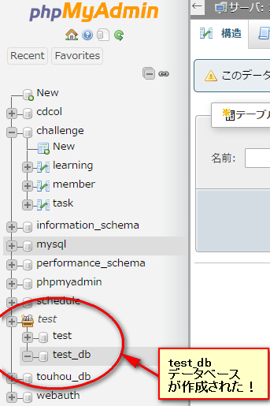
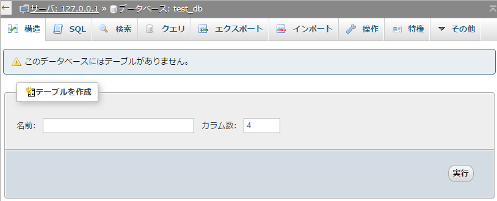
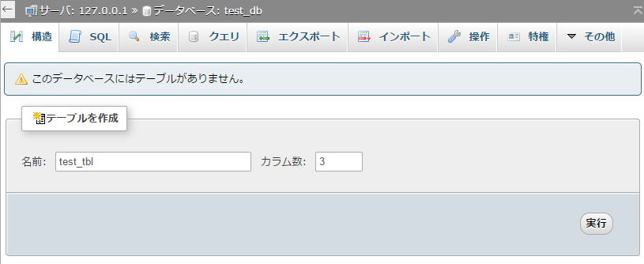
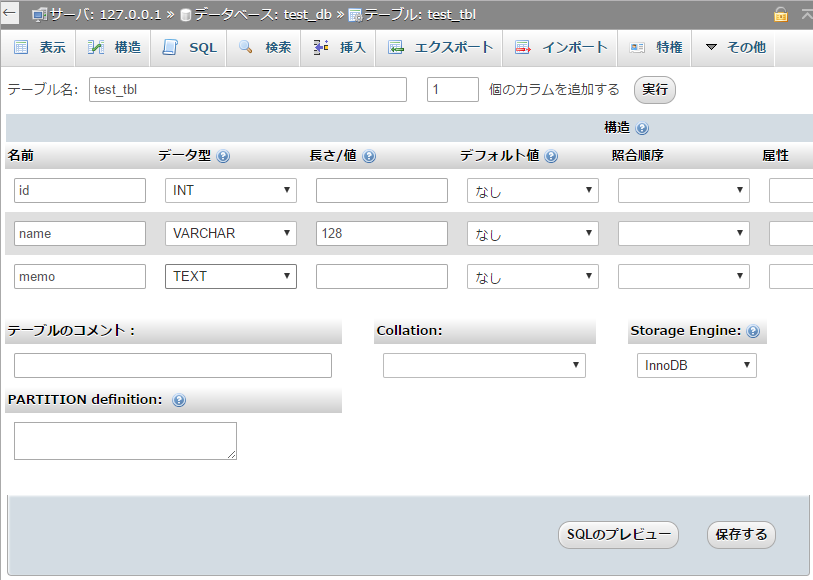
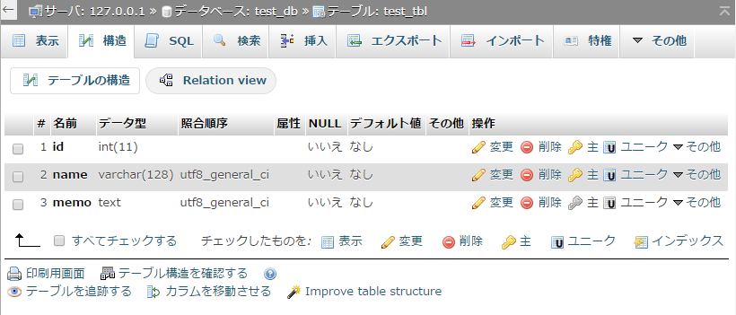
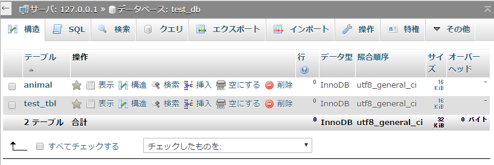

# テーブルの作成:CREATE

------

ここでは先ほど作成したデータベース`test_db`にテーブルを作ります。まずphpMyAdminのGUIを使ってテーブルを作る方法を使い，次にSQL文の一つであるCREATE命令を使ってテーブルを作ってみます。

## phpMyAdminの操作でテーブルを作る

1. phpMyAdminから作成したデータベース一覧を確認し，先ほど作成した

   ```
   test_db
   ```

   があることを確認します。サイドバーからも確認できます。

   [](http://cs-tklab.na-inet.jp/phpdb/Chapter3/fig/test_db_create_sidebar.png)

2. ```
   test_db
   ```

   をクリックすると下のような画面になります。 このデータベースは作成したばかりで何も設定を行っていないためテーブルが存在していません。

   [](http://cs-tklab.na-inet.jp/phpdb/Chapter3/fig/test_db_empty.png)

3. テーブルの名前を

   ```
   test_tbl
   ```

   (tblはtableの省略形)，カラム数(テーブルの列数)を

   ```
   3
   ```

   としてテーブルを作成します。

   [](http://cs-tklab.na-inet.jp/phpdb/Chapter3/fig/test_db_test_tbl_create.png)

4. 次のページではカラムの設定を行います。テーブル作成の時にカラム数を｢3｣にしたので3つの欄があります。ここでは次のように2つのカラムのデータ型を決定します。

   * 最初のカラムのフィールド名を`id`，データ型を`INT`(整数型)にする。
   * 2つ目のカラムのフィールド名を`name`，データ型を`VARCHAR(128)`(最大128文字分の可変長文字列型)にする。
   * 3つ目のカラムのフィールド名を`memo`，データ型を`TEXT`(長さ制限のない文字列型)にする。

   この設定ができたら

   ```
   保存する
   ```

   をクリックします。

   [](http://cs-tklab.na-inet.jp/phpdb/Chapter3/fig/test_db_test_tbl_field_after.png)

   出来上がった`test_tbl`のフィールド名，データ型を確認して下さい。

   [](http://cs-tklab.na-inet.jp/phpdb/Chapter3/fig/test_db_test_tbl_field_after2.png)

これでテーブル作成は完了です。

------

## SQL文でのテーブル作成:CREATE

phpMyAdminの操作だけでデータベースもテーブルも作成できることは今まで見てきましたが，これはSQLの`CREATE DATABASE`命令と`CREATE TABLE`命令を発行して実現しています。以下では後者の命令を使って実際にテーブルが作成できることを見ていきます。

1. SQL命令を入力するにはまず赤い矢印が付いているSQLの欄をクリックします。この欄はSQL文を入力するのに毎回使います。

   [](http://cs-tklab.na-inet.jp/phpdb/Chapter3/fig/test_db_sql.png)

2. 今回はテーブルを作成するので｢CREATE TABLE｣構文を使用します。書式は次のようになります。行末のセミコロン

   ```
   ;
   ```

   は2つ以上のSQL文をまとめて入力する際には必須ですが，1命令だけ発行する際には省略できます。

   [](http://cs-tklab.na-inet.jp/phpdb/Chapter3/fig/DB3-5.PNG)

3. 下記の3カラムのテーブル

   ```
   animal
   ```

   をデータベース

   ```
   test_db
   ```

   に作成します。

   | フィールド名 | データ型 |
   | :----------- | :------- |
   | id           | INT      |
   | name         | TEXT     |
   | size         | INT      |
   | memo         | TEXT     |

   これを実行するSQL文は下記のようになります。打ち込んだら

   ```
   実行
   ```

   ボタンをクリックしてテーブルを作成します。

   [](http://cs-tklab.na-inet.jp/phpdb/Chapter3/fig/test_db_create_animal.png)

4. 実行後は構造の欄をクリックして確認してみましょう。新しく作ったテーブルが増えているはずです。新しく作ったテーブルをクリックし，カラムの設定が正しいかどうか確認しましょう。

   [](http://cs-tklab.na-inet.jp/phpdb/Chapter3/fig/test_db_create_animal_test_tbl.png)
