* [←データ型の説明](http://cs-tklab.na-inet.jp/phpdb/Chapter3/DB4.html)
* [ホーム](http://cs-tklab.na-inet.jp/phpdb/index.html)
* [練習問題→](http://cs-tklab.na-inet.jp/phpdb/Chapter3/lesson3.html)

# データの挿入・変更・消去・検索

------

データベース`test_db`に2つのテーブル`test_tbl`と`animal`を作ったので，これを使ってデータの操作を行います。

## 値の挿入

まず，phpMyAdminのメニューから操作を行って`test_tbl`に下記の3つのデータを挿入してみましょう。

| id   | name  |
| :--- | :---- |
| 1    | 生物1 |
| 2    | 生物2 |
| 3    | 生物3 |

1. テーブルごとに「表示」，「構造」，「検索」，「挿入」，「空にする」，「削除」が選べますので，

   ```
   test_tbl
   ```

   行にある「挿入」をクリックします。

   [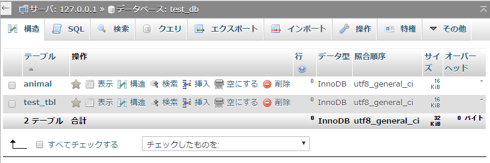](http://cs-tklab.na-inet.jp/phpdb/Chapter3/fig/test_db_create_animal_test_tbl.png)

2. 最初に

   ```
   id = 1
   ```

   ,

    

   ```
   name = "生物1"
   ```

   を

   ```
   test_tbl
   ```

   に挿入してみましょう。idの値に1を，nameの値に生物1と入力し，右下の「実行」ボタンをクリックします。

   [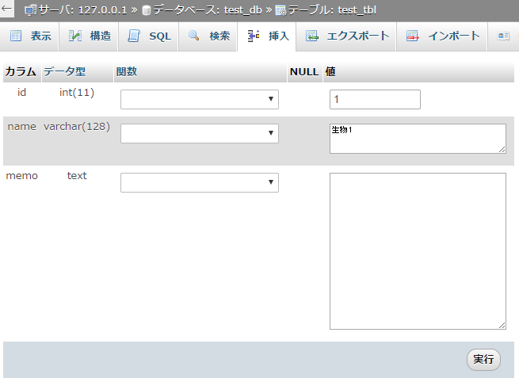](http://cs-tklab.na-inet.jp/phpdb/Chapter3/fig/test_db_test_tbl_insert1.png)

3. 挿入が正しく実行できれば，下記のように表示されます。実際に実行されたSQL文を読むこともできます。

   [](http://cs-tklab.na-inet.jp/phpdb/Chapter3/fig/test_db_test_tbl_insert1_after.png)

4. メニュー上部左の「表示」をクリックし，テーブルに正しく値が書きこまれていることを確認して下さい。

   [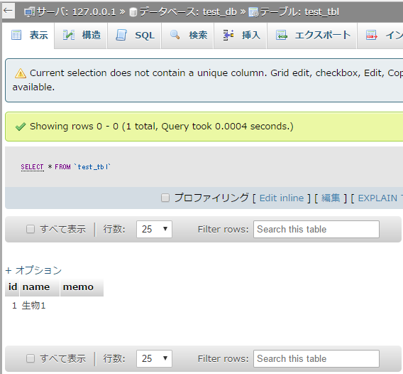](http://cs-tklab.na-inet.jp/phpdb/Chapter3/fig/test_db_test_tbl_insert1_after2.png)

5. 一通り動いたら，同様の手順で2行目の

   ```
   id = 2
   ```

   ,

    

   ```
   name = "生物2"
   ```

   も挿入してみて下さい。実行後は下記のように2行分の値があることを確認して下さい。

   [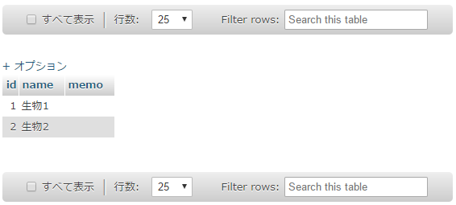](http://cs-tklab.na-inet.jp/phpdb/Chapter3/fig/test_db_test_tbl_insert2.png)

## idのオートインクリメント

すべての行に「id」があるのは，全てのフィールドが同じ値であっても区別できるようにするためです。このように，挿入するごとに必ず違う値になるように整数値を設定する機能として，MySQLにはオートインクリメント(Auto Increment, A_I)というものがあります。

`test_tbl`の3行目のデータのidを指定せずに挿入すると，自動的に「3」になるようidフィールドの設定を変更してみましょう。

1. ```
   test_tbl
   ```

   の「構造」をクリックし，idフィールドの「主」(主キー, primary keyの意味)をクリックし，主キーになるよう設定します。

   [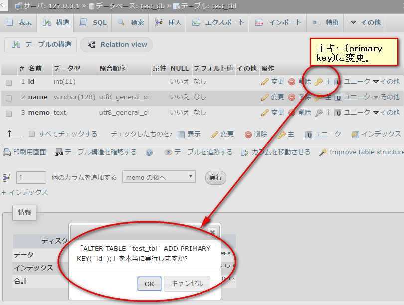](http://cs-tklab.na-inet.jp/phpdb/Chapter3/fig/test_db_test_tbl_id_change_primary_key.png)

2. idが主キーになっていることを確認し，更に設定を変更する。

   [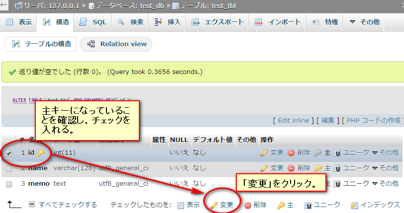](http://cs-tklab.na-inet.jp/phpdb/Chapter3/fig/test_db_test_tbl_id_change.png)

3. idの「A_I」(Auto Increment)をチェックして設定を保存する。

   [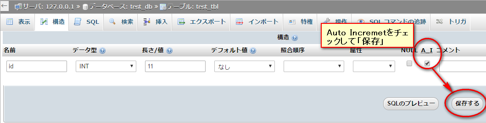](http://cs-tklab.na-inet.jp/phpdb/Chapter3/fig/test_db_test_tbl_id_change_ai.png)

4. ```
   test_tbl
   ```

   の構造を表示し，「id」が

   ```
   AUTO_INCREMENT
   ```

   に変更されていることを確認する。

   [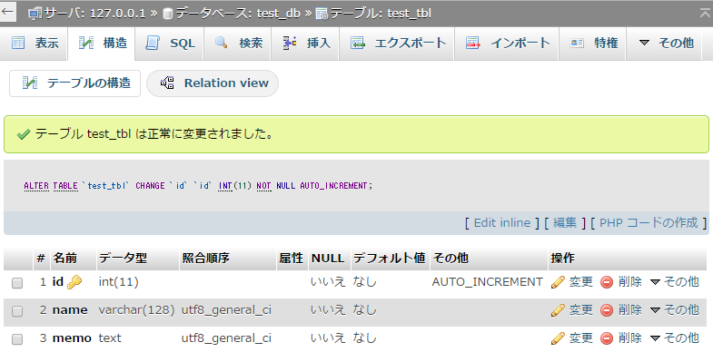](http://cs-tklab.na-inet.jp/phpdb/Chapter3/fig/test_db_test_tbl_id_confirm_ai.png)

idフィールドをオートインクリメントに設定できたら，次のように，idを空白にして値を挿入しても，idは自動的に値が増えて保存されることが確認できます。

[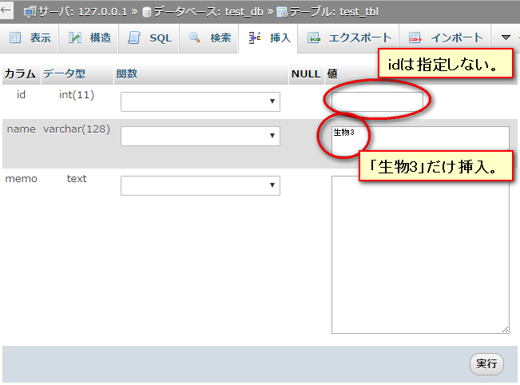](http://cs-tklab.na-inet.jp/phpdb/Chapter3/fig/test_db_test_tbl_id_insert4.png)


以上，当初の目的通り，3行分のデータが挿入できました。

[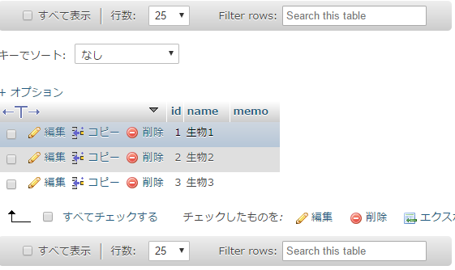](http://cs-tklab.na-inet.jp/phpdb/Chapter3/fig/test_db_test_tbl_insert4_finished.png)


idをオートインクリメントにすると，挿入時は無指定でも自動的にidが割り振られるので便利ですが，既存の最大idのデータを削除した後は，次に挿入された新規のidは`以前の最大id + 1`になり，連番ではなくなります。この辺が気にある人はオートインクリメントの使用をやめるか，無理やりにでも上書きする他ありません。データの一意性を保持するための仕組みなので，オートインクリメントを使用する以上は，飛び飛びのid値になっても気にしないようにしましょう。

## SQL文での挿入:INSERT

次はSQL文の一つであるINSERT命令を使用しての値の挿入です。これは前回作った`animal`テーブルを使用して実行してみましょう。

| id   | name   | size |
| :--- | :----- | :--- |
| 1    | トカゲ | 20   |

CREATEと同様にSQLの欄を選択した後，下記のSQL文を入力してください。この時数字以外の文字を入力する場合は`'`または`"`で囲む必要があります。

[](http://cs-tklab.na-inet.jp/phpdb/Chapter3/fig/test_db_animal_insert1.png)

### INSERT命令の書式

[](http://cs-tklab.na-inet.jp/phpdb/Chapter3/fig/DB5-6.PNG)

INSERT命令を使う際には，テーブル作成の時に設定したカラム名にデータ型に沿った値を入力することが肝要です。

------

## データの変更

続いて入力したデータを変更してみましょう。 ここからの操作は1度作成したデータに再び手を加えることになるので， SQL文ではどの既存データを変更するのか，きちんと特定することが重要になります。

[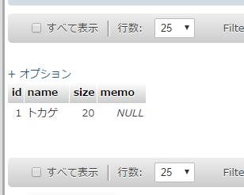](http://cs-tklab.na-inet.jp/phpdb/Chapter3/fig/test_db_animal_insert1_after.png)

## SQL文での変更:UPDATE

引き続きanimalで作業を行います。新しく使用する条件文に注意しましょう。

[](http://cs-tklab.na-inet.jp/phpdb/Chapter3/fig/test_db_animal_update.png)

### UPDATE命令の書式

[](http://cs-tklab.na-inet.jp/phpdb/Chapter3/fig/DB5-9.PNG)


今回は項目が少ないのでサイズしか変えていませんが，多数のデータを同時に変更することもできます。 そうする場合は`,`で区切りをつけて変更項目を増やしましょう。

WHEREの条件文は条件に当てはまるすべての項目が選択されるため，条件によっては複数個選択することもできます。

------

## データの消去

テーブルや値の消去です。 DELETE命令を使ったSQL操作では，指定の間違いによって必要以上にデータを消してしまうことが起こり得ます。一度消去したデータは復活できないので注意しましょう。

[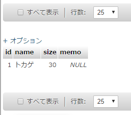](http://cs-tklab.na-inet.jp/phpdb/Chapter3/fig/test_db_animal_update_after.png)

## SQL文での消去:DELETE

animalテーブルの`id = 1`のデータを消去してみましょう。

[](http://cs-tklab.na-inet.jp/phpdb/Chapter3/fig/test_db_animal_delete.png)

DELETE命令を実行するときには，phpMyAdminを使う場合，下記のような表示が出るので`OK`をクリックしましょう。

[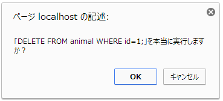](http://cs-tklab.na-inet.jp/phpdb/Chapter3/fig/DB5-12.PNG)

### DELETE命令の書式

[](http://cs-tklab.na-inet.jp/phpdb/Chapter3/fig/DB5-13.PNG)

テーブルを選択し，その中の条件文に合うデータを消去します。単純な操作ですが，条件次第で消したくないデータまで消してしまうことがあるので，きちんとデータを特定できる条件を作っておきましょう。

------

## データの検索

今までは，テーブル全体のデータ表示だけを行ってきましたが，条件を指定して表示範囲を限定することもできます。

先にDELETE命令でデータを消してしまったので，INSERT命令を利用し，animalテーブルにに下記の3種類のデータを入力して下さい。

[](http://cs-tklab.na-inet.jp/phpdb/Chapter3/fig/test_db_animal_select_before.png)

次に，検索の欄をクリックして条件文として`id`の値に`2`を入力して実行してください。

[](http://cs-tklab.na-inet.jp/phpdb/Chapter3/fig/test_db_animal_select.png)

この結果，`id = 2`の`トリ`のデータのみが表示されるはずです。

[](http://cs-tklab.na-inet.jp/phpdb/Chapter3/fig/test_db_animal_select_after.png)


このphpMyAdminのGUI画面では表示カラムの選択はできません。

## SQL文での検索:SELECT

SELECT命令に条件を追加することで，必要なデータの必要な箇所だけを取り出して表示することができるようになります。下記ケースでは`animal`テーブルの`id = 3`であるデータのうち，`id`と`name`だけを表示します。

[](http://cs-tklab.na-inet.jp/phpdb/Chapter3/fig/test_db_animal_select_id_name.png)

### SELECT命令の書式

[](http://cs-tklab.na-inet.jp/phpdb/Chapter3/fig/DB5-17.PNG)

SELECT命令の場合，他のSQL命令とは異なり，カラム名を先に指定するので順番には注意しましょう。全てのカラムを指定する時は，`*(アスタリスク)`を使います。

------

* [←データ型の説明](http://cs-tklab.na-inet.jp/phpdb/Chapter3/DB4.html)
* [ホーム](http://cs-tklab.na-inet.jp/phpdb/index.html)
* [練習問題→](http://cs-tklab.na-inet.jp/phpdb/Chapter3/lesson3.html)

Copyright (c) 2014-2017 幸谷研究室 @ 静岡理工科大学 All rights reserved.
Copyright (c) 2014-2017 T.Kouya Laboratory @ Shizuoka Institute of Science and Technology. All rights reserved.