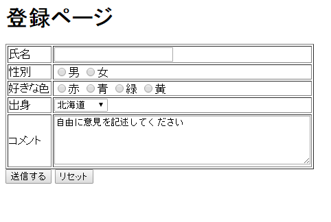
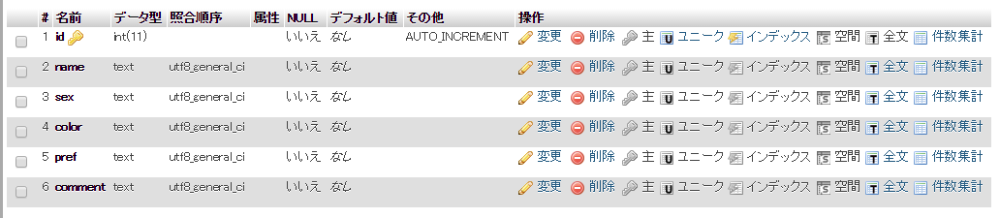

# 練習問題

------

第2章の練習問題で制作したページを使いデータベースに入力内容を保存する前提でデータベースを 設計・制作しましょう。

この章で作成したデータベース`test_db`の中に`member`というテーブルを作成し，その中にカラムを追加してください。

カラムを作成する際，入力項目と別にオートインクリメントを使用したidの項目も作成してください。

------

分からないところは最初からあきらめずに自分で調べましょう。どこを見ればいいか分からないときは下のヒントを見ましょう。

# 解答例

------

