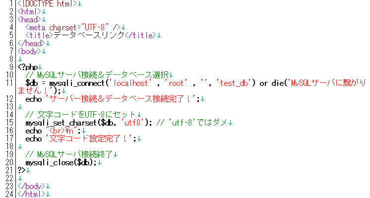

* [ホーム](http://cs-tklab.na-inet.jp/phpdb/index.html)
* [SQL文の実行→](http://cs-tklab.na-inet.jp/phpdb/Chapter4/link2.html)

# Webページとデータベースのリンク

------

## Webページとデータベースのリンクについて

ここまでPHPとデータベース操作を別々に学んできました。本章ではいよいよPHPからデータベースの操作を行っていきます。PHPスクリプトをMySQLクライアントとして動作させ，ユーザの要求に応じてSQL命令を使ってデータの入出力をMySQLサーバに対して行うようにしていきます。

## 準備

### PHP

今までのPHPスクリプトは単体で動かしてきましたが，ここからはMySQLサーバと連動してデータの入出力を行うようにしていきます。今まで作成してきたPHPスクリプトとは異なるので，`htdocs`に新しいフォルダ`demo`を作り，ここに本章で作成するPHPスクリプトを保存しておくようにしましょう。この場合，動作させる前にApacheとMySQLサーバを起動し，ブラウザからは`http://localhost/demo/PHPスクリプト名`としてアクセスする必要があります。

### データベース

前章で作成したデータベース`test_db`を使用します。phpMyAdminからこのデータベースと，テーブルが存在していることを確認して下さい。

## mysqli_connect:MySQLサーバへの接続

PHPにはMySQLに接続するためのファンクションが準備されています。代表的なものとして，[PDO(PHP Data Object)](http://php.net/manual/ja/book.pdo.php)と呼ばれるクラスライブラリと，MySQL専用のMySQL拡張モジュール(Extension)，そしてこれを改良したmysqli拡張モジュールがあります。現在のPHPではmysqli拡張モジュールの利用が推奨されていますので，この教材ではこちらを利用していきます。

mysqli Extensionのファンクションで最初に利用するのが，MySQLサーバに接続するための`mysqli_connect`です。

PHPスクリプト

実行結果

上記のPHPスクリプトで使用しているmysqli_connectの引数は`mysqli_connect('ホスト名' , 'ユーザーID' , 'パスワード');`となります。現在のXAMPP for WindowsにおけるMySQLの設定の場合はそれぞれ

* ホスト名:localhost
* ユーザーID:root
* パスワード:なし

となっていますので，そのように引数を与えてあります。他のWebサーバ + MySQLサーバの環境で動作させる場合は，この部分を最初にに変更する必要が出てくるでしょう。

### dieファンクションについて

上記のPHPスクリプトにおけるmysqli_connect関数の呼び出しの際には

接続リンク = mysqli_connect('localhost', 'root', '') or die('エラー時の出力');

としていますが，この`or die('エラー時の出力')`部分は，その前のmysqli_connect関数が失敗した時に呼び出される処理になります。`die()`ファンクションはPHPの処理を終了させるファンクションであり，接続に失敗すると引数で渡されたメッセージ(この場合は`'エラー時の出力'`)を返した後，PHPの処理を途中で終了させることができます。

## mysqli_close:MySQLサーバとの接続断

データベースに対する処理を全て終え，接続を切る時には`mysqli_close`関数を呼び出します。

mysqli_close(接続リンク);

基本的には，`mysqli_connect`関数と`mysqli_close`関数の間でデータベースに対する処理を行います。PHPスクリプトの場合，終了時には自動的にMySQLサーバから切断されますので，mysqli_close関数の実行は省略することもあります。

## データベースへのリンク

MySQLサーバーに接続した後にやることは，データベースへのリンクです。先ほど作ったリンク用プログラムを下のように変更しましょう。

PHPスクリプト

実行結果

既にMySQLに存在しているデータベースに接続する時には，データベース名を指定して接続します。MySQLサーバへ正常に接続した時には，接続情報を保持しているオブジェクトを返しますので，それを保存するリンク変数を保存しておくと，様々なオプションを指定することができるようになります。従って，今後は下記のようにmysqli_connect関数を呼び出して，MySQLサーバへの接続，既存データベースへの接続，リンク情報の保存を行うようにしましょう。

接続リンク ＝ mysqli_connect('ホスト名' , 'ユーザー名' , 'パスワード' , 'データベース名');

## 文字コード設定

MySQLサーバに接続した後でデータの入出力を行う際には，同じ文字コードでやり取りする必要があります。これを接続リンクに対して設定するのが`mysqli_set_charset`関数です。これを怠ると，文字化けが起こり，正しく文字列の入出力が行えないことがありますので，注意しましょう。下記のPHPスクリプトでは文字コードとしてUTF-8を設定しています。

PHPスクリプト

実行結果

mysqli_set_charsetはMySQLサーバとの入出力全般に対する文字コードの設定を行います。MySQLにあらかじめUTF-8をデフォルトの文字コードとして設定してある場合は省略しても影響はありませんが，別のMySQLサーバ環境でも正しく実行できるようにするため，なるべくmysqli_set_charset関数で設定しておいた方がいいでしょう。

## 完成

ここまで入力が完了すればMySQLサーバに存在するデータベースと接続するためのPHPスクリプトは完成です。動作確認表示用のecho表示は消しておいて下さい。

------

* [ホーム](http://cs-tklab.na-inet.jp/phpdb/index.html)
* [SQL文の実行→](http://cs-tklab.na-inet.jp/phpdb/Chapter4/link2.html)

Copyright (c) 2014-2017 幸谷研究室 @ 静岡理工科大学 All rights reserved.
Copyright (c) 2014-2017 T.Kouya Laboratory @ Shizuoka Institute of Science and Technology. All rights reserved.