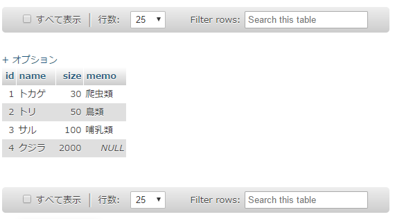
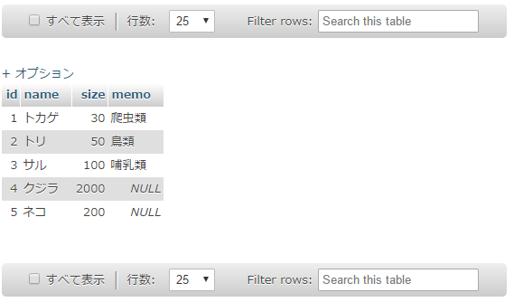
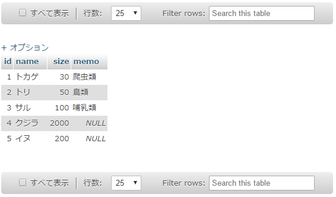
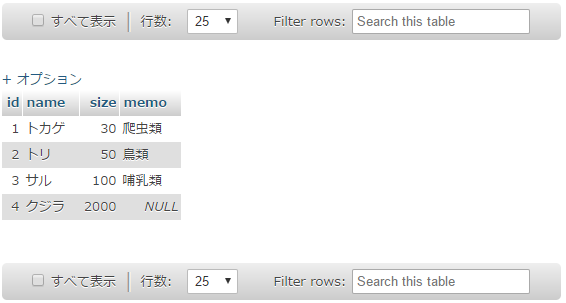
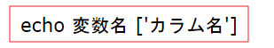
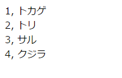

# mysqli_query:SQL文の実行

------

## PHPスクリプトからデータベースへの書き込み

前の節でMySQLサーバに存在するデータベースへ接続できるようになりましたが，それだけでは意味がありません。 接続したデータベースに対して操作ができるようになって，はじめてデータベースと接続した意味が出てきます。この節では，PHPスクリプトからSQL命令を実行できるようにしましょう。

## mysqli_query:SQL文の実行

作成したSQL命令を文字列にしたものをSQL文を呼びます。このSQL文を実行するファンクションが`mysqli_query`です。

`animal`テーブルに

| id   | name   | size |
| :--- | :----- | :--- |
| 4    | クジラ | 2000 |

を挿入するINSERT文は

INSERT INTO animal SET id=4, name="クジラ", size=2000

となります。これをmysqli_queryファンクションで実行するのが下記のPHPスクリプトです。


PHPスクリプト: insert1.php

```php
<!DOCTYPE html>
<html>
<head>
    <meta charset="utf-8">
    <title>データベースリンク</title>
</head>
<body>
    <?php
    // MySQLサーバ接続
    $db = mysqli_connect('localhost', 'root', '', 'test_db') or die('MySQLサーバに繋がりません。');
    echo 'サーバー接続&データベース接続完了';

    // 文字コードをUTF-8にセット
    mysqli_set_charset($db, 'utf8'); // 'utf-8'ではダメ
    
    // SQL文の実行
    mysqli_query($db, 'INSERT INTO animal SET id=4, name="クジラ", size=2000') or die(mysqli_error($db));
    echo 'データを挿入しました。';

    //MySQLサーバ接続終了
    mysqli_close($db);
    ?>
</body>
</html>
```


14行目でエラーが出なければ15行目の「データを挿入しました」というメッセージがブラウザ画面に出てきます。


[](http://cs-tklab.na-inet.jp/phpdb/Chapter4/fig/link2-2.PNG)


正しく動作していれば，データベースにデータが挿入されている筈ですので，phpMyAdminで確認してみましょう。今回は`id = 4`に`クジラ`を挿入したので，これを確認できれば大丈夫です。


[](http://cs-tklab.na-inet.jp/phpdb/Chapter4/fig/link2-3.PNG)


成功が確認できたら，もう一度下記のINSERT文を実行してみましょう。


PHPスクリプト: insert.php

```php
<!DOCTYPE html>
<html>
<head>
    <meta charset="utf-8">
    <title>データベースリンク</title>
</head>
<body>
    <?php
    // MySQLサーバ接続
    $db = mysqli_connect('localhost', 'root', '', 'test_db') or die('MySQLサーバに繋がりません。');
    echo 'サーバー接続&データベース接続完了';

    // 文字コードをUTF-8にセット
    mysqli_set_charset($db, 'utf8'); // 'utf-8'ではダメ
    
    // SQL文の実行
    mysqli_query($db, 'INSERT INTO animal SET id=5, name="ネコ", size=200') or die(mysqli_error($db));
    echo 'データを挿入しました。';

    //MySQLサーバ接続終了
    mysqli_close($db);
    ?>
</body>
</html>
```


ブラウザ画面

[](http://cs-tklab.na-inet.jp/phpdb/Chapter4/fig/link2-5.PNG)


phpMyAdmin画面

[](http://cs-tklab.na-inet.jp/phpdb/Chapter4/fig/link2-6.PNG)


新しくネコが挿入されているのなら成功です。

次にUPDATE文を実行してみましょう。


PHPスクリプト: update.php

```php
<!DOCTYPE html>
<html>
<head>
    <meta charset="utf-8">
    <title>データベースリンク</title>
</head>
<body>
    <?php
    // MySQLサーバ接続
    $db = mysqli_connect('localhost', 'root', '', 'test_db') or die('MySQLサーバに繋がりません。');
    echo 'サーバー接続&データベース接続完了';

    // 文字コードをUTF-8にセット
    mysqli_set_charset($db, 'utf8'); // 'utf-8'ではダメ
    
    // SQL文の実行
    mysqli_query($db, 'UPDATE animal SET name="イヌ" WHERE id=5') or die(mysqli_error($db));
    echo 'データを変更しました。';

    //MySQLサーバ接続終了
    mysqli_close($db);
    ?>
</body>
</html>
```


ブラウザ画面

[](http://cs-tklab.na-inet.jp/phpdb/Chapter4/fig/link-2-8.PNG)


phpMyAdmin画面

[](http://cs-tklab.na-inet.jp/phpdb/Chapter4/fig/link2-9.PNG)


ネコがイヌに変更されているなら成功です。

最後にDELETE文を実行してみましょう。


PHPスクリプト: delete.php

```php
<!DOCTYPE html>
<html>
<head>
    <meta charset="utf-8">
    <title>データベースリンク</title>
</head>
<body>
    <?php
    // MySQLサーバ接続
    $db = mysqli_connect('localhost', 'root', '', 'test_db') or die('MySQLサーバに繋がりません。');
    echo 'サーバー接続&データベース接続完了';

    // 文字コードをUTF-8にセット
    mysqli_set_charset($db, 'utf8'); // 'utf-8'ではダメ
    
    // SQL文の実行
    mysqli_query($db, 'DELETE FROM animal WHERE id=5') or die(mysqli_error($db));
    echo 'データを削除しました。';

    //MySQLサーバ接続終了
    mysqli_close($db);
    ?>
</body>
</html>
```


ブラウザ画面

[](http://cs-tklab.na-inet.jp/phpdb/Chapter4/fig/link2-11.PNG)


phpMyAdmin画面

[](http://cs-tklab.na-inet.jp/phpdb/Chapter4/fig/link2-12.PNG)


イヌのデータが消えていれば成功です。

以上で，PHPを利用してのデータの挿入，更新，削除操作の基本は完了です。

フォーム入力データを上記の事例に当てはめると，Webページ上で入力した値でデータベースのデータを自由に操作することができるようになります。

## SELECTの場合

以上でSQL文を実行できることが確認できましたが，データを検索して引っ張り出すSELECT命令は注意が必要です。SELECT命令の引数を不用意に設定すると，条件次第ですべてのデータが引き出されてしまいます。

### SELECTの実行方法：mysqli_fetch_assoc

SELECT命令を実行した結果を取り出すには`mysqli_fetch関数グループ`を使います。ここではフィールド名(カラム名)を引数とする連想配列として取り出す`mysqli_fetch_assoc`ファンクションを使います。


PHPスクリプト: select1.php

```php
<!DOCTYPE html>
<html>
<head>
    <meta charset="utf-8">
    <title>データベースリンク</title>
</head>
<body>
    <?php
    // MySQLサーバ接続
    $db = mysqli_connect('localhost', 'root', '', 'test_db') or die('MySQLサーバに繋がりません。');
    echo 'サーバー接続&データベース接続完了';

    // 文字コードをUTF-8にセット
    mysqli_set_charset($db, 'utf8'); // 'utf-8'ではダメ
    
    // SQL文の実行
    $recordSet = mysqli_query($db, 'SELECT * FROM animal') or die(mysqli_error($db));
    
    // データの取り出し
    $data = mysqli_fetch_assoc($recordSet);

    // データの表示
    echo $data['id'];
    echo ', ';
    echo $data['name'];

    //MySQLサーバ接続終了
    mysqli_close($db);
    ?>
</body>
</html>
```


実行結果

[](http://cs-tklab.na-inet.jp/phpdb/Chapter4/fig/link2-14.PNG)


SELECTは結果が戻り値として帰ってくるので，これを変数`$recordSet`に保存します。

レコードセットを連想配列に直して取り出す`mysqli_fetch_assoc`という専用のファンクションが用意されていますので，これを使って連想配列`$data`に取り出し，printもしくはecho文で表示させます。

連想配列はテーブルのカラム名(フィールド名)がインデックスになっていますので，echoで表示する時には次のように指定します。


[](http://cs-tklab.na-inet.jp/phpdb/Chapter4/fig/link2-15.PNG)


### 複数またはすべての内容を表示する

先ほどまでの方法では表示される結果が1件のみであり，SELECTの本来の結果を引き出したことにはなりません。

SELECTは条件にあてはまるものをすべて表示させるのが正しい使い方なので，該当結果の2件目以降も表示させなければなりません。

そのためには`mysqli_fetch_assoc`ファンクションを繰り返し使うことになります。下記の例は２回呼び出して２行分のデータを表示しています。


PHPスクリプト: select2.php

```php
<!DOCTYPE html>
<html>
<head>
    <meta charset="utf-8">
    <title>データベースリンク</title>
</head>
<body>
    <?php
    // MySQLサーバ接続
    $db = mysqli_connect('localhost', 'root', '', 'test_db') or die('MySQLサーバに繋がりません。');
    echo 'サーバー接続&データベース接続完了';

    // 文字コードをUTF-8にセット
    mysqli_set_charset($db, 'utf8'); // 'utf-8'ではダメ
    
    // SQL文の実行
    $recordSet = mysqli_query($db, 'SELECT * FROM animal') or die(mysqli_error($db));
    
    // データの取り出しと表示
    $data = mysqli_fetch_assoc($recordSet);
    echo $data['id'];
    echo ', ';
    echo $data['name'];

    // 改行
    echo '<br>';

    // データの取り出しと表示(2)
    $data = mysqli_fetch_assoc($recordSet);
    echo $data['id'];
    echo ', ';
    echo $data['name'];

    //MySQLサーバ接続終了
    mysqli_close($db);
    ?>
</body>
</html>
```


実行結果

[](http://cs-tklab.na-inet.jp/phpdb/Chapter4/fig/link2-17.PNG)


２行以上のデータをデータを表示してみましょう。

実行方法としてはwhile分を利用して，繰り返しmysqli_fetch_assocを実行させることで，該当件数が終了するまで 変数に代入し表示させることができるようになります。


PHPスクリプト: select.php

```php
<!DOCTYPE html>
<html>
<head>
    <meta charset="utf-8">
    <title>データベースリンク</title>
</head>
<body>
    <?php
    // MySQLサーバ接続
    $db = mysqli_connect('localhost', 'root', '', 'test_db') or die('MySQLサーバに繋がりません。');
    echo 'サーバー接続&データベース接続完了';

    // 文字コードをUTF-8にセット
    mysqli_set_charset($db, 'utf8'); // 'utf-8'ではダメ
    
    // SQL文の実行
    $recordSet = mysqli_query($db, 'SELECT * FROM animal') or die(mysqli_error($db));
    
    // データの取り出しと表示(検索データ全て)
    while($data = mysqli_fetch_assoc($recordSet)) {
        echo $data['id'];
        echo ', ';
        echo $data['name'];

        // 改行
        echo '<br>';
    }

    //MySQLサーバ接続終了
    mysqli_close($db);
    ?>
</body>
</html>
```


実行結果

[](http://cs-tklab.na-inet.jp/phpdb/Chapter4/fig/link2-19.PNG)