# データベース接続の共通化とCRUDシステムの完成

------

Webアプリケーションシステムを制作する際にはデータベースと関係するページが多く，データベースの接続と終了を行う処理を何回も実行する必要があります。

これを全てのPHPスクリプトに書き込むのは効率が悪い上に見通しも悪くなります。それを避けるため，データベース接続用の処理を一つのPHPスクリプトにまとめ，データベースを使う前に各PHPスクリプトから`require('接続処理用PHPスクリプト名')`を実行するようにします。

こうすることで，データベースの接続処理を共通化することができ，MySQL環境が変わっても，この接続処理用PHPスクリプトだけを変更すれば，これを読み込むすべてのPHPスクリプトのデータベース接続処理を変更したことになる訳です。

## データベース接続用PHPスクリプトの作成と共有

まず初めに下のようなデータベース接続用PHPスクリプト`dbconnect.php`を作成します。この時，HTMLの部分は不要なので注意してください


PHPスクリプト：dbconnect.php

```php
<?php
// MySQLサーバ接続&データベース選択
$db = mysqli_connect('localhost', 'root', '', 'test_db') or die('MySQLサーバに繋がりません！');

// 文字コードをUTF-8にセット
mysqli_set_charset($db, 'utf8'); // 'utf-8'ではダメ
```


例として，このdbconnect.phpを使ってデータベースを利用するプログラムを作成してみましょう。下記のPHPスクリプトは，前の節で作ったSELECT命令を使ったテーブル全表示スクリプトを改良したものです。

データベース接続文の代わりに

require('dbconnect.php');

と書き，データベース接続用スクリプトをこの部分に読み込んで使用しています。なお上記のカッコは省略可能です。


PHPスクリプト: select.php

```php
<!DOCTYPE html>
<html>
<head>
    <meta charset="utf-8">
    <title>データベースリンク</title>
</head>
<body>
    <?php
    // データベース接続処理
    require('dbconnect.php');
    
    
    // SQL文の実行
    $recordSet = mysqli_query($db, 'SELECT * FROM animal') or die(mysqli_error($db));
    
    // データの取り出しと表示(検索データ全て)
    while($data = mysqli_fetch_assoc($recordSet)) {
        echo $data['id'];
        echo ', ';
        echo $data['name'];

        // 改行
        echo '<br>';
    }

    //MySQLサーバ接続終了
    mysqli_close($db);
    ?>
</body>
</html>
```


実行結果

[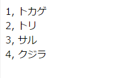](http://cs-tklab.na-inet.jp/phpdb/Chapter4/fig/link3-3.PNG)


ここまで出来たら，同様にして[前回](http://cs-tklab.na-inet.jp/phpdb/Chapter4/link2.html)作成した`insert.php`, `delete.php`, `update.php`も，データベース接続処理部分を`require('dbconnect.php');`に置き換えて動作確認をして下さい。

# CRUDシステムを構築する

データベースを使ったWebアプリとして，次の4つの機能を備えたものをCRUD(クラッド)システムと呼びます。

* Create・・・データの生成(INSERT命令で追加)
* Read ・・・データの読み取りと表示(SELECT命令で実現)
* Update・・・データの更新(UPDATE命令で実行)
* Delete・・・データの削除(DELETE命令で実行)

ユーザからは，PHPの後ろに存在するデータベースは意識させず，フォームを通じてだけ，データの入出力ができるようにするのが標準的なWebのCRUDシステムです。用途ごとにUI(ユーザーインターフェース)は柔軟に変える必要がありますが，ここでは今まで作ってきたPHPスクリプトを改良する形で最小限のCRUD Webアプリを作っていくことにします。


では最初に，htdocsフォルダに`minicrud`フォルダを作り，そこに今まで作ってきたPHPスクリプト(select.php, insert.php, delete.php, update.php, dbconnect.php)一式をコピーしておきます。以降はこのコピーしたファイルに手を加えていきます。

次に，minicrudフォルダにindex.htmlを作り，同じフォルダにあるselect.phpへのリンクを追加します。

```html
<a href="insert.php">Create</a><br>
<a href="select.php">Read</a><br>
<a href="update.php">Update</a><br>
<a href="delete.php">Delete</a>
```


index.htmlの例

[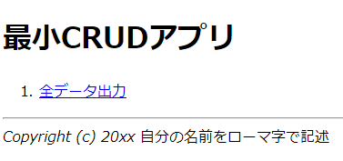](http://cs-tklab.na-inet.jp/phpdb/Chapter4/fig/index_html_first.png)


ここで，select.phpには次の機能を追加しておきます。

1. size, memoフィールドのデータも表示する
2. index.htmlへ戻るリンクを付加し，ユーザを迷子にしないように配慮

改良したselect.phpの表示例

[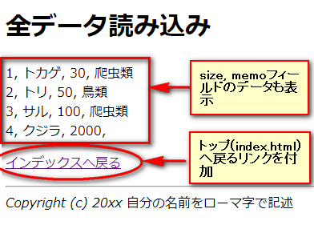](http://cs-tklab.na-inet.jp/phpdb/Chapter4/fig/select_php_all.png)


## フォームからデータを入力する(insert.php)

次は`insert.php`に次のようなフォームを付け，追加するデータをフォームから入力し，データベースに保存できるよう改良します。idは自動的に付加させたいので，あらかじめphpMyAdminからAuto incrementの設定を追加しておいて下さい。

改良したinsert.phpの表示例

[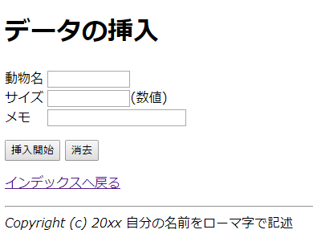](http://cs-tklab.na-inet.jp/phpdb/Chapter4/fig/insert_form.png)


しかし，フォームに入力された内容をそのまま信用してはいけません。なぜならユーザーが誤って情報を入力してしまったり，「SQLインジェクション(injection)」という攻撃にさらされることがあるからです。

このような情報は「サニタイズ（sanitize）＝無害化」という作業を行う必要があります。 PHPでSQL文をサニタイズする場合使用するファンクションが`mysqli_real_escape_string`です。フォームのデータは，なるべく以前使った`htmlspecialchars`で無害化した上で，mysqli_real_escape_string関数を噛ませたものだけをデータベースに入力させるようにしましょう。


PHPスクリプト: insert.phpを改良

```php
<!DOCTYPE html>
<html>
<head>
    <meta charset="UTF-8">
    <title>データベースリンク</title>
</head>
<body>
    <form method="post">
        <p>動物の名前: <input name="name" type="text" size="10"></p>
        <p>サイズ:    <input name="size" type="text" size="10">(数値)</p>
        <p>メモ:    <input name="memo" type="text" size="20"></p>
        <br>
        <input type="submit" value="追加">
        <input type="reset" value="リセット">
    </form>
    <a href="/"><button>ホームに戻る</button></a>
<?php

// 入力データが存在しない場合、以降の処理を行わない。
if(empty($_POST['name']) || empty($_POST['size']) || empty($_POST['memo'])){
    exit();
}

// サニタイズ
$name = htmlspecialchars($_POST['name'], ENT_QUOTES);
$size = htmlspecialchars($_POST['size'], ENT_QUOTES);
$memo = htmlspecialchars($_POST['memo'], ENT_QUOTES);

// データベース接続
require('db_connect.php');

// SQL文の実行
$sql = sprintf('INSERT INTO animal SET name="%s", size=%d, memo="%s"',
    mysqli_real_escape_string($db, $name),
    mysqli_real_escape_string($db, $size),
    mysqli_real_escape_string($db, $memo)
);
// デバッグ用
echo "<p>$sql<p>";
mysqli_query($db, $sql) or die(mysqli_error($db));
echo '<p>データを挿入しました。</p>';

// MySQLサーバ接続終了
mysqli_close($db);

?>
</body>
</html>
```


[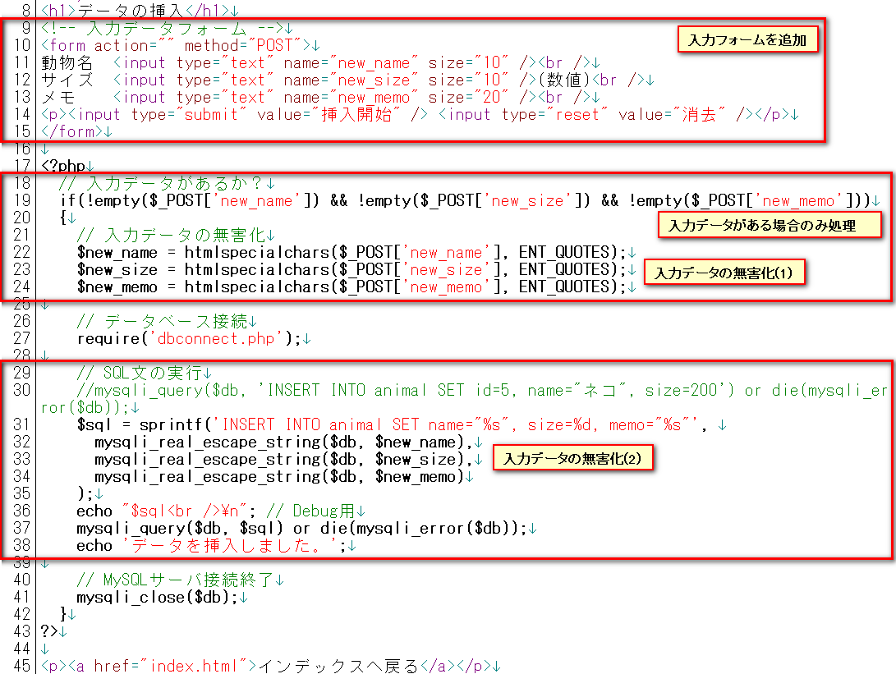](http://cs-tklab.na-inet.jp/phpdb/Chapter4/fig/insert2_form_php.png)


入力サンプル

[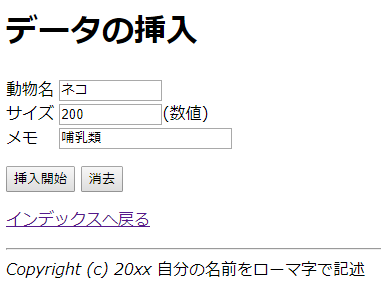](http://cs-tklab.na-inet.jp/phpdb/Chapter4/fig/insert2_form_sample.png)

↓↓
実行結果

[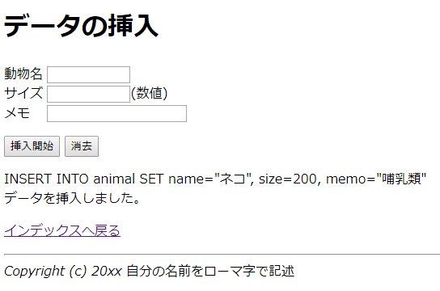](http://cs-tklab.na-inet.jp/phpdb/Chapter4/fig/insert2_form.png)


実行したら，データがきちんと挿入できたかどうか，select.phpで確認して下さい。

[注意] 上記のように2重サニタイズを行うと，データベースに書き込んだUTF-8の文字列が文字化けして読めなくなります。実行には支障ありませんが，気になるようならどちらかのサニタイズ処理を取りやめて下さい。

## サニタイズ処理をまとめる(dbconnect.phpの改良とinsert.phpの再改良)

2段階にわたるサニタイズ処理が面倒なので，まとめて実行する関数`sanitize`を作り，`dbconnect.php`に追加します。


PHPスクリプト: dbconnect.phpを改良

```php
<?php
// MySQLサーバ接続&データベース選択
$db = mysqli_connect('localhost', 'root', '', 'animal') or die('MySQLサーバに繋がりません！');

// 文字コードをUTF-8にセット
mysqli_set_charset($db, 'utf8'); // 'utf-8'ではダメ

function sanitize($db, $input) {
    return mysqli_real_escape_string($db, htmlspecialchars($input, ENT_QUOTES));
}
```


これによって，insert.phpの処理が簡略化できます。定義したsanitize関数を使ってPHPスクリプト部分を書き換えてみましょう。


PHPスクリプト: insert.phpを再改良

```php
<!DOCTYPE html>
<html>
<head>
    <meta charset="UTF-8">
    <title>データベースリンク</title>
</head>
<body>
    <form method="post">
        <p>動物の名前: <input name="name" type="text" size="10"></p>
        <p>サイズ:    <input name="size" type="text" size="10">(数値)</p>
        <p>メモ:    <input name="memo" type="text" size="20"></p>
        <br>
        <input type="submit" value="追加">
        <input type="reset" value="リセット">
    </form>
    <a href="/"><button>ホームに戻る</button></a>
<?php

// 入力データが存在しない場合、以降の処理を行わない。
if(empty($_POST['name']) || empty($_POST['size']) || empty($_POST['memo'])){
    exit();
}

// データベース接続
require('db_connect.php');

// SQL文の実行
$sql = sprintf('INSERT INTO animal SET name="%s", size=%d, memo="%s"',
    sanitize($db, $name),
    sanitize($db, $size),
    sanitize($db, $memo)
);
// デバッグ用
echo "<p>$sql<p>";
mysqli_query($db, $sql) or die(mysqli_error($db));
echo '<p>データを挿入しました。</p>';

// MySQLサーバ接続終了
mysqli_close($db);

?>
</body>
</html>
```


PHPスクリプトがだいぶん短くなりました。これを使って，「ハチ」「10」「昆虫」を追記してみましょう。改良前と同じように動作して，データが次のようになっていればO.K.です。

実行結果

[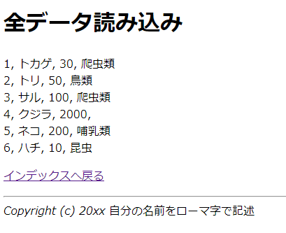](http://cs-tklab.na-inet.jp/phpdb/Chapter4/fig/insert_sanitize_after.png)


完成したら，index.phpにinsert.phpへのリンクを追加しておいて下さい。

## 既存データを削除する(select_delete.php作成とdelete.phpの改良)

既存データを削除するためには，まずどのデータを削除したいのか，一覧表からユーザに選んでもらう必要があります。そのために，select.phpを`select_delete.php`にコピーし，各データの先頭に「削除」ボタンを付けることにします。

select_delete.php完成イメージ

[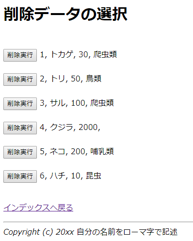](http://cs-tklab.na-inet.jp/phpdb/Chapter4/fig/select_delete.png)


「削除」ボタンが押されると，当該行のデータが削除される仕組みです。このためにSELECTの出力結果の先頭に削除用のフォームを追加します。


PHPスクリプト: select_delete.php(改良部分のみ表示)

```php
<!DOCTYPE html>
<html>
<head>
    <meta charset="UTF-8">
    <title>データベースリンク</title>
</head>
<body>
<?php

require('db_connect.php');

if(empty($_POST)) {
    // 最初にアクセスしたときに表示されるコンテンツ
    $recordSet = mysqli_query($db, 'SELECT * FROM animal') or die(mysqli_error($db));
    while($record = mysqli_fetch_assoc($recordSet)) { ?>

        <form method="post">
            <input type="submit" value="削除実行">
            <input type="hidden" name="id" value="<?=$record['id']?>">
            <span><?=$record['id']?>, <?=$record['name']?>, <?=$record['size']?>, <?=$record['memo']?></span>
            <br>
        </form>

    <?php }
} else {
    // 削除ボタンを押したあとに表示されるコンテンツ
    $id = sanitize($db, $_POST['id']);
    mysqli_query($db, "DELETE FROM animal WHERE id = $id") or die(mysqli_error($db));
    echo "削除しました。";
}

mysqli_close($db);

?>
<a href="/"><button>ホームに戻る</button></a>
</body>
</html>
```


このフォームをサブミットすると，不可視(`type="hidden"`)のinputタグ(`name="hidden_id"`)に埋め込まれたid番号が`delete.php`に送られます。

従って，フォームのデータが送られる`delete.php`はこのid番号を受け取り(`$_POST['hidden_id']`または`$_REQUEST['hidden_id']`に格納されている)，先ほど定義したsanitize関数を使ってサニタイズ処理を行ってSQL命令(DELETE)を発行させればよいということになります。どのように改良すればいいか，自分で考えて正しく当該データの削除処理ができることを確認して下さい。これは皆さんへの課題とします。

## 既存データを更新する(select_update.php作成とupdate.phpの改良)

既存データの更新も，select.phpを改変することで楽に行うことができます。データは既にあるものなので，ユーザの負担を減らすためにも，既存データを最初からフォームに入れておくと良いでしょう。

select_update.php完成イメージ

[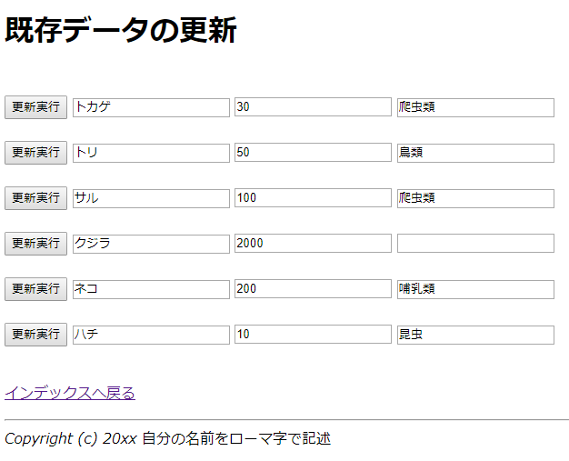](http://cs-tklab.na-inet.jp/phpdb/Chapter4/fig/select_update.png)


削除と同様に，select.phpをコピーして`select_udpate.php`を作り，下記のようにwhileループ内を書き換えます。

```php
<!DOCTYPE html>
<html>
<head>
    <meta charset="UTF-8">
    <title>データベースリンク</title>
</head>
<body>
<?php

require('db_connect.php');

if(empty($_POST)) {
    // 最初にアクセスしたときに表示されるコンテンツ
    $recordSet = mysqli_query($db, 'SELECT * FROM animal') or die(mysqli_error($db));
    while($record = mysqli_fetch_assoc($recordSet)) { ?>
        <form method="post">
            <input type="submit" value="更新実行">
            <input type="hidden" name="id" value="<?=$record['id']?>">
            <input type="text" name="name" value="<?=$record['name']?>">
            <input type="text" name="size" value="<?=$record['size']?>">
            <br>
        </form>
    <?php }
} else {
    // 更新ボタンを押したあとに表示されるコンテンツ
    $id = sanitize($db, $_POST['id']);
    $new_name = sanitize($db, $_POST['name']);
    $new_size = sanitize($db, $_POST['size']);

    $recordSet = mysqli_query($db, "SELECT * FROM animal WHERE id = $id") or die(mysqli_error($db));
    $record = mysqli_fetch_assoc($recordSet);
    $old_name = $record['name'];
    $old_size = $record['size'];

    mysqli_query($db, "UPDATE animal SET name = '$new_name', size = $new_size WHERE id = $id") or die(mysqli_error($db));

    echo "<p>変更しました。</p>";
    echo "<p>[ $id, $old_name, $old_size ] => [ $id, $new_name, $new_size ]</p><br>";
    echo '<a href="/"><button>ホームに戻る</button></a>';
}


mysqli_close($db);

?>
</body>
</html>
```


`update.php`には更新されたデータのid, name, size, memoが送られてきます。これをどのようにサニタイズしてupdate.php内でSQL文として組み立てたらよいでしょうか？　これは皆さんへの課題とします。

update.phpの改良が終わったら，実際に更新処理ができることを確認しましょう。きちんと動作することが確認できたら，index.htmlにselect_update.phpへのリンクを追加しておいて下さい。

## 完成！

以上で，データの閲覧(select.php)，追加(insert.php)，削除(select_delete.php→delete.php)，更新(select_update.php→update.php)が可能なCRUD Webアプリが完成したことになります。下記の項目から全ての処理が正常に動くことを再度確認して下さい。

CRUD Webシステム完成後のトップページ

[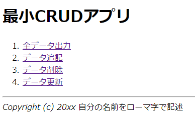](http://cs-tklab.na-inet.jp/phpdb/Chapter4/fig/index_html_complete.png)


最後に，このCRUD Webアプリのリンク関係を図にしてみましょう。すべてのHTMLファイル，PHPスクリプトがどのようは役割を果たし，どのようにリンクされ状態遷移するのか，人に説明できる図を書けるようになって初めてWebアプリは完成したことになります。

CRUD Webアプリ ファイル関係図

[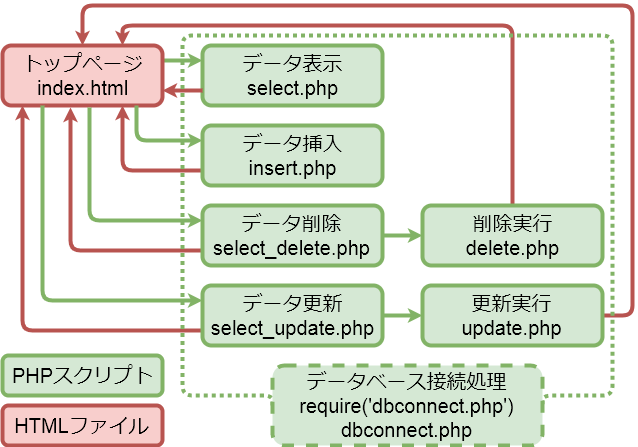](http://cs-tklab.na-inet.jp/phpdb/Chapter4/fig/minicrud.png)


この最小限のCRUD Webアプリはまだまだ機能的に不足しているところがあります。すぐにできそうな改良は

* 更新，削除ボタンを押すと確認のためのプロセス（ex. 「本当に更新 or 削除してよろしいですか？」等のメッセージを出す）を加える。
* 削除，追加を繰り返して歯抜けになったid番号を表示させない仕組み。(ex. olタグで箇条書きする等)
* Responsiveデザインにする。(ex. metaタグの設定，[Bootstrap](http://getbootstrap.com/)の利用等)
* memoフィールドのデータがなくても追加できる仕組み。
* 削除データ選択&削除実行，更新データ選択＆更新実行の処理を一つのPHPスクリプトにまとめる。

等がありますし，発展的に他のアプリに衣替えさせることも可能です。自由制作のアイディアづくりの土台として参考にして下さい。
