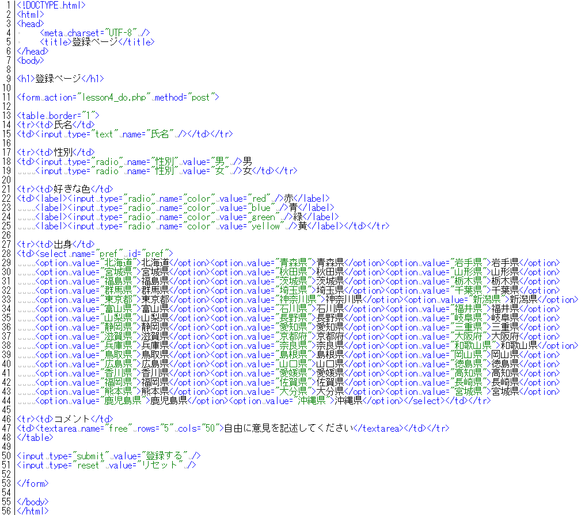
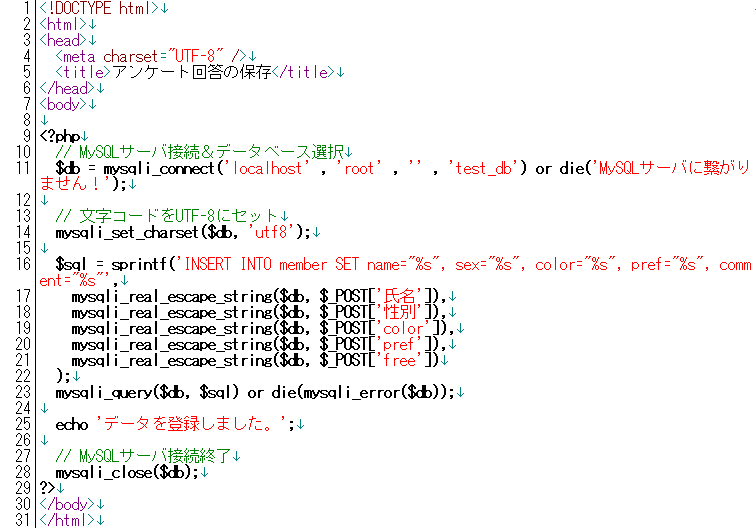

* [←データベース接続の共通化](http://cs-tklab.na-inet.jp/phpdb/Chapter4/link3.html)
* [ホーム](http://cs-tklab.na-inet.jp/phpdb/index.html)
* [解答例→](http://cs-tklab.na-inet.jp/phpdb/Chapter4/lesson4-A.html)

# 練習問題

------

第3章で作成したテーブル`member`に入力内容が保存されるページを作成しましょう。

`登録する`ボタンをクリックすると，下の画像のような確認画面が出るようにして下さい。

フォーム画面

実行結果

phpMyAdmin画面

------

分からないところは最初からあきらめずに自分で調べましょう。どこを見ればいいか分からないときは下のヒントを見ましょう。

[ヒント(別窓で開きます)](http://cs-tklab.na-inet.jp/phpdb/Chapter4/link2.html)

このプログラムが完成したら，データベースの中身を表示するプログラムを作成してみましょう。

------

* [←データベース接続の共通化](http://cs-tklab.na-inet.jp/phpdb/Chapter4/link3.html)
* [ホーム](http://cs-tklab.na-inet.jp/phpdb/index.html)
* [解答例→](http://cs-tklab.na-inet.jp/phpdb/Chapter4/lesson4-A.html)

Copyright (c) 2014-2017 幸谷研究室 @ 静岡理工科大学 All rights reserved.
Copyright (c) 2014-2017 T.Kouya Laboratory @ Shizuoka Institute of Science and Technology. All rights reserved.

* [←問題へ戻る](http://cs-tklab.na-inet.jp/phpdb/Chapter4/lesson4.html)
* [ホーム](http://cs-tklab.na-inet.jp/phpdb/index.html)

# 解答例

------

HTMLファイル

PHPスクリプト

------

* [←問題へ戻る](http://cs-tklab.na-inet.jp/phpdb/Chapter4/lesson4.html)
* [ホーム](http://cs-tklab.na-inet.jp/phpdb/index.html)

Copyright (c) 2014-2017 幸谷研究室 @ 静岡理工科大学 All rights reserved.
Copyright (c) 2014-2017 T.Kouya Laboratory @ Shizuoka Institute of Science and Technology. All rights reserved.