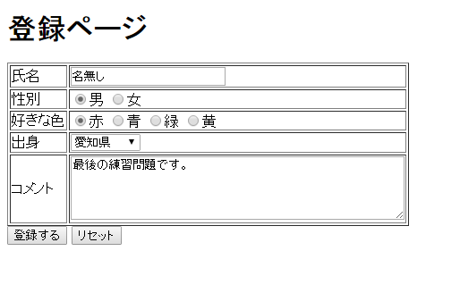
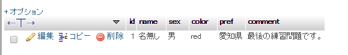

# 練習問題

------

第3章で作成したテーブル`member`に入力内容が保存されるページを作成しましょう。

`登録する`ボタンをクリックすると，下の画像のような確認画面が出るようにして下さい。

フォーム画面[](http://cs-tklab.na-inet.jp/phpdb/Chapter4/fig/lesson4-1.PNG)

実行結果[](http://cs-tklab.na-inet.jp/phpdb/Chapter4/fig/lesson4-2.PNG)

phpMyAdmin画面[](http://cs-tklab.na-inet.jp/phpdb/Chapter4/fig/lesson4-3.PNG)

------

分からないところは最初からあきらめずに自分で調べましょう。どこを見ればいいか分からないときは下のヒントを見ましょう。

# 解答例

------

送信元PHPファイル

```php
<!DOCTYPE html>
<html>
    <head>
        <title>登録ページ</title>
        <meta charset="utf-8">
    </head>
    <body>
        <h1>登録ページ</h1>
        <form>
            <table border="1">
                <tr><th>氏名</th><td><input name="name"></td></tr>
                <tr><th>性別</th><td>
                    <input type="radio" name="sex" value="男">男
                    <input type="radio" name="sex" value="女">女
                </td></tr>
                <tr><th>好きな色</th><td>
                    <input type="radio" name="color" value="赤">赤
                    <input type="radio" name="color" value="青">青
                    <input type="radio" name="color" value="緑">緑
                    <input type="radio" name="clor" value="黄">黄
                </td></tr>
                <tr><th>出身</th><td>
                    <select name="prefecture">
                        <?php
                            foreach(["北海道", "青森県", "岩手県", "宮城県", "秋田県", "山形県", "福島県", "茨城県", "栃木県", "群馬県", "埼玉県", "千葉県", "東京都", "神奈川県", "新潟県", "富山県", "石川県", "福井県", "山梨県", "長野県", "岐阜県", "静岡県", "愛知県", "三重県", "滋賀県", "京都府", "大阪府", "兵庫県", "奈良県", "和歌山県", "鳥取県", "島根県", "岡山県", "広島県", "山口県", "徳島県", "香川県", "愛媛県", "高知県", "福岡県", "佐賀県", "長崎県", "熊本県", "大分県", "宮崎県", "鹿児島県", "沖縄県"] as $value)
                                echo "<option value=$value>$value</option>"
                        ?>
                    </select>
                </td></tr>
                <tr><th>コメント</th><td><textarea name="comment" rows="5" cols="50"></textarea></td></tr>
            </table>
            <input type="submit">
            <input type="reset">
        </form>
    </body>
</html>
```


受信PHPスクリプト

```php
<!DOCTYPE html>
<html>
<head>
    <meta charset="UTF-8">
    <title>データベースリンク</title>
</head>
<body>
<?php

// データベース接続
require('db_connect.php');

// SQL文の実行
$sql = sprintf('INSERT INTO member SET name="%s", sex="%s", color="%s", pref="%s", comment="%s"',
    sanitize($db, $_POST['name']),
    sanitize($db, $_POST['sex']),
    sanitize($db, $_POST['color']),
    sanitize($db, $_POST['pref']),
    sanitize($db, $_POST['comment']),
);

echo '<p>データを登録しました。</p>';

// MySQLサーバ接続終了
mysqli_close($db);

?>
</body>
</html>
```

