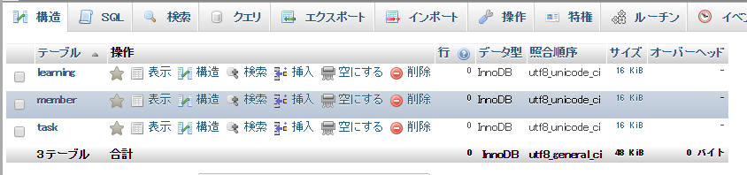
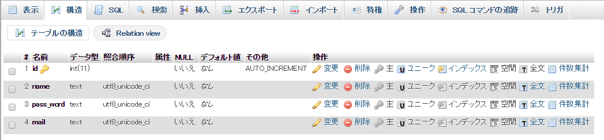
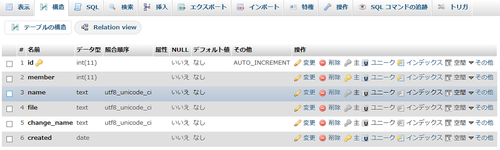
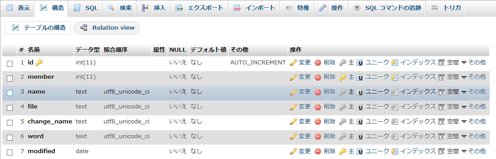

# システム制作

------

## データベース構造

全体の構想による必要機能のうち，データとして保持しておく必要があるのは，(1)会員情報(管理者，受講生)と，(2)教材や(3)提出課題です。これをそれぞれテーブルに保存しておくとすると，データベースにはこの(1)～(3)を保持しておくための3つのテーブルが必要となります。

必要なテーブルの数が決まったら次は必要なカラムを考えます。 会員情報，教材，提出課題の登録に最小限必要な情報の他に，それぞれのデータを区別するためのidや登録・変更日時の情報も付加しなくてはなりません。 その結果として次のようなテーブル構成となりました。

### 会員情報：`member`テーブル

| カラム名  | 目的                                                       | データ型          |
| :-------- | :--------------------------------------------------------- | :---------------- |
| id        | 会員ID。セッション配列に格納し，ログイン情報の引継ぎに使用 | INT(A_I,PRAIMARY) |
| name      | 登録会員名                                                 | TEXT              |
| pass_word | ログイン用の個人識別情報その１                             | TEXT              |
| mail      | ログイン用の個人識別情報その2                              | TEXT              |

### 教材情報：`learning`テーブル

| カラム名    | 目的                                         | データ型          |
| :---------- | :------------------------------------------- | :---------------- |
| id          | 登録情報の個別識別                           | INT(A_I,PRAIMARY) |
| member      | 登録メンバーの識別                           | INT               |
| name        | 登録情報の題名                               | TEXT              |
| file        | 登録された時点のファイルの名前               | TEXT              |
| change_name | 登録時名前が重複しないためのファイルの変更名 | TEXT              |
| created     | 登録された年・月・日                         | DATE              |

### 提出課題情報：`task`テーブル

| カラム名    | 目的                                         | データ型          |
| :---------- | :------------------------------------------- | :---------------- |
| id          | 登録情報の個別識別                           | INT(A_I,PRAIMARY) |
| member      | 登録メンバーの識別                           | INT               |
| name        | 登録情報の題名                               | TEXT              |
| file        | 登録された時点のファイルの名前               | TEXT              |
| change_name | 登録時名前が重複しないためのファイルの変更名 | TEXT              |
| word        | 提出課題に関するコメント                     | TEXT              |
| modified    | 最終更新された年・月・日                     | DATE              |


※今回指定したデータ型の中でTEXT型を多く使用していますが，入力文字数に制限をかけられるVARCHAR型でも問題ありません。むしろ，文字数に制限をかけられるVARCHAR型のほうがデータ量が少なくなるため，入力内容が多くならないと予想できるデータについてはVARCHAR型の使用をお勧めします。

## データベースの作成

以上の想定からデータベースを構築していきましょう。

データベースの構築方法は既に[第3章](http://cs-tklab.na-inet.jp/phpdb/Chapter3/)で説明しましたので，ここでは３つのテーブルを含むデータベースを構築するための情報と，構築した結果のphpMyAdmin画面を示します。

それではデータベース`challenge`を作成し，その中にテーブル`member`，`learning`，`task`を作っていきましょう。

| データベース名称      | テーブル構成 | カラム |
| :-------------------- | :----------- | :----- |
| challenge             | member       | id     |
| name                  |              |        |
| …以下上部会員情報参照 |              |        |
| learning              | id           |        |
| member                |              |        |
| …以下上部教材情報参照 |              |        |
| task                  | id           |        |
| member                |              |        |
| …以下上部課題情報参照 |              |        |

テーブルの構成

[](http://cs-tklab.na-inet.jp/phpdb/Chapter5/fig/system2-1.PNG)


カラム情報：member

[](http://cs-tklab.na-inet.jp/phpdb/Chapter5/fig/system2-2.PNG)


カラム情報：learning

[](http://cs-tklab.na-inet.jp/phpdb/Chapter5/fig/system2-3.PNG)


カラム情報：task

[](http://cs-tklab.na-inet.jp/phpdb/Chapter5/fig/system2-4.PNG)


```sql
create table member (id integer primary key auto_increment, name text, pass_word text, mail text);

create table larning (id integer primary key auto_increment, member integer, name text, file text, change_name text, created date);

create table task (id integer primary key auto_increment, member integer, name text, file text, change_name text, word text, modified date);
```


SQLite

```sqlite
create table member (id integer primary key autoincrement, name text, pass_word text, mail text);

create table learning (id integer primary key autoincrement, member integer, name text, file text, change_name text, created text);

create table task (id integer primary key autoincrement, member integer, name text, file text, change_name text, word text, modified text);
```

