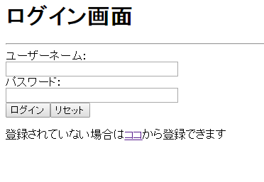
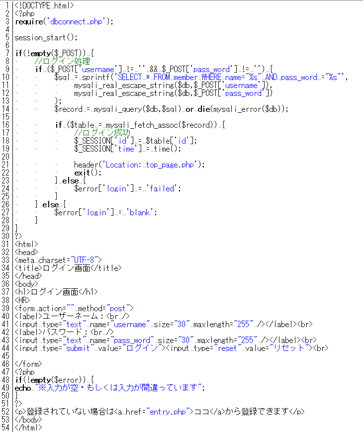
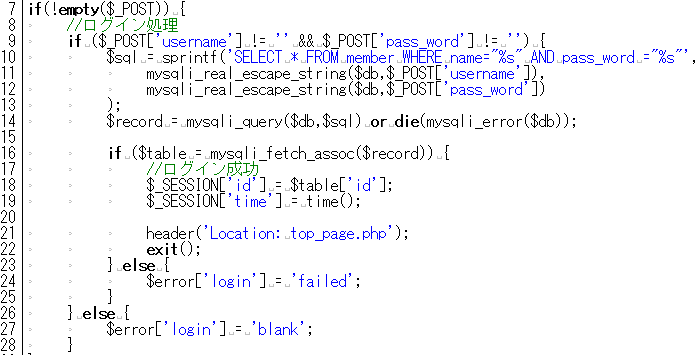
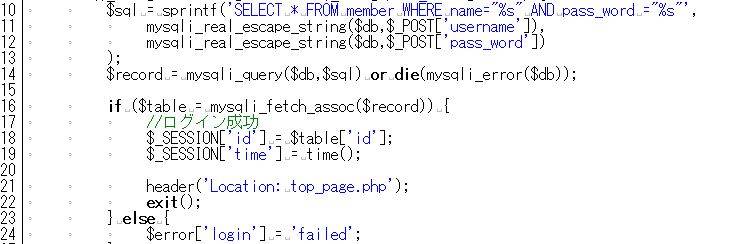

* [←データベース構造](http://cs-tklab.na-inet.jp/phpdb/Chapter5/system2.html)
* [ホーム](http://cs-tklab.na-inet.jp/phpdb/index.html)
* [ユーザー登録（入力）→](http://cs-tklab.na-inet.jp/phpdb/Chapter5/system4.html)

# ログインシステム

------

## ログイン画面の構築: index.php

[システムの構成図](http://cs-tklab.na-inet.jp/phpdb/Chapter5/system1.html#structure_figure)にある通り，本システムはログインして認証されたユーザーのみが使用できるようになっています。そのため，ログインしていないユーザーに対しては必ずログイン画面に強制的に移行させるようにしなくてはなりません。ここで構築する`index.php`はシステムのトップに位置するインデックスファイル([後述](http://cs-tklab.na-inet.jp/phpdb/Chapter5/system3.html#index_file))であるとともに，ログインのためのフォームを提供するシステムへの入口となるPHPスクリプトでなければなりません。

完成したログイン画面

PHPスクリプト：index.php

[注意!] **dbconnect.phpについて**

4章のデータベース接続の共通化で作成したプログラムをそのまま使用すると 今回作成したデータベース`challenge`ではなく，その前に作成したデータベースと接続してしまいます。`dbconnect.php`の中を変更し，データベース`challenge`と接続するプログラムを作成しましょう。

------

## 解説

まず初めに気づくことは，これまで作ってきたプログラムと大きく違い，HTMLのタグの前にPHPでの`if`判定が来ている所でしょう。ifの判定内容は`(!empty($_POST))`となっており，このページに送られてきた`method="post"`フォームからの入力内容が存在するかどうかを判定しています。`$_POST`が存在しない時には，7行目から28行目までは実行されません。

------

今回使用しているログインのためのフォームの`action`の内容が空白となっています。

これは別のページではなく，現在のページにフォームの内容を返すという意味です。従って，現在のページに`$_POST`の内容が送られるので，前述の7行目のif文が実行される，ということになる訳です。

------

フォームのテキストボックスへの入力の有無にかかわらず，送信ボタンを押した場合は`$_POST`が空になることはないので7行目の判定は"true"となります。従って，9行目の`if($_POST['mail']!="" && $_POST['pass_word']!="")`が実行されます。

このif文の条件は，入力されたパスワードとメールアドレスが共に空でない場合"true"となります。 そうでなかった場合はelse以降が実行され，変数`$error`に文字列が入力されます。この時入力された変数`$error`は48行目の`if(!empty($error))`の判定に影響を与えます。もし`$error`が存在した場合には"true"となり，警告文を出力します。

------

ログインフォームのパスワード・メールアドレスが共に入力された場合はデータベースとの照合が行われます。

そのためにSELECT命令にWHEREを加え，メールアドレスとパスワードの両方が一致する行があるかどうかを探します。 両方一致する行があれば，セッション配列`$_SESSION`に条件に合ったメンバー情報のIDと現在時間の情報を ここに入力し，次ページ以降も保持される状態にしてから`header('Location: ○○')`を発行してページを○○に移動させています。

適合するメンバー情報が存在しなかった場合は，`$record`の中身が入力されないため，変数`$error`に文字列が入力されます。

------

### インデックスファイルとは？

URLの表記として，末端がスラッシュ(`/`)で終了する文字列で与えられることがあります。例えば`http://www.sist.ac.jp/`や`https://cs-tklab.na-inet.jp/phpdb/`といったものがそれに当たります。スラッシュが省略されることもありますが，その際には自動的に補われています。

このようなURL指定の場合，Webサーバは対応する自身のフォルダ（ディレクトリ）に存在する特定の名前のファイル，あるいは，スクリプトを呼び出して処理を行います。これを**インデックスファイル(index file)**と呼び，例えばXAMPP for WindowsのApacheでは，設定ファイル(httpd.conf)の中で`DirectoryIndex`オプションとして次のようにインデックスファイル名を指定しています。

<IfModule dir_module>
DirectoryIndex `index.php index.pl index.cgi index.asp index.shtml index.html index.htm \default.php default.pl default.cgi default.asp default.shtml default.html default.htm \home.php home.pl home.cgi home.asp home.shtml home.html home.htm`
</IfModule>

この並びの順に，もしそのディレクトリに(1)`index.php`(PHPスクリプト)があればまずこれを最初に呼び出し，存在していなければ(2)`index.pl`(Perlスクリプト)を，なければ(3)`index.asp`を・・・というようにインデックスファイルを探して処理を行います。`index.html`は6番目にありますので，これもインデックスファイルの一つになります。

本システムのように，どんなアクセスに対しても真っ先に呼び出すべきファイルやスクリプトのファイル名は，このインデックスファイルになり得るものにしておいて下さい。

------

* [←データベース構造](http://cs-tklab.na-inet.jp/phpdb/Chapter5/system2.html)
* [ホーム](http://cs-tklab.na-inet.jp/phpdb/index.html)
* [ユーザー登録（入力）→](http://cs-tklab.na-inet.jp/phpdb/Chapter5/system4.html)

Copyright (c) 2014-2017 幸谷研究室 @ 静岡理工科大学 All rights reserved.
Copyright (c) 2014-2017 T.Kouya Laboratory @ Shizuoka Institute of Science and Technology. All rights reserved.