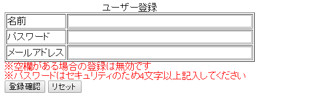
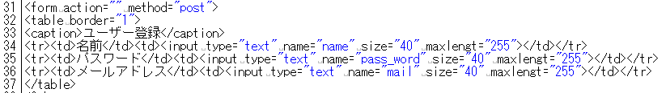
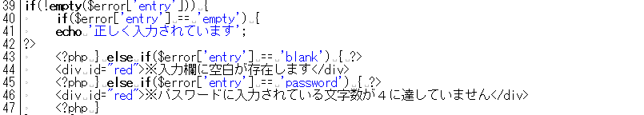
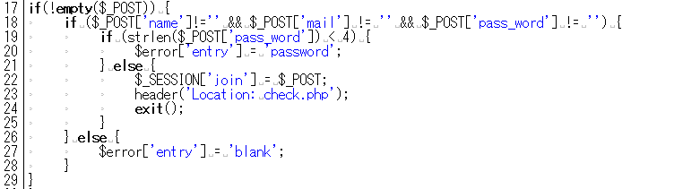

# ユーザー登録（入力）

------

## ユーザー登録（入力）ページ: entry.php

完成したユーザー登録(入力)フォーム[](http://cs-tklab.na-inet.jp/phpdb/Chapter5/fig/system4-1.PNG)

PHPスクリプト: entry.php

```php
<?php
require('dbconnect.php');
session_start();

// エラー判定
if(!empty($_POST)) {

    if($_POST['name'] !== '' && $_POST['mail'] !== '' && $_POST['pass_word'] !== '') {
        if(strlen($_POST['pass_word']) < 4) {
            $error['entry'] = 'password';
        } else {
            $_SESSION['join'] = $_POST;
            header('Location: check.php');
            exit();
        }
    } else {
        $error['entry'] = 'blank';
    }

}
?>

<!DOCTYPE html>
<html>
<head>
    <meta charset="utf-8">
    <title>登録画面</title>
    <style>
        #red { color: red; }
    </style>
</head>
<body>
<form method="post">
    <table>
        <caption>ユーザ登録</caption>
        <tr><th>Name</th><td><input type="text" name="name" size="40" maxlength="255"></td></tr>
        <tr><th>Password</th><td><input type="password" name="pass_word" size="40" maxlength="255"></td></tr>
        <tr><th>Mail</th><td><input type="text" name="mail" size="40" maxlength="255"></td></tr>
    </table>
<?php if(!empty($error['entry'])): ?>
    <?php
        switch($error['entry']):
        case 'empty':
    ?>
        <p>正しく入力されています。</p>
        <?php break; ?>
    <?php case 'blank': ?>
        <p id="red">※入力欄に空白が存在します。</p>
        <?php break; ?>
    <?php case 'password': ?>
        <p id="red">※パスワードに入力されている文字数が4に達していません。</p>
        <?php break; ?>
    <?php default: ?>
        <?php // ここなに？ ?>
        <p id="red">※空欄がある場合の登録は無効です。</p>
        <p id="red">※パスワードに入力されている文字数が4に達していません。</p>
    <?php endswitch;?>
<?php endif ?>
<input type="submit" value="submit">
<input type="reset" value="reset">
</form>
</body>
</html>

```


------

## 解説

17行目の`if(!empty($_POST))`の説明は前の[ログイン画面](http://cs-tklab.na-inet.jp/phpdb/Chapter5/system3.html#login_if)のところで説明しましたので，17行目から29行目までの処理の解説は省略します。

※以降，既に解説した部分については断りなく記述を省きます。

入力フォームの作成をしていきましょう。新規のユーザの登録はこの入力フォームを使って行います。

新規ユーザの登録情報はこのページで処理し，入力のエラーチェックも行いますので，`action`の送信先は入力を行いません。

また，[フォームの練習問題](http://cs-tklab.na-inet.jp/phpdb/Chapter1/lesson1.html)と同様に，テーブル要素を使ってフォーム入力要素を揃えて表示しています。





------

次に，エラーと警告文の表示を行います。1度送信ボタンを押すまではエラー配列`$error`が存在することはないので，入力後の処理を行うこの部分でエラーの発生をチェックします。

エラーが発生していた場合は，内容に応じて2種類の警告文`「※入力欄に空白が存在します」「※パスワードに入力されている文字数が４に達していません」`を表示しています。





以上のif文の入れ子による判別をまとめると，上から順に，

> "$_POST"が送信されているか
> →全ての入力欄はすべて入力されているか
> →パスワードが4文字以上であるか

と判定していることが分かります。パスワードの文字数は`strlen`(文字列の長さを返す関数)ファンクションを使って得ています。


その過程で`false`判定が出た場合，エラー配列`$error`に対応するエラー内容が文字列で入力され，39行目からの警告処理で，どこ部分の入力にミスがあったのかが分かるように表示されます。

入力内容にミスがなかった場合は`$_SESSION['join']`にユーザー情報が入力され，次の内容登録ページ(`check.php`)へ移動します。





