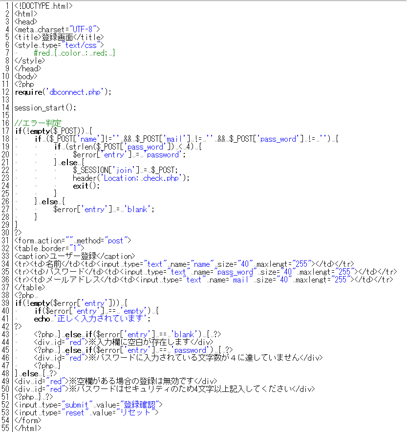

* [←ログインシステム](http://cs-tklab.na-inet.jp/phpdb/Chapter5/system3.html)
* [ホーム](http://cs-tklab.na-inet.jp/phpdb/index.html)
* [ユーザー登録（登録）→](http://cs-tklab.na-inet.jp/phpdb/Chapter5/system5.html)

# ユーザー登録（入力）

------

## ユーザー登録（入力）ページ: entry.php

完成したユーザー登録(入力)フォーム

PHPスクリプト: entry.php

------

## 解説

17行目の`if(!empty($_POST))`の説明は前の[ログイン画面](http://cs-tklab.na-inet.jp/phpdb/Chapter5/system3.html#login_if)のところで説明しましたので，17行目から29行目までの処理の解説は省略します。

※以降，既に解説した部分については断りなく記述を省きます。

入力フォームの作成をしていきましょう。新規のユーザの登録はこの入力フォームを使って行います。

新規ユーザの登録情報はこのページで処理し，入力のエラーチェックも行いますので，`action`の送信先は入力を行いません。

また，[フォームの練習問題](http://cs-tklab.na-inet.jp/phpdb/Chapter1/lesson1.html)と同様に，テーブル要素を使ってフォーム入力要素を揃えて表示しています。

------

次に，エラーと警告文の表示を行います。1度送信ボタンを押すまではエラー配列`$error`が存在することはないので，入力後の処理を行うこの部分でエラーの発生をチェックします。

エラーが発生していた場合は，内容に応じて2種類の警告文`「※入力欄に空白が存在します」「※パスワードに入力されている文字数が４に達していません」`を表示しています。

以上のif文の入れ子による判別をまとめると，上から順に，

> "$_POST"が送信されているか
> →全ての入力欄はすべて入力されているか
> →パスワードが4文字以上であるか

と判定していることが分かります。パスワードの文字数は`strlen`(文字列の長さを返す関数)ファンクションを使って得ています。

その過程で`false`判定が出た場合，エラー配列`$error`に対応するエラー内容が文字列で入力され，39行目からの警告処理で，どこ部分の入力にミスがあったのかが分かるように表示されます。

入力内容にミスがなかった場合は`$_SESSION['join']`にユーザー情報が入力され，次の内容登録ページ(`check.php`)へ移動します。

------

* [←ログインシステム](http://cs-tklab.na-inet.jp/phpdb/Chapter5/system3.html)
* [ホーム](http://cs-tklab.na-inet.jp/phpdb/index.html)
* [ユーザー登録（登録）→](http://cs-tklab.na-inet.jp/phpdb/Chapter5/system5.html)

Copyright (c) 2014-2017 幸谷研究室 @ 静岡理工科大学 All rights reserved.
Copyright (c) 2014-2017 T.Kouya Laboratory @ Shizuoka Institute of Science and Technology. All rights reserved.