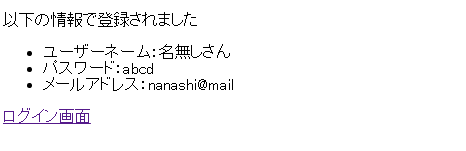
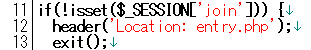
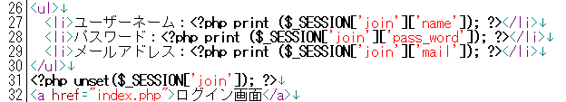
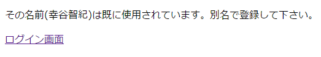

# ユーザー登録（登録）

------

## ユーザー登録（登録）ページ: check.php

ユーザー登録（入力）ページ(`entry.php`)から渡された新規ユーザーのデータはセッション配列`$_SESSION['join']`に格納されていますので，それをこのページ(`check.php`)でデータベースの`member`テーブルにに登録します。

登録が完了した時には次のような表示を行うようにプログラミングしてみましょう。


[](http://cs-tklab.na-inet.jp/phpdb/Chapter5/fig/system5-1.PNG)


PHPスクリプト：check.php

```php
<?php
session_start();
require('dbconnect.php');

if(!isset($_SESSION['join'])) {
    header('Location: entry.php');
    exit();
}

$sql = sprintf('INSERT INTO member SET name="%s", pass_word="%s", mail="%s"',
    sanitize($db, $_SESSION['join']['name']),
    sanitize($db, $_SESSION['join']['pass_word']),
    sanitize($db, $_SESSION['join']['mail'])
);
mysqli_query($db, $sql) or die(mysqli_error($db));
?>

<!DOCTYPE html>
<html>
<head>
    <meta charset="utf-8">
    <title>ログイン情報チェック</title>
</head>
<p>以下の情報で登録されました。</p>
<ul>
    <li><b>Name: </b><?=$_SESSION['join']['name']?></li>
    <li><b>Password: </b><?=$_SESSION['join']['pass_word']?></li>
    <li><b>Mail: </b><?=$_SESSION['join']['mail']?></li>
</ul>
<?php unset($_SESSION['join']) ?>
<a href="index.php">ログイン画面</a>
</html>
```


------

## 解説

11行目の`isset`は変数が存在するかを確認するための関数です。従って，`if(!isset($_SESSION['join']))`は，変数`$_SESSION['join']`が存在しない時に`TRUE`となり，12行目の`header`で入力ページ(`entry.php`に強制移動されます。


[](http://cs-tklab.na-inet.jp/phpdb/Chapter5/fig/check_old_php_11-13.png)


------

`entry.php`では，`$_POST`を`$_SESSION['join']`にそのまま代入したため，その内容はフォームで入力した`name`ごとの連想配列になっています。

従って，入力内容を取り出すには`$_SESSION['join']['○○']`(○○の内容はフォームの`input`タグにおける`name="○○"`)となります。

最後にどこかでセッション情報が再使用されてしまわないよう，`$_SESSION['join']`を消去します。


[](http://cs-tklab.na-inet.jp/phpdb/Chapter5/fig/check_old_php_26-32.png)


## ユーザー名の重複防止

一応これで新規ユーザーの登録ができることになる訳ですが，現状では次の問題が残っています。

1. 同じ名前のユーザーが登録できてしまう。
2. パスワードが平文(plain text)のままなので，入力時，データベース登録時に盗まれて悪用される可能性がある。

2については[最後にまとめて実施](http://cs-tklab.na-inet.jp/phpdb/Chapter5/system13.html)することにして，ここでは1の対策を施してしまいましょう。これは，同じ名前のユーザーがいないかどうか，INSERT文を発行する前にSELECT文で検索しておき，同名ユーザーがいない場合のみ，INSERT文で登録を実施するように`check.php`を改変することで対策が完了します。

一例として，下記のように17行目以降を書き換えて，18行目～25行目のように`SELECT count(*)`を実行してみましょう。これは同名ユーザーが存在している場合(`WHERE name="ユーザー名"`に合致)は，1以上の値が返ってくるというSQL文です。

check.phpの改良箇所


実際に，既にデータベースに存在しているユーザー名で登録してみると，


[](http://cs-tklab.na-inet.jp/phpdb/Chapter5/fig/check_php_error_output.png)


のように表示され，登録ができないようになっている筈です。
