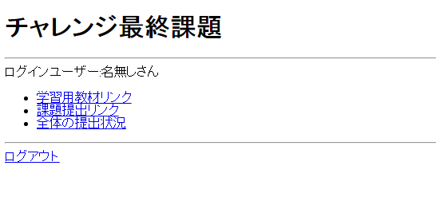
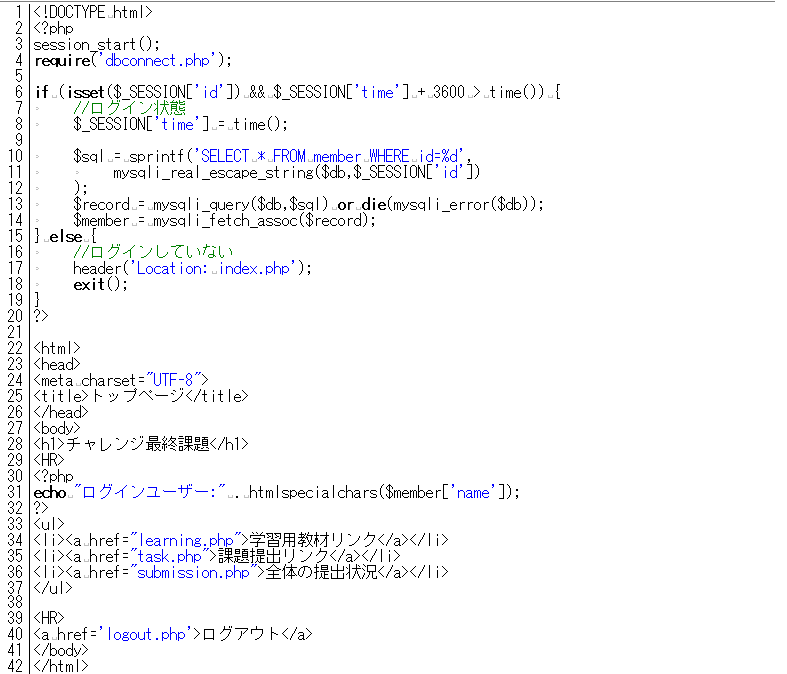
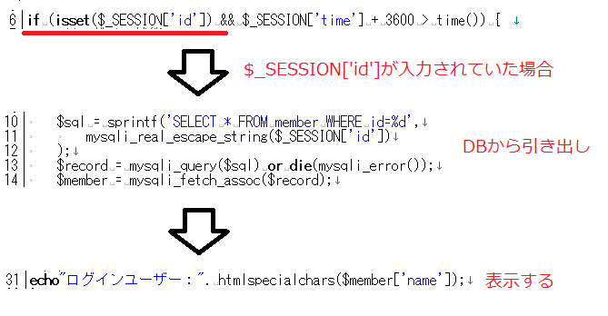
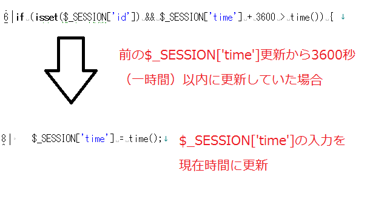

* [←ユーザー登録（登録）](http://cs-tklab.na-inet.jp/phpdb/Chapter5/system5.html)
* [ホーム](http://cs-tklab.na-inet.jp/phpdb/index.html)
* [ログアウト→](http://cs-tklab.na-inet.jp/phpdb/Chapter5/system7.html)

# トップページとログインの継続: top_page.php

------

## トップページ: top_page.php

正常にログインができた後に表示されるトップページを作ります。ここからリンクを張られたページはログインしたユーザーのみが使用できるページです。従って，これらのページにもログイン済みであるという情報をセッション配列`$_SESSION`を通じて伝達していく必要があります。

トップページは下記のようにメニューだけの簡素な作りになっています。

PHPスクリプト: top_page.php

------

## ログインの継続

正常にログインが完了すると，ログインページからトップページに移動した時に，必ずセッション配列の`$_SESSION['id']`と`$_SESSION['time']`が入力されている状態になっています。この2つをチェックすることで，ログイン済みかどうかを確認するようにします。

### ログイン済み条件1: $_SESSION['id']が継続しているか？

[ログインページの処理](http://cs-tklab.na-inet.jp/phpdb/Chapter5/system3.html)により，正常にログインされていれば`$_SESSION['id']`にmemberテーブルのidが入力されています。このid情報は，カラムに`AUTO_INCREMENT`とプライマリーキー(`Primary key`)を設定しているため，自動的かつ重複がされないように番号が設定されているので，ユーザーの特定には最適な値です。

セッションの情報はここからリンクを張ったページにも引き継がれるため，必要があればページ毎に`$_SESSION['id']`を元にデータベースからユーザー情報の詳細を引き出して表示することも可能になります。下記の図に示す通り，ここではユーザーの名前を検索して表示しています。

------

### ログイン済み条件2: 前回の$_SESSION['time']の更新から定時時間内であるか？

ログイン時にはユーザーidの他に，`$_SESSIOM['time']`にログイン時間を設定してあります。これを利用することで，ログイン状態の保持に制限時間をかけることができるようになります。

セッションは入力内容を保持する便利な機能ですが，解除せずに放置しておくことはセキュリティ的に望ましいことではありません。ログインしっぱなしで長く席を離れていると，他の人に操作されてしまう危険があるため，ここではログイン時間の制限をかけています。

制限方法としては，`time()`ファンクションを使って現在時間を取得し，`$_SESSION['time'] + 3600 > time()`という条件で判断しています。つまり，前回のログイン時より3600秒(1時間)以内かどうかをチェックしているわけです。もしこの条件を満足していれば$_SESSION['time']が更新され，ログイン情報が継続されるようになっています。3600秒以上経過していればこの条件は`false`となり，ログインは継続されません。

------

### どちらかの条件に当てはまらなかった場合

上記2項目の条件内容に当てはまらなかった場合は15行目の`else`以降が実行されます。処理内容としては`header('Location: index.php')`によりログインページに飛ばすだけですが，`$_SESSION['time']`が更新されないため，ログインが必要なページにはアクセスができなくなります。

------

* [←ユーザー登録（登録）](http://cs-tklab.na-inet.jp/phpdb/Chapter5/system5.html)
* [ホーム](http://cs-tklab.na-inet.jp/phpdb/index.html)
* [ログアウト→](http://cs-tklab.na-inet.jp/phpdb/Chapter5/system7.html)

Copyright (c) 2014-2017 幸谷研究室 @ 静岡理工科大学 All rights reserved.
Copyright (c) 2014-2017 T.Kouya Laboratory @ Shizuoka Institute of Science and Technology. All rights reserved.