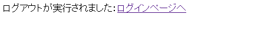
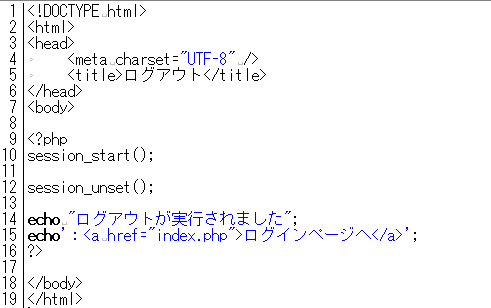
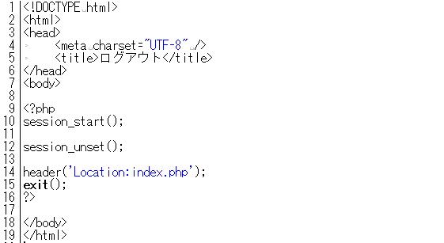

* [←トップページとログインの継続](http://cs-tklab.na-inet.jp/phpdb/Chapter5/system6.html)
* [ホーム](http://cs-tklab.na-inet.jp/phpdb/index.html)
* [教材管理システム→](http://cs-tklab.na-inet.jp/phpdb/Chapter5/system8.html)

# ログアウト

------

## ログアウト: logout.php

`ログアウト`リンクをクリックするか，ログイン条件を満足しなくなった時にはこの`logout.php`に飛ばされ，下記のような表示を得ます。

PHPスクリプト：logout.php

------

## 解説

この講義支援システムのログイン情報はセッションの引継ぎによって保たれています。従って，ログアウトの際に必要な処理は，セッションによる情報の引継ぎを止めて破棄することです。これは`session_unset`ファンクションを利用することで実現できます。

このページでは説明のためにログアウトが完了したことを表示していますが，`header('Location: ○○')`を使用することで，ログアウト結果の確認を省略し，例えば`index.php`に飛ばすことも可能です。

表示を省略したlogout.php

------

* [←トップページとログインの継続](http://cs-tklab.na-inet.jp/phpdb/Chapter5/system6.html)
* [ホーム](http://cs-tklab.na-inet.jp/phpdb/index.html)
* [教材管理システム→](http://cs-tklab.na-inet.jp/phpdb/Chapter5/system8.html)

Copyright (c) 2014-2017 幸谷研究室 @ 静岡理工科大学 All rights reserved.
Copyright (c) 2014-2017 T.Kouya Laboratory @ Shizuoka Institute of Science and Technology. All rights reserved.