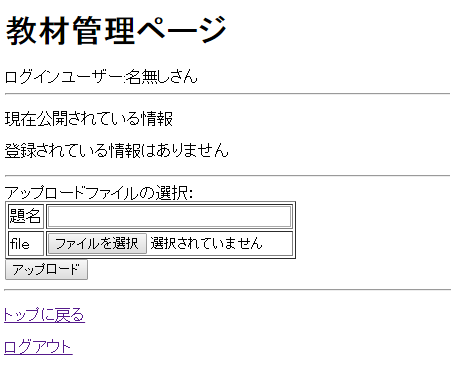
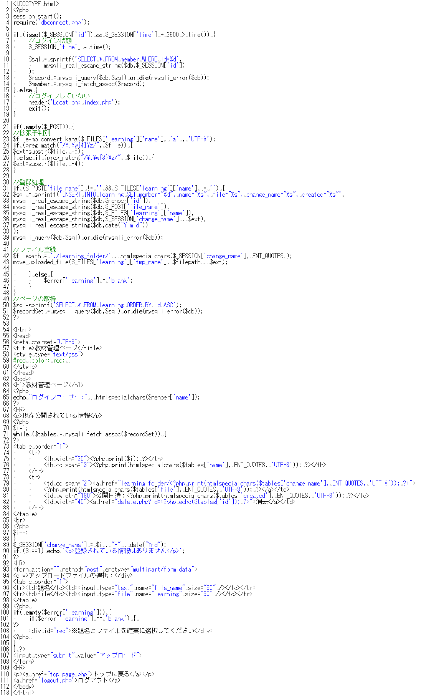
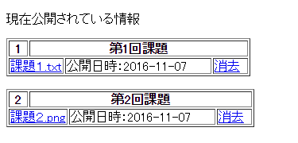
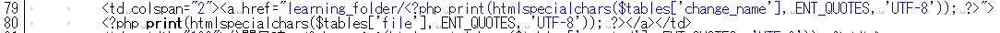
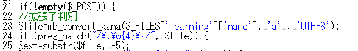
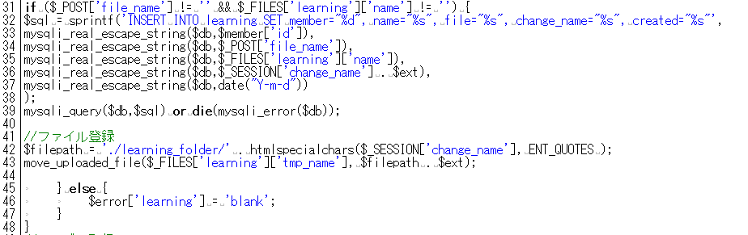

* [←ユーザー登録（登録）](http://cs-tklab.na-inet.jp/phpdb/Chapter5/system7.html)
* [ホーム](http://cs-tklab.na-inet.jp/phpdb/index.html)
* [共通する機能をまとめる→](http://cs-tklab.na-inet.jp/phpdb/Chapter5/system85.html)

# 教材管理システム

------

## 教材管理システム: learning.php

教材や課題を登録するページを作ります。最終的には管理者（教師）のみが教材の登録や変更が可能なように制限をかけますが，ここではログインユーザーかどうかの確認のみ行っています。

[注意！] 教材ファイルを保存するためのフォルダ`learning_folder`を`challenge`に作るのも忘れないようにして下さい。これがないと教材登録が正常にできません。

プログラム：learning.php

------

## 解説

### 6～19行：ログインの判別

すでにログインしているかどうかの判別を行っています。この部分はトップページ([top_page.php](http://cs-tklab.na-inet.jp/phpdb/Chapter5/system6.html))と全く同じ処理を行っています。

### 50・51行：ページの取得

ここでは教材情報を登録している`learning`テーブルの内容を`ORDER BY id ASC`を使ってidカラムの昇順(`AUTO_INCREMENT`)を使用しているので登録順)に並べ替えて全件を変数`$recordSet`に格納しています。

------

### 67～90行：登録内容の表示

既に教材を登録していた場合，表示は下記のようになります。

表示内容の左上には番号があります。左下には消去があるので登録内容は消去することができることがわかります。

データベースに登録されたidをそのまま表示してしまうと，例えば教材の消去をした場合にはそのid番号が欠番となり，番号が飛び飛びになってしまうことがありますのでよろしくありません。従ってここでは70行目に変数`$i`を設定し，繰り返しの最後である87行目で1ずつプラスして番号飛びが発生しないようにしています。この部分は`for文`を使って記述することも可能です。

------

登録された教材へのダウンロード用リンクの表示は79～80行目で行っています。ここで注意してほしいのは，データベースに登録してあるファイル名(ここでは`$tables['file']`にあたる)と，実際にリンクしているファイル名(`$tables['change_name']`)が異なっている点です。

この理由は，登録ファイル名が日本語交じりの全角文字列であった場合でも対応できるようにするためです。登録した教材ファイルを保管するのはサーバ側になりますが，全角文字ファイル名を正しく扱えなかったり，サーバへの転送時に文字化けしてしまう可能性があり，結果として「登録したのに表示させることができない」という状況になりかねません。

このような事態を避けるため，たとえ登録するファイル名と一対一対応の半角ASCII文字範囲のファイル名を新しく付け直しています。これが`$tables['change_name']`で，89行目に変更名を登録順である`$i`と現在の年月日時刻である`date`を繋ぎ合わせて作られています。

------

82行目には`消去`のリンクがあります。教材の消去を行うPHPスクリプト`delete.php`に`?id=xxx`を付加したリンクを作ることで，このリンクをクリックした後で実行される`delete.php`では`$_REQUEST['id']`を使用することができるようになります。ここに格納されている教材情報のid(`=xxx`)を使ったDELETE命令を実行することで指定された情報を消去することができるようになります。

------

90行目はデータベースに教材登録情報の有無をチェックしています。`if`の判定内容は「データベースから引き出し，格納した変数が存在するか」でも構いませんが，ここでは繰り返しの番号である`$i`を利用し，「1度も繰り返しがなかった場合」で判定しています。

------

### 21～48行

21～25行では登録するファイルの拡張子を判別しています。登録教材の元のファイル名のまま登録することができるならば判別の必要はありませんが，前述した通り変更していますので，拡張子をそのまま残す目的で判別を行っています。

拡張子の判別には正規表現を利用しています。ファイル名の文字列の後ろから4または5文字が`.(ドット)w{○}(○内は文字数)` であるかどうかを調べ，その部分を拡張として取り出して変数`$ext`に格納しています。これを教材ファイルの登録時に利用します。

------

31～48行目で，見慣れない処理を行っている所ではファイル名の変更を行っています。

36行目では変更後のファイル名をデータベースに登録しています。そのため，89行目で新しく作られた名前と拡張子`$ext`をくっつけることで，元のファイルと同じ拡張子を持ったファイル名になります。こうして転送した元のファイル名と齟齬が発生しないようにしている訳です。

------

* [←ユーザー登録（登録）](http://cs-tklab.na-inet.jp/phpdb/Chapter5/system7.html)
* [ホーム](http://cs-tklab.na-inet.jp/phpdb/index.html)
* [共通する機能をまとめる→](http://cs-tklab.na-inet.jp/phpdb/Chapter5/system85.html)

Copyright (c) 2014-2017 幸谷研究室 @ 静岡理工科大学 All rights reserved.
Copyright (c) 2014-2017 T.Kouya Laboratory @ Shizuoka Institute of Science and Technology. All rights reserved.