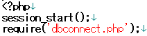
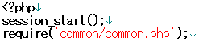
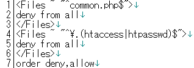

# 共通する機能をまとめる

------

## common/common.phpの作成と既存PHPスクリプトの書き換え

セッション配列($_SESSION)の値をチェックしてログイン済みかどうかを判断する処理はtop_page.php, learning.phpでも同一です。従ってこれは一つのPHPファンクション`login_check`にまとめて共通化しましょう。ついでに，MySQLサーバに接続する処理(`dbconnect.php`)の機能も，`common/common.php`にまとめてしまいます。

まず，現在の`challenge`フォルダ(ディレクトリ)の下に`common`フォルダを作り，`dbconnect.php`の内容をコピペし，その下にログインチェック関数を作ります。

common/common.php

```php
<?php
// -----------
// 共通ファイル
// -----------

// データベース関連
$db = mysqli_connect('localhost', 'root', '', 'test_db') or die('MySQLサーバに接続できませんでした。');
mysqli_set_charset($db, 'utf8');

// 関数群
function login_check(&$member, $db) {
    if(isset($_SESSION['id']) && $_SESSION['time'] + 3600 > time()) {
        // ログイン状態
        $_SESSION['time'];
        $sql = 'SELECT * FROM member WHERE id = '.mysqli_real_escape_string($db, $_SESSION['id']);
        $record = mysqli_query($db, $sql) or die(mysqli_error($db));
        $member = mysqli_fetch_assoc($record);
    } else {
        // ログインしていない場合
        header('Location: index.php');
        exit();

        //return login_failed
    }
}

function sanitize($db, $input) {
    return mysqli_real_escape_string($db, htmlspecialchars($input, ENT_QUOTES));
}
```


次に，`dbconnect.php`を呼び出しているPHPスクリプトを，全て`common/common.php`を呼び出すように書き換えます。


##### 変更前

[](http://cs-tklab.na-inet.jp/phpdb/Chapter5/fig/dbconnect2common_before.png)

　　↓ 　3行目を変更 　　↓

##### 変更後

[](http://cs-tklab.na-inet.jp/phpdb/Chapter5/fig/dbconnect2common.png)


下記のPHPスクリプトを上記のように変更して下さい。

* index.php
* entry.php
* check.php


`top_page.php`と`learning.php`はログインチェック部分もlogin_check関数を使って共通化できるので，次のように書き換えます

#### top_page.php

```php
<?php
session_start();
require('common/common.php');

// ログインしているかのチェック
login_check($member, $db);
?>

<!DOCTYPE html>
<html>
<head>
    <meta charset="utf-8">
    <title>トップページ</title>
</head>
<body>
    <h1>チャレンジ最終問題</h1>
    <hr>
    <p>ログインユーザー: <?=htmlspecialchars($member['name'])?></p>
    <ul>
        <li><a href="learning.php">学習用教材リンク</a></li>
        <li><a href="task.php">課題提出リンク</a></li>
        <li><a href="submission.php">全体の提出状況</a></li>
    </ul>
    <hr>
    <a href="logout.php">ログアウト</a>
</body>
</html>
```


#### learning.php

```php
<?php
session_start();
require('common/common.php');

// ログインしているかのチェック
login_check($member, $db);

if(!empty($_POST)) {
    // 拡張子判別
    $file = mb_convert_kana($_FILES['learning']['name'], 'a', 'UTF-8');
    if(preg_match("/\.\w{4}\z/", $file))
        $ext = substr($file, -5);
    else if (preg_match("/\.\w{3}\z/", $file))
        $ext = substr($file, -4);

    // 登録処理
    if(!empty($_POST['file_name']) && !empty($_FILES['learning']['name'])) {
        $sql = sprintf('INSERT INTO learning SET member=%d, name="%s", file="%s", change_name="%s", created="%s"',
            sanitize($db, $member['id']),
            sanitize($db, $_POST['file_name']),
            sanitize($db, $_FILES['learning']['name']),
            sanitize($db, $_SESSION['change_name'].$ext),
            sanitize($db, date("Y-m-d"))
        );
        mysqli_query($db, $sql) or die(mysqli_error($db));

        // ファイル登録
        $filepath = './learning_folder/'.htmlspecialchars($_SESSION['change_name'], ENT_QUOTES);
        move_uploaded_file($_FILES['learning']['tmp_name'], $filepath.$ext);
    } else {
        $error['learning'] = 'blank';
    }
}

// ページの取得
$sql = 'SELECT * FROM learning ORDER BY id ASC';
$recordSet = mysqli_query($db, $sql) or die(mysqli_error($db));
?>

<!DOCTYPE html>
<html>
<head>
    <meta charset="utf-8">
    <title>教材管理ページ</title>
    <style>
        #red { color: red; }
    </style>
</head>
<body>
    <h1>教材管理ページ</h1>
    <p>ログインユーザ: <?=htmlspecialchars($member['name'], ENT_QUOTES)?></p>
    <hr>
    <p>公開されている情報</p>
    <?php
        $i = 1;
        while($tables = mysqli_fetch_assoc($recordSet)) {
    ?>
    <table border="1">
            <tr>
                <th width="20"><?=$i?></th>
                <th colspan="3"><?=htmlspecialchars($tables['name'], ENT_QUOTES, 'utf-8')?></th>
            </tr>
            <tr>
                <td colspan="2">
                    <a href="learning_folder/<?=htmlspecialchars($tables['change_name'], ENT_QUOTES, 'utf-8')?>">
                        <?=htmlspecialchars($tables['file'], ENT_QUOTES, 'utf-8')?>
                    </a>
                </td>
                <td width="180">公開日時: <?=htmlspecialchars($tables['created'], ENT_QUOTES, 'utf-8')?></td>
                <td width="40">
                    <a href="delete.php?id=<?=$tables['id']?>">消去</a>
                </td>
            </tr>
    </table>
    <br>
    <?php
        $i++;
        }
        $_SESSION['change_name'] = $i . "-" . date("Ymd");
        if ($i == 1) echo '<p>登録されている情報はありません</p>';
    ?>
    <hr>
    <form method="post" enctype="multipart/form-data">
        <p>アップロードファイルの選択: </p>
        <table border="1">
            <tr><th>題名</th><td><input type="text" name="file_name" size="30"></td></tr>
            <tr><th>file</th><td><input type="file" name="learning" size="50"></td></tr>
        </table>
        <?php
            if(!empty($error['learning']) && $error['learning'] === 'blank') {
                var_dump($error);
                echo '<p id="red">※題名とファイルを確実に選択してください。</p>';
            }
        ?>
        <input type="submit" value="アップロード">
    </form>
    <hr>
    <p><a href="top_page.php">トップに戻る</a></p>
    <a href="logout.php">ログアウト</a>
</body>
</html>
```


## セキュリティの確保

これ以降は，共通する機能や変数の操作は全て`common/commo.php`に記述し，なるべくPHPスクリプトの行数を少なく抑えるようにしていきます。逆に，重要かつセキュリティ上保護すべき機能も書きこまれることになりますので，これを放置してはいけません。以下，Webアプリケーションのセキュリティを確保する手続きを説明します。

### dbconnect.phpを削除する

今まで使ってきた`dbconnect.php`を放置していてはセキュリティ上問題がありますのでこれを削除します。保存したければブラウザからアクセスできないフォルダにコピーしておいて下さい。

### common/common.phpのアクセスを制限する

`common/common.php`もWebブラウザからダイレクトにアクセスできないようにしましょう。そのためには

1. htdocsより上の階層のフォルダに置いておく
2. Apacheのアクセス制限機能を使う

という2つの方法が使えます。ここでは2について解説します。


Apacheの設定にもよりますが，ユーザー側で追加のアクセス制限をかける時には，同じフォルダに`.htaccess`というテキストファイルを作成し，指定したファイル・フォルダのアクセスを制限することができます。例えば`common/common.php`を外部からアクセスできないようにするためには`.htaccess`を

```
<Files ~ "^common.php$">
	deny from all
</Files>
<Files ~ "^\.(htaccess|htpasswd)$">
	deny from all
</Files>
order deny,allow
```


[](http://cs-tklab.na-inet.jp/phpdb/Chapter5/fig/htaccess.png)


とします。実際これでアクセスできなくなったかどうかをhttp://localhost/challenge/common/common.phpにアクセスして確認して下さい。

[](http://cs-tklab.na-inet.jp/phpdb/Chapter5/fig/htaccess_deny.png)

と出れば制限されていることが確認できます。
