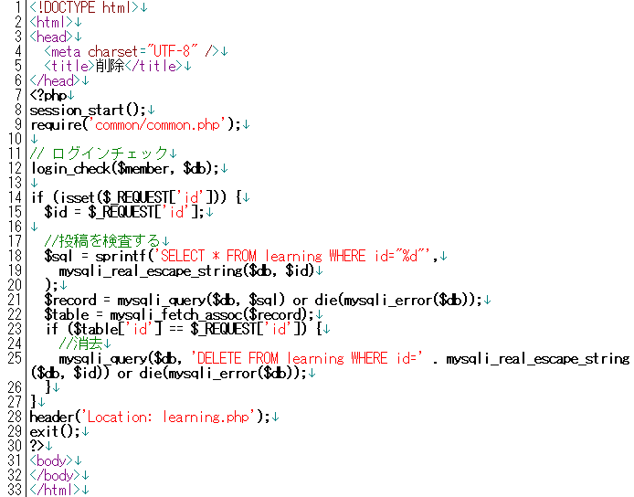

* [←共通する機能をまとめる](http://cs-tklab.na-inet.jp/phpdb/Chapter5/system85.html)
* [ホーム](http://cs-tklab.na-inet.jp/phpdb/index.html)
* [課題提出システム→](http://cs-tklab.na-inet.jp/phpdb/Chapter5/system10.html)

# 教材の消去

------

## 教材の消去: delete.php

[教材管理のところでも説明しました](http://cs-tklab.na-inet.jp/phpdb/Chapter5/system8.html#delete)が，削除すべき教材のidが送られてくるようになっているので，これを使ってDELETE命令で消去しています。セキュリティ的には考えるところの多い仕様なので，改良案を思いついたら提案して下さい。

PHPスクリプト: delete.php

------

## 解説

登録データの消去はデータベースの取扱いで一番気を付けなければならない操作です。必ず12行目のようにログインチェックを行って消去する権限のあるユーザーのみ実行できるようにして下さい。

さもなければ，この`delete.php`にアクセスできるすべてのユーザがあらゆるデータを消去できるようになってしまいます。

削除はいったん実行してしまうと取り返しがつきません。できれば実行前に「削除します。よろしいですか？」という確認のためのメッセージを出すようにプログラミングしましょう。

------

* [←共通する機能をまとめる](http://cs-tklab.na-inet.jp/phpdb/Chapter5/system85.html)
* [ホーム](http://cs-tklab.na-inet.jp/phpdb/index.html)
* [課題提出システム→](http://cs-tklab.na-inet.jp/phpdb/Chapter5/system10.html)

Copyright (c) 2014-2017 幸谷研究室 @ 静岡理工科大学 All rights reserved.
Copyright (c) 2014-2017 T.Kouya Laboratory @ Shizuoka Institute of Science and Technology. All rights reserved.