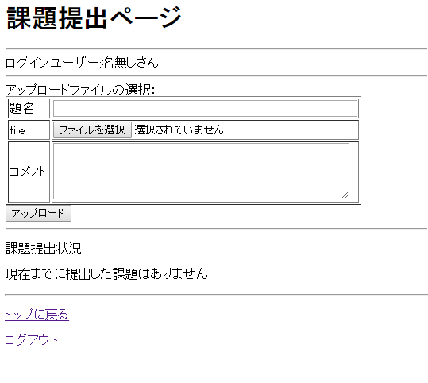
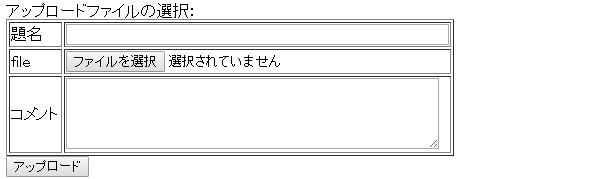
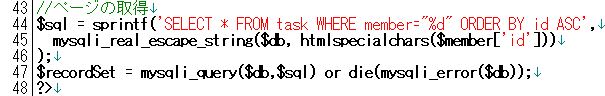

# 課題提出システム

------

## 課題提出システム: task.php

提出される課題を受け取ると共に，今まで提出した課題の一覧も表示するのがこの課題提出システム`task.php`です。下記のようなページを作っていきます。

[](http://cs-tklab.na-inet.jp/phpdb/Chapter5/fig/system10-1.PNG)

PHPスクリプト：task.php

```php
<?php

session_start();
require('common/common.php');

// ログインチェック
login_check($member, $db);

if(!empty($_POST)) {
    // 拡張子判別
    $file = mb_convert_kana($_FILES['task']['name'], 'a', 'UTF-8');
    if(preg_match("/\.\w{4}\z/", $file))
        $ext = substr($file, -5);
    else if (preg_match("/\.\w{3}\z/", $file))
        $ext = substr($file, -4);

    // 登録処理
    if(!empty($_POST['file_name']) && !empty($_FILES['task']['name'])) {
        $sql = sprintf('INSERT INTO task SET member=%d, name="%s", file="%s", change_name="%s", word="%s", modified="%s"',
            sanitize($db, $member['id']),
            sanitize($db, $_POST['file_name']),
            sanitize($db, $_FILES['task']['name']),
            sanitize($db, $_SESSION['change_name'].$ext),
            sanitize($db, $_POST['word']),
            date("Y-m-d")
        );
        mysqli_query($db, $sql) or die(mysqli_error($db));

        // ファイル登録
        $filepath = './task_folder/'.htmlspecialchars($_SESSION['change_name'], ENT_QUOTES);
        move_uploaded_file($_FILES['task']['tmp_name'], $filepath.$ext);
    } else {
        $error['task'] = 'blank';
    }
}

// ページの取得
$sql = 'SELECT * FROM task WHERE member="'.sanitize($db, $member['id']).'" ORDER BY id ASC';
$recordSet = mysqli_query($db, $sql) or die(mysqli_error($db));
?>
<!DOCTYPE html>
<html>
<head>
    <meta charset="utf-8">
    <title>課題提出ページ</title>
    <style>
        #red { color: red; }
    </style>
</head>
<body>
    <h1>課題提出ページ</h1>
    <hr>
    <p>ログインユーザー: <?=htmlspecialchars($member['name'], ENT_QUOTES)?></p>
    <hr>
    <form method="post" enctype="multipart/form-data">
        <p>アップロードファイルの選択:</p>
        <table border="1">
            <tr><th>題名</th><td><input type="text" name="file_name" size="50"></td></tr>
            <tr><th>file</th><td><input type="file" name="task" size="50"></td></tr>
            <tr><th>コメント</th><td><textarea name="word" cols="50" rows="5"></textarea></td></tr>
        </table>
        <?php if(!empty($error['task']) && $error['task'] == 'blank'): ?>
            <p id="red">※題名とファイルを確実に選択してください。</p>
        <?php endif ?>
        <input type="submit" value="アップロード">
    </form>
    <hr>
    <p>課題提出状況</p>
    <?php
        $i = 1;
        while($tables = mysqli_fetch_assoc($recordSet)) {
    ?>
    <table border="1">
            <tr>
                <th width="20"><?=$i?></th>
                <th colspan="3"><?=htmlspecialchars($tables['name'], ENT_QUOTES, 'utf-8')?></th>
            </tr>
            <tr>
                <td colspan="2">
                    ファイル名: <?=htmlspecialchars($tables['file'], ENT_QUOTES, 'utf-8')?>
                </td>
                <td width="180">
                    更新日時: <?=htmlspecialchars($tables['modified'], ENT_QUOTES, 'utf-8')?>
                </td>
                <td width="40">
                    <a href="change.php?id=<?=$tables['id']?>">変更</a>
                </td>
            </tr>
            <tr>
                <td colspan="4">
                    <?=htmlspecialchars($tables['word'], ENT_QUOTES, 'utf-8')?>
                </td>
            </tr>
    </table>
    <br>
    <?php
        $i++;
        }
        $_SESSION['change_name'] = $i . "-" . date("Ymd");
        if ($i == 1) echo '<p>現在までに提出した課題はありません。</p>';
    ?>
    <hr>
    <p><a href="top_page.php">トップに戻る</a></p>
    <a href="logout.php">ログアウト</a>
</body>
</html>
```


[注意！] 教材管理システム`learning.php`と同じように，フォルダ`challenge`の中に`task_folder`を作るのも忘れないようにして下さい。ここに課題ファイルが保存されます。

------

## 解説

基本的な構造は`learning.php`と同じですが，表示する情報が違うため相違点を解説します。

### 課題登録に関しての相違点

[](http://cs-tklab.na-inet.jp/phpdb/Chapter5/fig/system10-3.PNG)

登録内容に受講生が一言述べるためのコメント欄が追加されています。これは，課題を解く過程で詰まったところを質問したりするためのものです。

コメントを書くことによって，課題を受け取る管理者（教師）側は，課題の難易度などをを判断することができますし， 提出する受講生側も，課題の内容を振り返ることによって自分に足りない点に気づくことができます。

------

### 表示に関しての相違点

課題提出をしている場合は下のような表示となります。

[](http://cs-tklab.na-inet.jp/phpdb/Chapter5/fig/system10-4.PNG)

このページは受講生個々人の提出状況を確認することができるようになっています。そのため，受講生ごとに自分が提出した課題一覧を表示することが必要になります。このため，登録内容を全件取得していた`learning.php`とは異なり，受講生個人を特定した選択をするため，SELECT命令を発行する際にはWHEREを使用することで，受講生idを選択して取得しています。

PHPスクリプトの43～48行目の内容がその部分にあたり，`member`テーブルの中から`$member`に格納されている受講生idを利用して登録者を特定し，提出課題一覧を取得しています。


[](http://cs-tklab.na-inet.jp/phpdb/Chapter5/fig/task_php_common_l43-l48.png)


