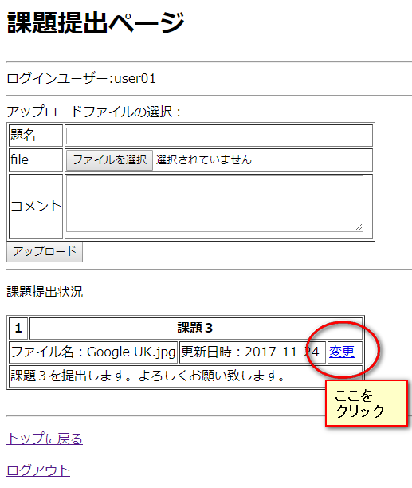
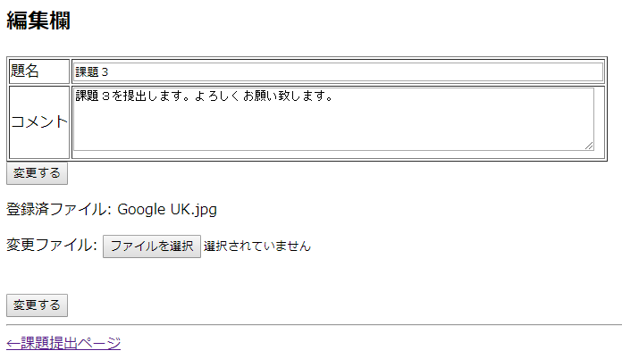
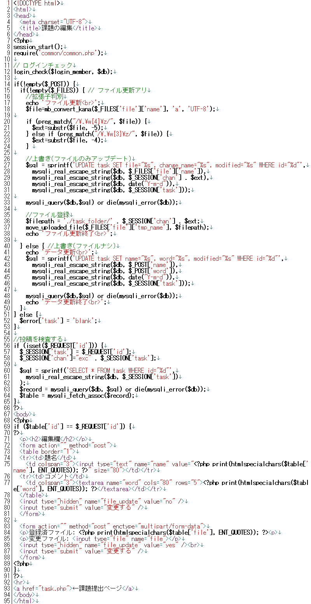
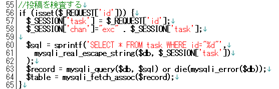
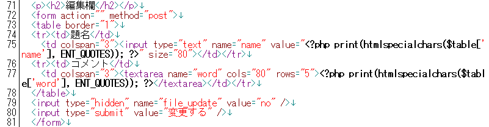

* [←課題提出システム](http://cs-tklab.na-inet.jp/phpdb/Chapter5/system10.html)
* [ホーム](http://cs-tklab.na-inet.jp/phpdb/index.html)
* [全体の提出内容の表示→](http://cs-tklab.na-inet.jp/phpdb/Chapter5/system12.html)

# 提出課題の内容変更

------

## 提出課題の内容変更: change.php

下記のように登録した課題を変更するリンクから呼び出されるページがこの`change.php`です。

### [task.phpページ](http://cs-tklab.na-inet.jp/phpdb/Chapter5/system10.html)から登録内容変更ページへのリンク

下記のフォームのように，登録された課題ファイル情報を呼び出し，題名，コメント，課題ファイルそれぞれを個別に変更する必要があるため，登録した課題の情報を変更する方が面倒になります。

### 登録内容の変更ページ

PHPスクリプト：change.php

------

## 解説

### 編集欄への変更前情報の表示

登録内容を変更するため，変更前の情報を呼び出してあらかじめフォームの入力欄に表示します。こうすることで，変更点が明確になりますし，変更する必要のない項目はそのままにしておけます。

55～65行目では，`task.php`から送られてきた，変更すべき部分の提出課題の`id`を使ってデータベースから情報を引き出しています。

フォームの入力要素であるテキストボックスの場合，引き出した内容を`input`タグの`value`属性として与えておくことで，表示することができます。テキストエリアの場合は`textarea`タグで挟み込んだ部分に初期文字列の設定ができます。

------

### 登録内容の変更

ここで気を付けることは`change_name`の設定です。

`task.php`で登録したファイル名と被らないよう，`$_SESSION['chan']`に 前回までとは違うファイル名を作り，これを新たな登録ファイル名としています。

このファイル名変更の仕様については改善の余地があります。「別に同じファイル名でも上書きすればいいじゃないか」と考える人は，そのようにこの`change.php`を書き換えてみて下さい。

------

* [←課題提出システム](http://cs-tklab.na-inet.jp/phpdb/Chapter5/system10.html)
* [ホーム](http://cs-tklab.na-inet.jp/phpdb/index.html)
* [全体の提出内容の表示→](http://cs-tklab.na-inet.jp/phpdb/Chapter5/system12.html)

Copyright (c) 2014-2017 幸谷研究室 @ 静岡理工科大学 All rights reserved.
Copyright (c) 2014-2017 T.Kouya Laboratory @ Shizuoka Institute of Science and Technology. All rights reserved.