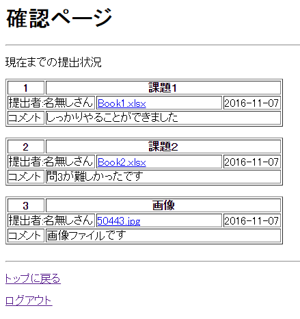
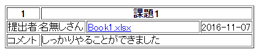
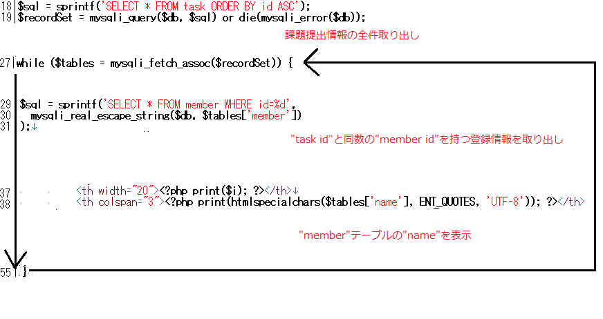

# 全体の提出内容の表示

------

## 全体提出状況の表示: submission.php

受講全員の課題提出状況を一覧できると教師としては非常に便利です。既に`task.php`では受講生毎の提出物の一覧を表示させていましたが，ここではその制限を外し，下記のように表示するページを作成します。

[](http://cs-tklab.na-inet.jp/phpdb/Chapter5/fig/system12-1.PNG)

PHPスクリプト： submission.php

```php
<?php
session_start();
require('common/common.php');

// ログインしているかのチェック
login_check($member, $db);

// ページの取得
$sql = sprintf('SELECT * FROM task ORDER BY id ASC');
$recordSet = mysqli_query($db, $sql) or die(mysqli_error($db));
?>

<!DOCTYPE html>
<html>
<head>
    <meta charset="utf-8">
    <title>全体の提出状況</title>
    <style>
        #red { color: red; }
    </style>
</head>
<body>
    <h1>確認ページ</h1>
    <hr>
    <p>現在までの提出状況</p>
    <?php
$i = 1;
while($table = mysqli_fetch_assoc($recordSet)) {
    $sql = 'SELECT * FROM member WHERE id = '.mysqli_real_escape_string($db, $table['member']);
    $record = mysqli_query($db, $sql) or die(mysqli_error($db));
    $member = mysqli_fetch_assoc($record);
    ?>
        <table border="1">
            <tr>
                <th width="20">
                    <?=$i?>
                </th>
                <th colspan="3">
                    <?=htmlspecialchars($table['name'], ENT_QUOTES, 'utf-8')?>
                </th>
            </tr>
            <tr>
                <td colspan="2">
                    提出者: <?=htmlspecialchars($member['name'])?>
                </td>
                <td width="180">
                    <a href="task_folder/<?=htmlspecialchars($table['change_name'], ENT_QUOTES, 'utf-8')?>">
                        <?=htmlspecialchars($table['file'], ENT_QUOTES, 'utf-8')?>
                    </a>
                </td>
                <td width="80">
                    <?=htmlspecialchars($table['modified'], ENT_QUOTES, 'utf-8')?>
                </td>
            </tr>
            <tr>
                <td width="50">
                    コメント
                </td>
                <td colspan="3">
                    <?=htmlspecialchars($table['word'], ENT_QUOTES, 'utf-8')?>
                </td>
            </tr>
        </table>
    <?php
$i++;
}
    ?>
<p><a href="top_page.php">トップに戻る</a></p>
<a href="logout.php">ログアウト</a>
</body>
</html>
```


------

## 解説

### 提出者の識別表示

リレーショナルベースデータベースの機能として，異なるテーブルに共通するカラムがある場合，それを元に互いの情報を組み合わせた新たなテーブルを作成することができるようになります。例えばこの講義支援システムの[データ構造](http://cs-tklab.na-inet.jp/phpdb/Chapter5/system2.html)の場合，`task`テーブルの`member`フィールドは，`member`テーブルの`id`を格納しているので，共通のものになっています。この場合，その例として，今回表示している提出者の表示が挙げられます。


[](http://cs-tklab.na-inet.jp/phpdb/Chapter5/fig/system12-3.PNG)


SQL文だけで上記のような複数テーブルを組み合わせたテーブルを作成することが可能ですが，以下ではこの手法は使っていません。チャレンジしてみたい人は`JOIN`をキーワードにいろいろ検索してこの手法を編み出してみて下さい。

------

ここでは次のような手順で二つのテーブルの情報を組み合わせた表示を行っています。

1. 18～19行目で`task`テーブルに登録されている`member`カラムの情報を引っ張り出す
2. 27行目から始まる`while文`による全件表示内で，29～31行目に`member`テーブルの情報を引き出す`SELECT文`を発行
3. `member`テーブルの`name`情報を38行目で表示


これを図解したのが下記になります。


[