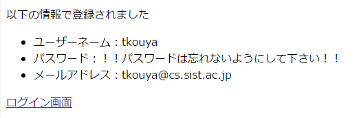

* [←全体提出状況の表示](http://cs-tklab.na-inet.jp/phpdb/Chapter5/system12.html)
* [ホーム](http://cs-tklab.na-inet.jp/phpdb/index.html)
* [AjaxとファイルのDrag & Drop処理→](http://cs-tklab.na-inet.jp/phpdb/Chapter5/file_upload_javascript.html)

# システムの改良

------

## 管理者のチェック機構

[システム構成図](http://cs-tklab.na-inet.jp/phpdb/Chapter5/system1.html#structure_figure)のところで解説したように，このシステムでは

* 学習教材のアップロード・消去(`learning.php`, `delete.php`)
* (受講生レポートの)提出状況の一覧(`submission.php`)

が管理者（教師）のみがアクセスできる機能として用意されています。従って，ログインしたユーザーが管理者かどうかを確認するための機構が必要になります。

そこで，管理者は特定の登録ユーザーを一人だけ指定しておき，その管理者ユーザーだけがこれらの機能にアクセスできるような仕組みを導入することにします。

### common.phpの改良: 管理者ユーザーの指定

まず，10行目から23行目のように，`common/common.php`に管理者のユーザー名を`$admin_name`としてあらかじめ記入しておくことにします。そして，自動的にこのユーザーIDを`$admin_id`として保持しておくことにしましょう。

しかる後，管理者かどうかの確認を行う関数`admin_check`を51行目～58行目のように定義します。ここでは，`$admin_id`とセッション配列のユーザーIDが一致するかどうかで判断しています。

common/common.php

### top_page.php: 提出状況一覧へのリンクを制限する

top_page.phpの一部

### learning.php: 学習教材のアップロード・消去機能の制限

管理者以外のユーザの表示

管理者ユーザの表示

learning.phpの一部(1/2)

learning.phpの一部(2/2)

### delete.php, submission.php: 実行そのものを制限する

念のため，`delete.php`, `submission.php`の冒頭部分にも`admin_check関数`によるif文を挿入し，実行を制限させておくと，ダイレクトにこれらのPHPスクリプトにアクセスされても実行できません。上記の例を参考に，この二つのPHPスクリプトにも管理者のみ実行可能なように制限をかけてみて下さい。これは課題とします。

## パスワードの暗号化

ユーザーのパスワードは厳重に保存しておく必要があります。たとえ管理者と言えども，パスワードそのものを直接見ることは好ましいことではありません。そこで，パスワードは暗号化したものを保存しておくように変更します。また，パスワードをフォームに入力する際にも`<input type="password">`タグを使って「********」のように伏字で表示させるようにしましょう。

PHP 5.5.0以上では`password_hash関数`を使って暗号化し，平文パスワードと一致するかどうかの確認は`password_verify関数`を用いて行うことが推奨されています。新規ユーザのフォームは`entry.php`，パスワードを保存するのは`check.php`で，ログイン時のパスワードチェックは`index.php`で行っていますので，この三つのPHPスクリプトを改良します。

### entry.php: フォーム入力時にパスワードを伏字にする

新規ユーザー登録時にパスワード入力部分を伏字にします。

entry.phpの変更箇所

新規ユーザー情報を入力する際に，下記のようにパスワード入力が伏字になることを確認しましょう。

### check.php: パスワードの暗号化と暗号化パスワードの登録

`entry.php`から受け取ったパスワードを`password_hash`で暗号化します。

check.phpの変更箇所

新規ユーザーを登録して，下記のように正常に登録でき，パスワードが表示されないことを確認しましょう。

実際に暗号化されたかどうか，memberテーブルを見て確認して下さい。pass_wordフィールドの値が下記のように解読不能な文字列になっていれば大丈夫です。

暗号化パスワードを保持するmemberテーブル

### index.php: パスワード入力と暗号化パスワードの確認

登録した新規ユーザーを暗号化したパスワードで認証してみます。暗号化パスワードと平文のパスワードの照合は`password_verify`関数を使って行います。

index.phpの変更箇所

うまくログインできるようでしたら，既存ユーザーの情報は全てmemberテーブルから消去し，すべてのユーザーが暗号化パスワードになるように登録し直しましょう。

------

* [←全体提出状況の表示](http://cs-tklab.na-inet.jp/phpdb/Chapter5/system12.html)
* [ホーム](http://cs-tklab.na-inet.jp/phpdb/index.html)
* [AjaxとファイルのDrag & Drop処理→](http://cs-tklab.na-inet.jp/phpdb/Chapter5/file_upload_javascript.html)

Copyright (c) 2014-2017 幸谷研究室 @ 静岡理工科大学 All rights reserved.
Copyright (c) 2014-2017 T.Kouya Laboratory @ Shizuoka Institute of Science and Technology. All rights reserved.