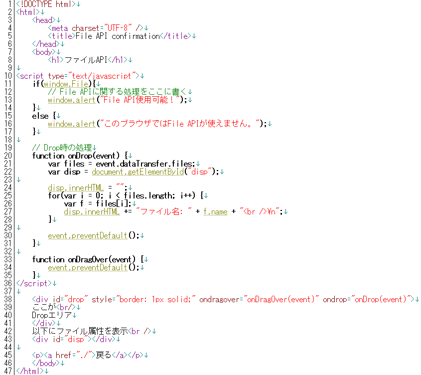
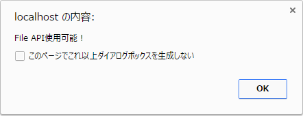
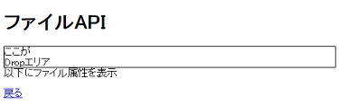
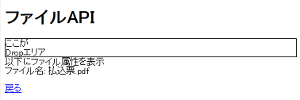
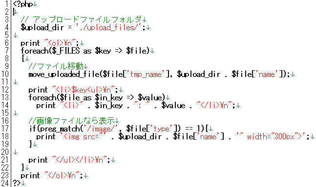
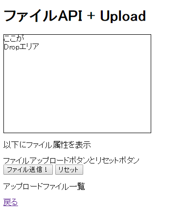
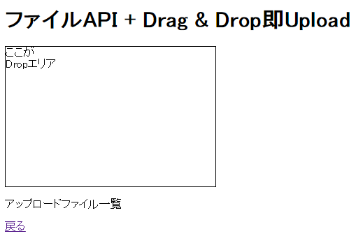

* [←システムの改良](http://cs-tklab.na-inet.jp/phpdb/Chapter5/system13.html)
* [ホーム](http://cs-tklab.na-inet.jp/phpdb/index.html)
* [練習問題→](http://cs-tklab.na-inet.jp/phpdb/Chapter5/lesson_javascript.html)

# AjaxとファイルのDrag & Drop処理

------

## JavaScriptのファイルAPI

ファイルAPI([File API](https://www.w3.org/TR/FileAPI/))とは，ブラウザ側にあるファイルを扱うためのJavaScript(ECMAScript)のAPI規格です。現行出回っているGoogle Chrome, Firefox, Internet Explorer, Microsoft Edgeで使用でき，ファイルの読み書きをJavaScriptから行うことができるようになります。

以下のHTML+JavaScriptでファイルAPIの機能を確認しましょう。

file_api.html

これを実行すると，ファイルAPIが実行可能であれば

という確認ウィンドウが出て，OKボタンを押すと下記の画面に移行します。

file_api.htmlの38行目～41行目に当たる`id=drop`のdivタグ部分に適当なファイルをDrag&Dropすると，22行目～33行目のDrop時に実行される`onDrop`関数が働き，下記のように`id=disp`のdivタグにファイル名が表示されるはずです。確認してみて下さい。

## XMLHttpRequest関数を用いたAjax非同期通信

Ajax(Asyncronus JavaScript + XML)とは，非同期のHTTP通信を可能とする技法で，JavaScriptの`XMLHttpRequest`関数を利用するのが標準のAjaxです。

下記はファイルのアップロードをDrag & Dropだけで実行するためのHTML+JavaScript, PHPスクリプトです。

file_api_upload.html

upload.php

これを実行すると下記のようにDrag & Dropのためのエリアが表示されます。

このエリアに画像ファイルを2つDrag & Dropし，「ファイル送信！」ボタンをクリックするとアップロードが開始され，無事終了すると下記のような表示を得ることができます。

今度は，「ファイル送信！」ボタンを使わず，Drag & Dropした直後に自動的にアップロードが開始されるようにJavaScriptを改良します。

file_api_quick_upload.html

送信ボタンが不要になりますので，下記のようにDrag & Dropエリアのみになります。

前述の例と同様，このエリアに画像ファイルを2つDrag & Dropした結果，アップロード処理完了後，下記のような画面を即座に見ることができます。

## jQueryを用いたAjax非同期通信

上記のXMLHttpRequest関数を使った例を，jQueryのAjax機能(`$.ajax関数`)を利用して書き換えたものが下記になります。

ファイルアップロード処理を行うPHPスクリプトを変更する必要はありません。

file_api_upload_jquery.html

------

* [←システムの改良](http://cs-tklab.na-inet.jp/phpdb/Chapter5/system13.html)
* [ホーム](http://cs-tklab.na-inet.jp/phpdb/index.html)
* [練習問題→](http://cs-tklab.na-inet.jp/phpdb/Chapter5/lesson_javascript.html)

Copyright (c) 2014-2017 幸谷研究室 @ 静岡理工科大学 All rights reserved.
Copyright (c) 2014-2017 T.Kouya Laboratory @ Shizuoka Institute of Science and Technology. All rights reserved.