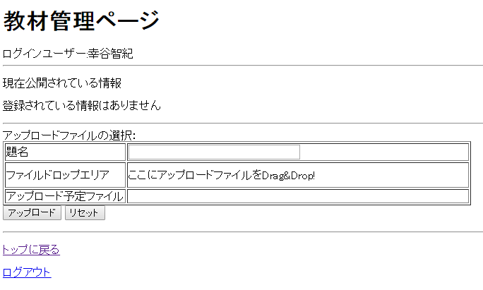
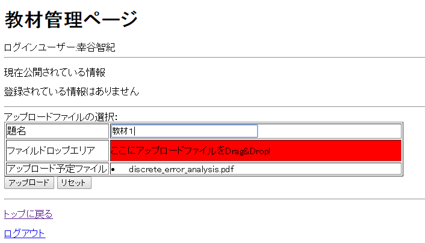
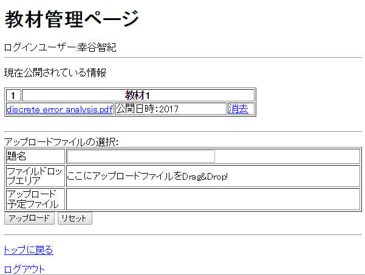
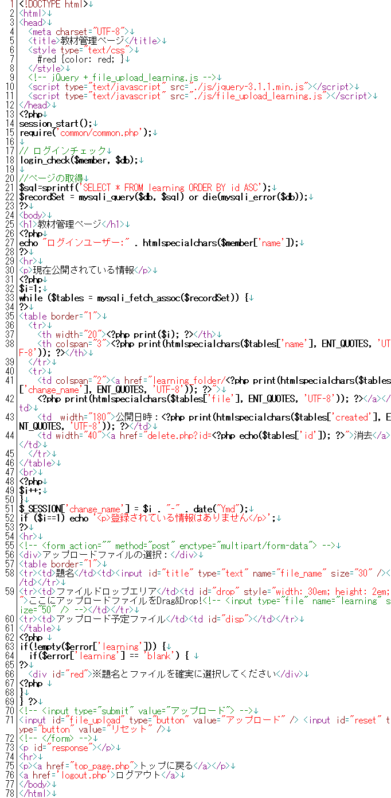
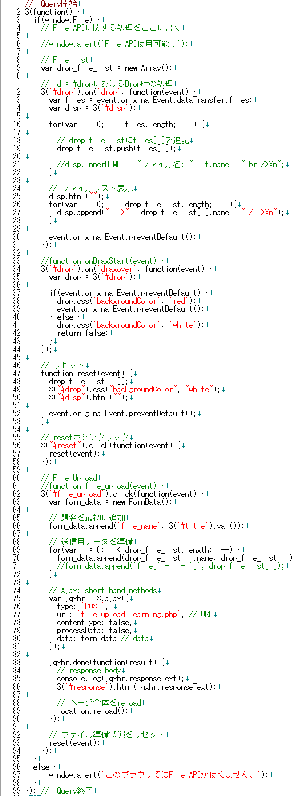
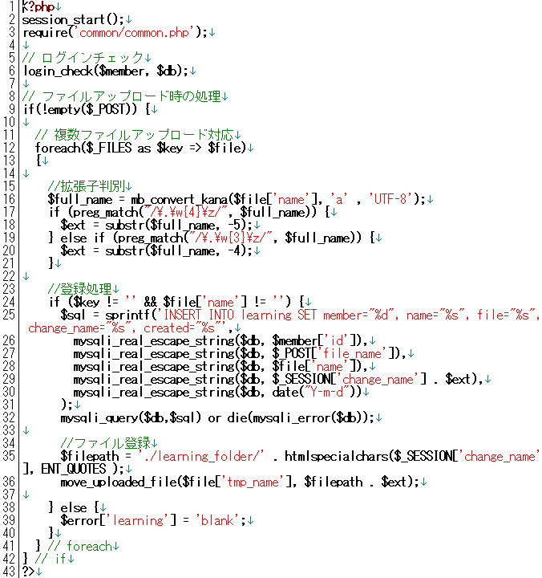

* [←AjaxとファイルのDrag & Drop処理](http://cs-tklab.na-inet.jp/phpdb/Chapter5/file_upload_javascript.html)
* [ホーム](http://cs-tklab.na-inet.jp/phpdb/index.html)
* [解答例→](http://cs-tklab.na-inet.jp/phpdb/Chapter5/lesson_javascript-answer.html)

# 練習問題

------

第5章で作成した`learing.php`をjQueryを用いて，Drag & Dropによる教材登録ができるように改変して下さい。

具体的にはまず`learning.php`に`id=drop`をテーブル内に設け，

ここに教材ファイルを下記のようにDrag & Dropすると自動的にファイル名を表示し

アップロードボタンを押すと下記のように教材が登録できるようにします。

------

分からないところは最初からあきらめずに自分で調べましょう。どこを見ればいいか分からないときは下のヒントを見ましょう。

[ヒント(別窓で開きます)](http://cs-tklab.na-inet.jp/phpdb/Chapter5/file_upload_javascript.html)

------

* [←AjaxとファイルのDrag & Drop処理](http://cs-tklab.na-inet.jp/phpdb/Chapter5/file_upload_javascript.html)
* [ホーム](http://cs-tklab.na-inet.jp/phpdb/index.html)
* [解答例→](http://cs-tklab.na-inet.jp/phpdb/Chapter5/lesson_javascript-answer.html)

Copyright (c) 2014-2017 幸谷研究室 @ 静岡理工科大学 All rights reserved.
Copyright (c) 2014-2017 T.Kouya Laboratory @ Shizuoka Institute of Science and Technology. All rights reserved.

* [←問題に戻る](http://cs-tklab.na-inet.jp/phpdb/Chapter5/lesson_javascript.html)
* [ホーム](http://cs-tklab.na-inet.jp/phpdb/index.html)

# 練習問題の解答例

------

learning.php

js/file_upload_learning.js

file_upload_learning.php

------

* [←問題に戻る](http://cs-tklab.na-inet.jp/phpdb/Chapter5/lesson_javascript.html)
* [ホーム](http://cs-tklab.na-inet.jp/phpdb/index.html)

Copyright (c) 2014-2017 幸谷研究室 @ 静岡理工科大学 All rights reserved.
Copyright (c) 2014-2017 T.Kouya Laboratory @ Shizuoka Institute of Science and Technology. All rights reserved.